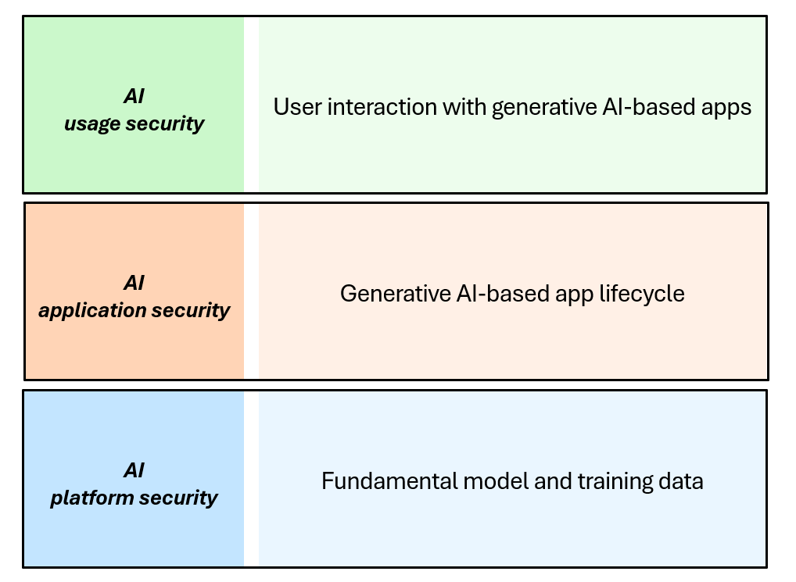

To understand how attacks against AI can occur, you can separate AI architecture into three layers as shown in the exhibit:

- AI Usage layer
- AI Application layer
- AI Platform layer

## AI usage layer

The AI usage layer describes how AI capabilities are ultimately used and consumed. Generative AI offers a new type of user/computer interface that is fundamentally different from other computer interfaces (API, command-prompt, and graphical user interfaces (GUIs)). The generative AI interface is both interactive and dynamic, allowing the computer capabilities to adjust to the user and their intent. This contrasts with previous interfaces that primarily force users to learn the system design and functionality to accomplish their goals. This interactivity allows user input to have a high level of influence of the output of the system (vs. application designers), making safety guardrails critical to protect people, data, and business assets.

Protecting AI at the AI usage layer is similar to protecting any computer system as it relies on security assurances for identity and access controls, device protections and monitoring, data protection and governance, administrative controls, and other controls. 

Additional emphasis is required on user behavior and accountability because of the increased influence users have on the output of the systems. It's critical to update acceptable use policies and educate users on them. These should include AI specific considerations related to security, privacy, and ethics. Additionally, users should be educated on AI based attacks that can be used to trick them with convincing fake text, voices, videos, and more.

## AI application layer

At the AI application layer, the application accesses the AI capabilities and provides the service or interface that is consumed by the user. The components in this layer can vary from relatively simple to highly complex, depending on the application. The simplest standalone AI applications act as an interface to a set of APIs taking a text-based user-prompt¸ and passing that data to the model for a response.  More complex AI applications include the ability to ground the user-prompt with additional context, including a persistence layer, semantic index¸ or via plugins to allow access to additional data sources. Advanced AI applications may also interface with existing applications and systems; these may work across text, audio, and images to generate various types of content.

To protect the AI application from malicious activities at this layer, an application safety system must be built to provide deep inspection of the content being used in the request sent to the AI model, and the interactions with any plugins, data connectors, and other AI applications (known as AI Orchestration).

## AI platform layer

The AI platform layer provides the AI capabilities to the applications. At the platform layer there's a need to build and safeguard the infrastructure that runs the AI model, training data, and specific configurations that change the behavior of the model, such as weights and biases. This layer provides access to functionality via APIs, which will pass text known as a Metaprompt to the AI model for processing, then return the generated outcome, known as a Prompt-Response.

To protect the AI platform from malicious inputs, a safety system must be built to filter out the potentially harmful instructions sent to the AI model (inputs). As AI models are generative, there's also a potential that some harmful content may be generated and returned to the user (outputs). Any safety system must first protect against potentially harmful inputs and outputs of many classifications including hate, jailbreaks, and others. Classifications will likely evolve over time based on model knowledge, locale, and industry.
