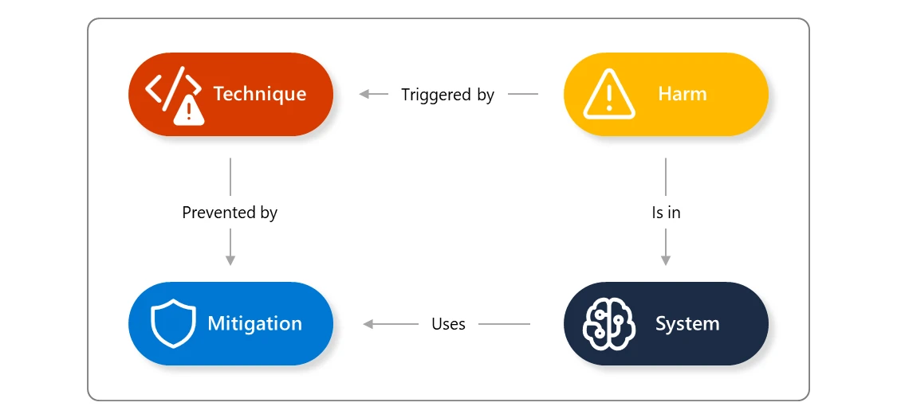

An AI jailbreak is a _technique_ that can cause the failure of guardrails (_mitigations_). The resulting _harm_ comes from whatever guardrail was circumvented: for example, causing the system to violate its operators' policies, make decisions unduly influenced by one user, or execute malicious instructions. This _technique_ may be associated with additional attack _techniques_ such as prompt injection, evasion, and model manipulation.

An example of a jailbreak would be when an attacker asks an AI assistant to provide information about how to build a Molotov cocktail (firebomb). As this is covered in many history books, this information is built into most of the generative AI models available today. However because no company that provides AI services wants to be providing weapon recipes, they are configured to prevent this information from being provided to the user through filters and other techniques to deny this request. 

The two basic families of jailbreak depend on who is doing them:

- A direct prompt injection attack (also known as a "classic" jailbreak) happens when an authorized operator of the system crafts jailbreak inputs in order to extend their own powers over the system.
- An indirect prompt injection happens when an attack is not directly in the prompt but in content that was referenced or called upon by the user at the time of writing their prompt. 

There is a wide range of known jailbreak-like attacks. Some of them (like DAN) work by adding instructions to a single user input, while others (like Crescendo) act over several turns, gradually shifting the conversation to a particular end. Jailbreaks may use very "human" techniques such as social psychology, effectively sweet-talking the system into bypassing safeguards, or very "artificial" techniques that inject strings with no obvious human meaning, but which nonetheless could confuse AI systems. Jailbreaks should not, therefore, be regarded as a single technique, but as a group of methodologies in which a guardrail can be talked around by an appropriately crafted input.

In the below video, you can see an example of a crescendo attack. Rather than outright asking the LLM model to break its guardrails in one prompt, the attacker crafts a number of prompts that incrementally confuse the LLM into breaking its guardrails.

Jailbreaking attacks are mitigated by Microsoft's safety filters; however, AI models are still susceptible to it. Many variations of these attempts are discovered on a regular basis, then tested and mitigated.

Guardrails will need to be updated as novel techniques in the AI space are discovered.