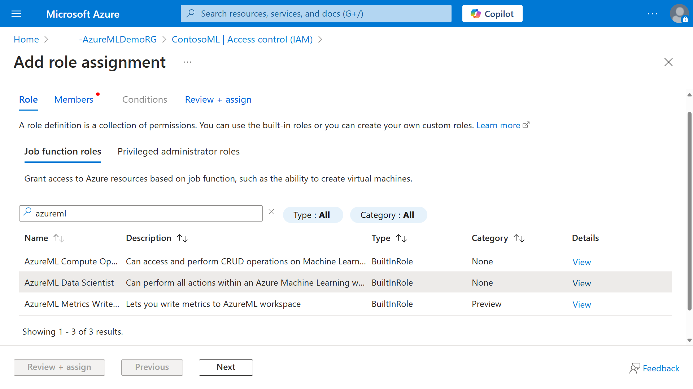

Azure role-based access control (Azure RBAC) is used to scope the level of access (authorization) allowed to the resources. For example, you would configure separate role assignments to ensure that an admin or automation process might have access to create a compute instance but not use it, while a data scientist could use it but not delete or create it.

Azure Machine Learning applies the same principle for authorization as other Azure resources. You use Azure role-based access control (Azure RBAC) to manage access giving users the ability to create new resources or use existing ones. Users in your Microsoft Entra ID are assigned specific roles, which grant access to resources. Azure provides both built-in roles and the ability to create custom roles for Azure Machine Learning.

Default Roles

The roles related to Azure Machine Learning workspaces are as follows.

| **Role** | **Access level** |
|---|---|
| **Azure Machine Learning Data Scientist** | Can perform all actions within an Azure Machine Learning workspace, except for creating or deleting compute resources and modifying the workspace itself. |
| **Azure Machine Learning Compute Operator** | Can create, manage, delete, and access compute resources within a workspace. |
| **Reader** | Read-only actions in the workspace. Readers can list and view assets, including [datastore](/azure/machine-learning/how-to-access-data) credentials, in a workspace. Readers can't create or update these assets. |
| **Contributor** | View, create, edit, or delete (where applicable) assets in a workspace. For example, contributors can create an experiment, create or attach a compute cluster, submit a run, and deploy a web service. |
| **Owner** | Full access to the workspace, including the ability to view, create, edit, or delete (where applicable) assets in a workspace. Additionally, you can change role assignments. |
| **Azure Machine Learning Registry User** | Can get registries and read, write, and delete assets within them. Can't create new registry resources or delete them. |

If the permissions assigned to the built-in roles are insufficient or do not meet your needs, you can create custom roles. Custom roles might possess read, write, delete, and compute resource permissions in that workspace. You can make the custom role available at a specific workspace level, a specific resource group level, or a specific subscription level.

When you create an Azure Machine Learning workspace, you're automatically assigned the role of Owner for that resource. As an owner, you can add and remove roles for the workspace, and assign roles to users or groups.

As a best practice, you can use Microsoft Entra security groups to manage access to workspaces. You assign the RBAC role to an Entra security group and then manage which security principals have the role by managing membership of the group. This approach has the following benefits:

You can assign project leaders group ownership permissions. This means they can manage user access to workspace, without needing Owner role on the workspace resource directly.

You can organize, manage, and revoke users' permissions on workspace and other resources as a group, without having to manage permissions on user-by-user basis. This also makes it simpler to audit the permissions held as it's only a matter of determining group membership.

Using Microsoft Entra groups helps you to avoid reaching the subscription limit on role assignments.

To assign the Azure Machine Learning Data Scientist role, perform the following steps:

1. On the Azure portal, open the Azure Machine Learning resource.
1. Select Access Control (IAM) on the left-hand side menu.
1. Select the Add drop-down menu and select Add role assignment.
1. You can filter the roles by typing "Azure Machine Learning" in the search box.
1. Select the Azure Machine Learning Data Scientist role and click Next:

1. On the Members tab, click on the + Select members link.
1. Look for the individual's account from Microsoft Entra ID and choose Select.
1. Back to the Members tab, confirm the account selected is shown in the list:

1. Select Review + assign twice to conclude the assignment.
1. You can confirm the assignment on the Role assignments tab by filtering the results with the name of the individual you're looking for.
1. Alternatively, you can select the Check access tab, and the Check access button. On the side-pane, type the name of the individual you're looking for. The Check access pane shows all Roles the individual has been assigned to.
