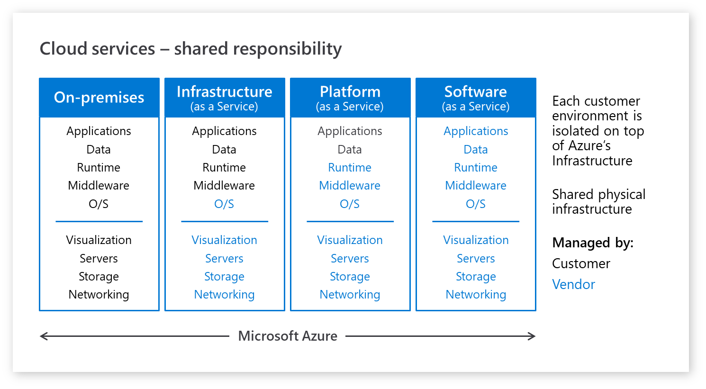

Resiliency is the ability of a system to recover from failures and continue to function. You implement resiliency to avoid application failures and to ensure that if a failure occurs, the application is able to rely upon underlying services to return to a fully functioning state. The level of resiliency an application requires is dependent on the importance of the application to the organization. A business critical application that takes customer orders over the internet requires a higher level of resiliency than an application that tracks leave requests. 

## Resilient services in Azure

Azure includes built-in resiliency services that you can implement to make your application more resilient to failures. These services include:

- Availability Sets provide a logical grouping of VMs that allows Azure to understand how your application is built in order to deliver redundancy and availability.  
- Availability Zones protect your applications and data from datacenter failures. You can distribute the VMs belonging to one tier across multiple availability zones within a region.
- Azure Load Balancer distributes inbound traffic according to rules and health probes. You can distribute incoming client traffic using load balancers.
- Azure Traffic Manager enables you to distribute traffic optimally to services across global Azure regions while providing high availability and responsiveness.
- Azure Site Recovery allows you to replicate virtual machines to another Azure region for business continuity and disaster recovery needs.
- Azure Backup service provides simple, secure, and cost-effective solutions to back up your data and recover it from the Microsoft Azure cloud.
- Geo Replication for Azure SQL Database allows the application to perform quick disaster recovery of individual databases in case of a regional disaster or large-scale outage.  
- Locally-redundant storage (LRS) provides object durability by replicating your data to a storage scale unit.
- Zone-redundant storage (ZRS) replicates your data synchronously across three storage clusters in a single region.  
- Geo-redundant storage (GRS) is designed to provide durability of objects over a given year by replicating your data to a secondary region that is hundreds of miles away from the primary region.

## Shared responsibility model

When implementing the resiliency of your applications, keep in mind that being resilient in the event of any failure is a shared responsibility between cloud provider and application developer. Which party is responsible for a specific element of resiliency depends on the cloud service model you use: IaaS, PaaS, or SaaS.  The exhibit shows the different types of responsibilities depending on the cloud service model.

In the traditional on-premises model, the entire responsibility of managing, from the hardware for compute, storage, and networking to the application falls on you. In an on-premises model, you must plan for various types of failures and how to deal with them on-premises. With an IaaS model, the cloud service provider is responsible for the core infrastructure resiliency, including storage, networking, and compute. As you move from the IaaS model to the PaaS model and then to a full SaaS model, you'll find that you're responsible for less with respect to the application's resiliency and the cloud service provider is responsible for more.

## Design your applications to be resilient

You can leverage the following model when designing your applications for resiliency:

1. Define your resiliency requirements based on business needs.
1. Design the application for resiliency. Start with an architecture that follows proven practices and then identify the possible failure points in that architecture.
1. Implement strategies to detect and recover from failures.
1. Test the implementation by simulating faults and triggering forced failovers.
1. Deploy the application into production using a reliable and repeatable process.
1. Monitor the application to detect failures. By monitoring the system, you can gauge the health of the application and respond to incidents if necessary.
1. Respond if there are failure that require manual interventions.

You'll learn more about parts of this model throughout the rest of this module.
