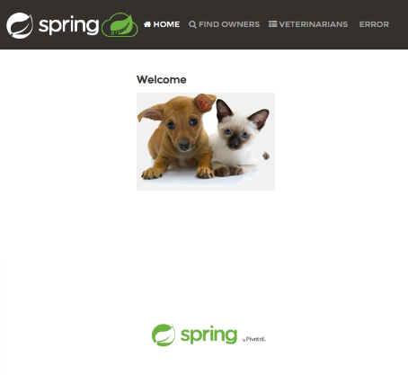

In this unit, you'll learn how to prepare a Spring Boot application for deployment on Azure Container Apps. We'll use the popular Spring PetClinic sample application, which demonstrates the use of Spring Framework and database access.

The Spring PetClinic is a simple web application that manages a list of veterinarians, their patients, and the visits those patients have had. This provides a practical way to understand key Spring Boot concepts while preparing it for deployment to Azure.

## Prerequisite

To successfully complete this project, ensure you have the following prerequisites:

| Requirement     | Instructions                                                                                                                                       |
|-----------------|-----------------------------------------------------------------------------------------------------------------------------------------------------|
| Azure account   | If you don't have one, [create an account for free](https://azure.microsoft.com/free/). You need the Contributor or Owner permission on the Azure subscription to proceed. Refer to [Assign Azure roles using the Azure portal](https://learn.microsoft.com/azure/role-based-access-control/role-assignments-portal) for details. |
| git             | [Install git](https://git-scm.com/downloads).                                                                                              |
| Azure CLI       | Install the [Azure CLI](https://learn.microsoft.com/cli/azure/install-azure-cli).

## Clone the PetClinic repository

To get started with PetClinic, you'll need to clone the Java on Azure Container Apps repository from GitHub. Use the following command in your terminal:

# [Bash](#tab/bash)

```bash
git clone https://github.com/Azure-Samples/azure-container-apps-java-samples.git
```

# [Azure PowerShell](#tab/azure-powershell)

```shell
git clone https://github.com/Azure-Samples/azure-container-apps-java-samples.git
```

---

## Run the Application Locally

Before deploying, it’s important to ensure that the application runs successfully on your local machine.

1. Navigate to the project PetClinic directory:

# [Bash](#tab/bash)

```bash
cd azure-container-apps-java-samples/spring-petclinic/spring-petclinic/
```

# [Azure PowerShell](#tab/azure-powershell)

```shell
cd azure-container-apps-java-samples/spring-petclinic/spring-petclinic/
```

---

2. Init and update the PetClinc to the latest version:

# [Bash](#tab/bash)

```bash
git submodule update --init --recursive
```

# [Azure PowerShell](#tab/azure-powershell)

```shell
git submodule update --init --recursive
```

---

3. Build the project using Maven:

# [Bash](#tab/bash)

```bash
./mvnw clean install
```

# [Azure PowerShell](#tab/azure-powershell)

```shell
./mvnw clean install
```

---

4. Run the application:

# [Bash](#tab/bash)

```bash
./mvnw spring-boot:run
```

# [Azure PowerShell](#tab/azure-powershell)

```shell
./mvnw spring-boot:run
```

---

5.Once the application is up, you can access it locally via [http://localhost:8080](http://localhost:8080). You should see the Spring PetClinic interface.



## Database configuration
By default, Petclinic utilizes an in-memory H2 database, which is automatically populated with data during startup. The H2 console is accessible at [http://localhost:8080/h2-console](http://localhost:8080/h2-console), allowing you to inspect the database content via the URL `jdbc:h2:mem:<uuid>`. The specific UUID is displayed in the console when the application starts.
