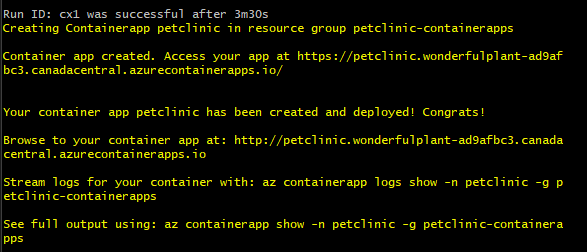

This section guides you through deploying a Spring Boot application to Azure Container Apps. We'll cover packaging the application, setting up the Azure environment, and pushing the  application to Azure Container Apps.
                                                                                     |
## Setup

To sign in to Azure from the CLI, run the following command and follow the prompts to complete the authentication process.

# [Bash](#tab/bash)

```bash
az login
```

# [Azure PowerShell](#tab/azure-powershell)

```shell
Connect-AzAccount
```

---

To ensure you're running the latest version of the CLI, run the upgrade command.

# [Bash](#tab/bash)

```bash
az upgrade
```

# [Azure PowerShell](#tab/azure-powershell)

```shell
Install-Module -Name Az -Scope CurrentUser -Repository PSGallery -Force
```

---

Next, install or update the Azure Container Apps extension for the CLI.

If you receive errors about missing parameters when you run `az containerapp` commands in Azure CLI, be sure you have the latest version of the Azure Container Apps extension installed.

# [Bash](#tab/bash)

```bash
az extension add --name containerapp --upgrade
```

# [Azure PowerShell](#tab/azure-powershell)

```shell
Install-Module -Name Az.App
Update-Module -Name Az.App
```

---

Now that the current extension or module is installed, register the `Microsoft.App` and `Microsoft.OperationalInsights` namespaces.

# [Bash](#tab/bash)

```bash
az provider register --namespace Microsoft.App
az provider register --namespace Microsoft.OperationalInsights
```

# [Azure PowerShell](#tab/azure-powershell)

```shell
Register-AzResourceProvider -ProviderNamespace Microsoft.App
Register-AzResourceProvider -ProviderNamespace Microsoft.OperationalInsights
```

---

## Create environment variables

Now that your Azure CLI setup is complete, you can define the environment variables that are used throughout this article.

# [Bash](#tab/bash)

```bash
export RESOURCE_GROUP="petclinic-containerapps"
export LOCATION="canadacentral"
export ENVIRONMENT="env-petclinic-containerapps"
export APP_NAME="petclinic"
```

# [Azure PowerShell](#tab/azure-powershell)

```shell
$RESOURCE_GROUP = "petclinic-containerapps"
$LOCATION = "canadacentral"
$ENVIRONMENT = "env-petclinic-containerapps"
$APP_NAME = "petclinic"
```

---

## Locate the sample code

Since we have already prepared the code sample in the last chapter, make sure that your are now in the `azure-container-apps-java-samples/spring-petclinic/spring-petclinic` directory of the project.

## Build and deploy the container app

Build and deploy your first Spring Boot app with the containerapp up command. This command will:

- Create the resource group.
- Create an Azure Container Registry.
- Build the container image and push it to the registry.
- Create the Container Apps environment with a Log Analytics workspace.
- Create and deploy the container app using the built container image.

The `up` command uses the Dockerfile in the root of the repository to build the container image. In the following code example, the `..` (dot dot) tells `containerapp up` to run the `dockerfile` in the previous folder.

# [Bash](#tab/bash)

```bash
az containerapp up \
    --name $APP_NAME \
    --resource-group $RESOURCE_GROUP\
    --location $LOCATION \
    --environment $ENVIRONMENT \
    --source ..
```

# [Azure PowerShell](#tab/azure-powershell)

```shell
az containerapp up `
    --name $APP_NAME `
    --resource-group $RESOURCE_GROUP `
    --location $LOCATION `
    --environment $ENVIRONMENT `
    --source ..
```

---

## Verify deployment
Once your deployment is done, you should be able to see a success message with the project endpoint printed in the console. You may open the url to verify your project deployed on azure.


