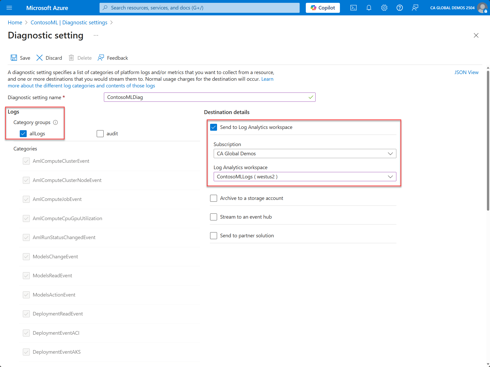

Resource logs provide insight into operations that were done by an Azure resource, such as Azure Machine Learning. Logs are generated automatically, but you must route them to Log Analytics or different service to save or query them. To route Azure Machine Learning logs to Log Analytics, perform the following steps:

1. On the Azure portal, open the Azure Machine Learning resource.
1. On the left-hand side menu, expand Monitoring and select Diagnostic settings.
1. Select + Add diagnostic setting.
1. On the Diagnostic setting page, provide a name for the Diagnostic setting name. 
1. Under Log, select the log categories you want to export. You can also select Metrics to be exported.
1. Under Destination details, select Send to Log Analytics workspace.
1. Select the Subscription and Log Analytics workspace you want to export this data to.

   

1. Select Save to save and close the export configuration.
1. Back on the Diagnostic settings page, you should now be able to see the configuration. If needed, you can change the settings for this export by clicking Edit setting.

Once you configure the Diagnostic setting, you can query the logs in Logs Analytics:

1. On the Azure portal, open the Azure Machine Learning resource.
1. On the left-hand side menu, expand Monitoring and select Logs.
1. If the Queries hub opens, you can close it. (Queries Hub provides a sample of queries you can use. They have the context of the resource type you're looking into and it's an easy way to get started with Logs Analytics.)
1. On the New Query 1* tab, select the drop-down menu on the right-hand side to change Simple mode to KQL. (KQL stands for Justo Query Language)
1. In the KQL query editor, you can type the query you want to perform. For our example, we check for records for a specific job name:

   ```kusto
   _AmlComputeJobEvent_
   *| where JobName == "musing_date_yg60v862b2"*
   _| project  TimeGenerated , ClusterId , EventType , ExecutionState , ToolType_
   ```

1. Select Run to run the query.


Once you run the query, you can analyze the results in the Results pane.
