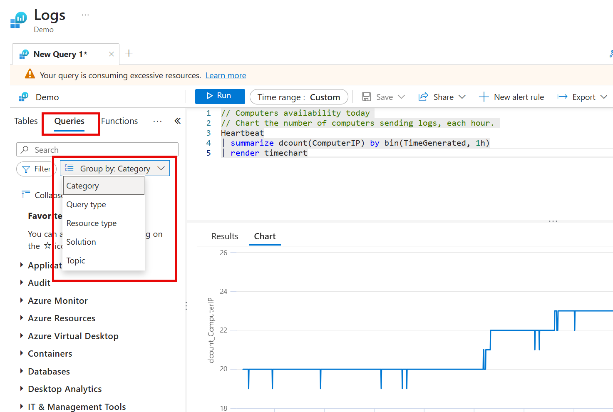

The operations team doesn't currently have enough information about its system behavior to diagnose and resolve problems effectively. To address this issue, the team has configured an Azure Monitor workspace with the company's Azure services. It runs Kusto queries to get the status of the system and attempts to identify the causes of any problems that might occur.

In particular, the team is interested in monitoring security events to check for possible attempts to break into the system. An attacker might try to manipulate the applications running on the system, so the team also wants to gather application data for further analysis. An attacker might also try to halt the computers that compose the system, so the team wants to examine how and when machines are stopped and restarted.

In this exercise, you'll practice performing Azure log queries against a demo project that contains sample data in tables, logs, and queries.

## Create basic Azure Monitor log queries to extract information from log data

Let's use the **Azure Demo Logs pane** to practice writing queries. The demo project workspace is prepopulated with sample data. Azure offers an optimized SQL-like query with visualization options of its data in a language called KQL (Kusto Query Language.)

1. Open the [Logs demo environment](https://portal.azure.com/learn.docs.microsoft.com/#blade/Microsoft_Azure_Monitoring_Logs/DemoLogsBlade?azure-portal=true). In the top-left corner, under **New Query 1**, you'll find **Demo**, which identifies the workspace, or the scope of the query. The left side of this pane contains several tabs: **Tables**, **Queries**, and **Functions**. The right side has a scratchpad for creating or editing queries.

1. On the **New Query 1** tab, enter a basic query on the first line of the scratchpad. This query retrieves the details of the 10 most recent security events.

    ```kusto
    SecurityEvent
        | take 10
    ```

1. In the command bar, select **Run** to execute the query and view the results. You can expand each row in the results pane for more information.

1. Sort the data by time by adding a filter to your query:

    ```kusto
    SecurityEvent
        | top 10 by TimeGenerated
    ```

1. Add a filter clause and a time range. Run this query to fetch records that are more than 30 minutes old, and that have a level of 10 or more:

    ```kusto
    SecurityEvent
        | where TimeGenerated < ago(30m)
        | where toint(Level) >= 10
    ```

1. Run the following query to search the `AppEvents` table for records of the `Clicked Schedule Button` event being invoked in the last 24 hours:

    ```kusto
    AppEvents 
        | where TimeGenerated > ago(24h)
        | where Name == "Clicked Schedule Button"
    ```

1. Run the following query to display the number of different computers that generated heartbeat events each week for the last three weeks. The results appear as a bar chart:

    ```kusto
    Heartbeat
        | where TimeGenerated >= startofweek(ago(21d))
        | summarize dcount(Computer) by endofweek(TimeGenerated) | render barchart kind=default
    ```

## Use predefined Azure log queries to extract information from log data

In addition to writing queries from scratch, the operations team can also take advantage of predefined queries in Azure Logs that answer common questions related to their resources' health, availability, usage, and performance.

1. Use the **Time Range** parameter in the command bar to set a custom range. Select the month, year, and day to a range from January to today. You can set and apply a custom time to any query.

1. On the left toolbar, select **Queries**. In the drop-down list in the left menu, you can view a list of the sample queries grouped by *Category*, *Query type*, *Resource type*, *Solution*, or *Topic*.



1. Select **Category** in the drop-down list, and then select **IT & Management Tools**.

1. In the search box, enter *Distinct missing updates cross computers*. Select the query in the left pane, then select **Run**. The **Logs** pane reappears, with the query returning a list of Windows updates missing from virtual machines that are sending logs to the workspace.

    > [!NOTE]
    > You can also run this same query from the **Logs** pane. In the left pane, select the **Queries** tab, then select **Category** in the **Group by** dropdown list. Now scroll down the list, expand **IT & Management Tools**, and double-click **Distinct missing updates cross computers**. Select **Run** to run the query.
    > When you select a predefined query in the left pane, the query code is appended to whatever query exists in the scratchpad. Remember to clear the scratchpad before opening or adding a new query to run.

1. In the left pane, clear the search box. Select **Queries**, then select **Category** in the **Group by** dropdown list. Expand **Azure Monitor**, and double-click **Computers availability today**. Select **Run**. This query creates a time series chart with the number of unique IP addresses sending logs into the workspace each hour for the last day.

1. Select **Topic** in the **Group by** dropdown list, scroll down to expand **Function App**, and then double-click **Show application logs from Function Apps**. Select **Run**. This query returns a list of application logs, sorted by time with the latest logs shown first.

You'll notice that from the Kusto queries you used here, it's easy to target a query to a specific time window, event level, or event log type. The security team can easily examine heartbeats to identify when servers are unavailable, which might indicate a denial-of-service attack. If the team spots the time when a server was unavailable, it can query for events in the security log around that time to diagnose whether an attack caused the interruption. Additionally, predefined queries can also evaluate VM availability, identify missing Windows updates, and review firewall logs to view denied network flows intended for the VMs of interest.
