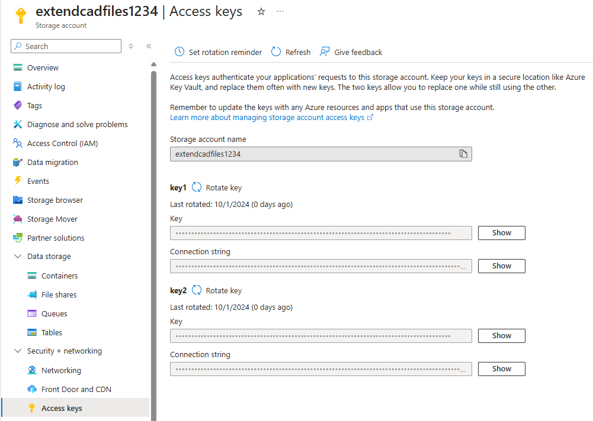

You've deployed Azure File Sync and configured both the Azure and on-premises environments. In this exercise, you'll map a drive to the Azure file share and check that the file sync works.

## Find your connection details

1. Sign in to the [Azure portal](https://portal.azure.com?azure-portal=true).

1. Go to the storage account by selecting **Storage accounts** > **extendcadfilesXXXX**. Your **Storage account** pane appears.

1. In the service menu, under **Security + networking**, select **Access keys**. The **Access keys** pane appears for your storage account.

   

1. Under **key1**, copy the **Key** value. You'll use this key to set up the mapped drive.

## Create a mapped drive to the Azure file share

1. If you closed your Remote Desktop connection, use these steps to connect to the VM:
    1. Sign in to the [Azure portal](https://portal.azure.com?azure-portal=true).
    1. Go to **Virtual machines** > **FileServerLocal**.
    1. Select **Connect** and then select **Native RDP**.
    1. Select **Download RDP File**, and then open the RDP file.
    1. In the **Windows Security** window, select **More choices** > **Use a different account**.
    1. Enter the user name **learnadmin** and the password you used when you created the VM.

1. On the toolbar, select **File Explorer**, and then select **This PC**.

1. In the menu at the top of the window, select **Computer** > **Map network drive**.

1. In the **Folder** box, enter **\\\extendcadfilesXXXX.file.core.windows.net\cadfileshare**. Replace the XXXX to match your storage account name.

1. Select **Connect using different credentials**.

1. Select **Finish**.

1. For the user name, enter **AZURE\extendcadfilesXXXX**. Replace the XXXX to match your storage account name. You might need to select **More choices** > **Use a different account**.

1. For the password, paste in the key you copied in the previous section.

1. Select **OK**.

## Check the file sync

1. Open a new File Explorer window.

1. Put the two File Explorer windows side by side, with D:\\CADFolder on the left, and the mapped cadfileshare on the right:

    

1. In the left window, below **CADFolder**, right-click and select **New** > **Text Document**.

1. Rename the file to **test**.

1. Confirm that the file replicates to the Azure file share in the right window.

