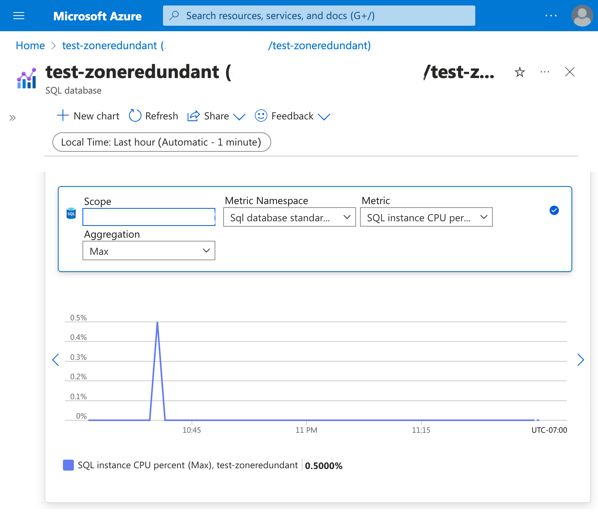
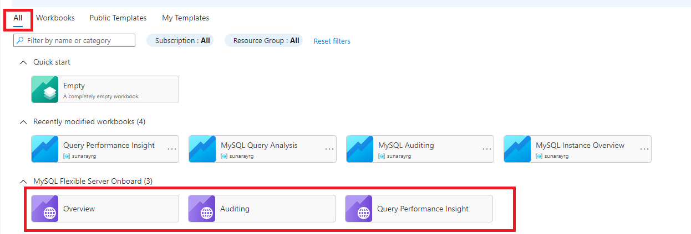
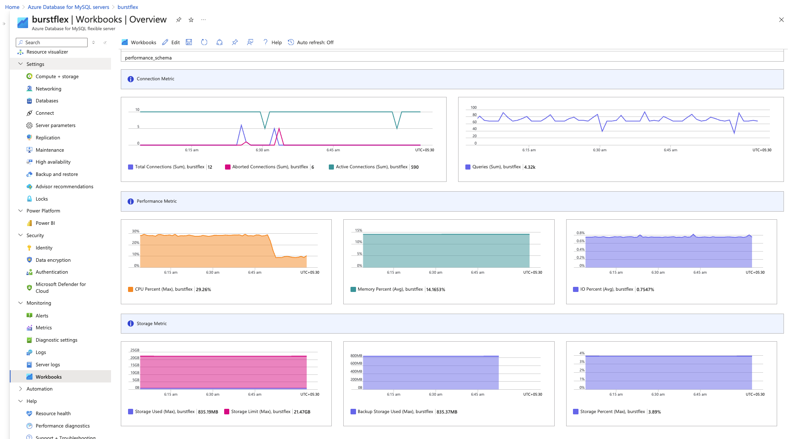
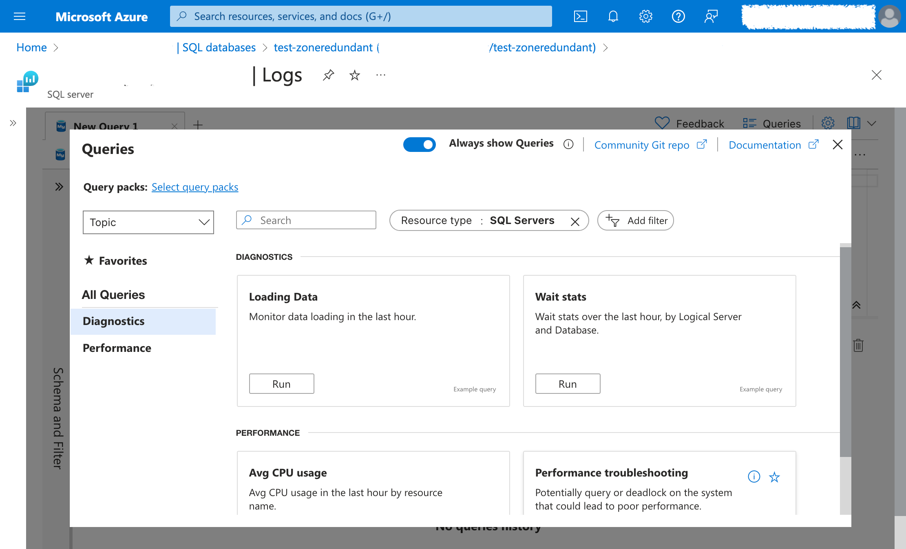
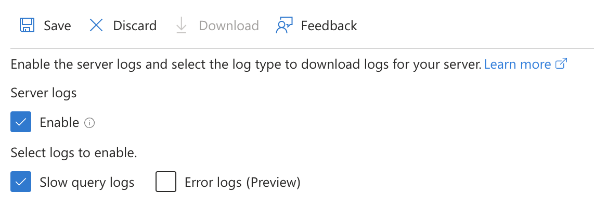
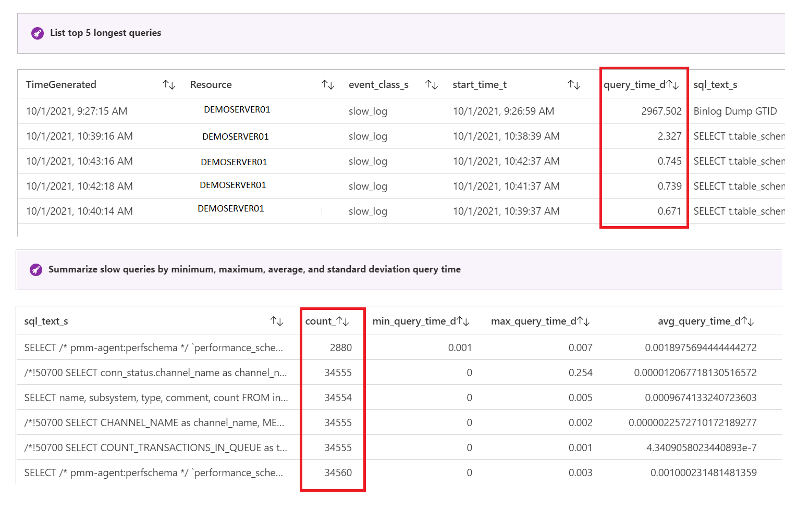
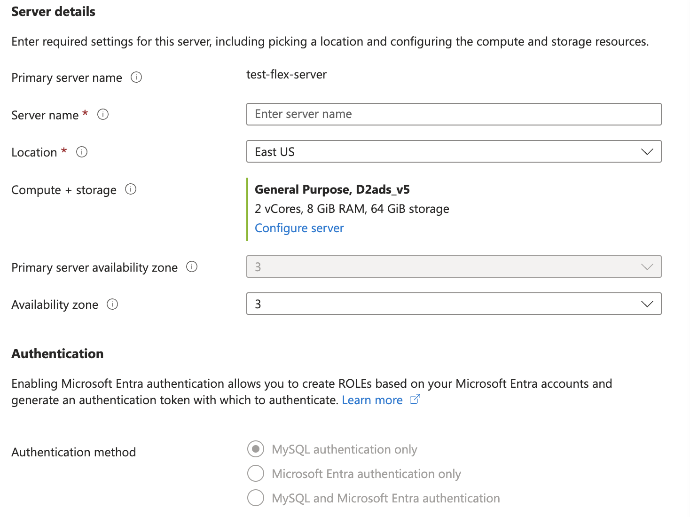

When it comes to sizing compute resources, consider whether existing and forecasted usage are well within capacity. You can gather necessary information by monitoring basic performance metrics such as CPU and RAM utilization. It may be possible to use the slow query log to identify and optimize poorly performing queries and remedy the performance problem without scaling the compute size. You should also monitor I/O performance to make sure database reads and writes aren't a performance bottleneck. Another option to effectively increase available capacity on the main database is to provision a read replica to shift query load. 

## Monitor database performance metrics

The Azure portal presents access to a [number of metrics](https://review.learn.microsoft.com/azure/mysql/flexible-server/concepts-monitoring) that you can use to monitor database performance. For example, you can visualize the CPU percentage used by a flexible server.

As CPU utilization nears 100%, database performance degrades severely. As a result, if the CPU utilization on your flexible server is consistently above 50%, consider increasing the compute size. 

You can view your performance metrics in the monitoring overview workbook. To access the overview workbook, perform these steps: 

1. In the Azure portal, on the left pane, under Monitoring for your Azure Database for MySQL flexible server instance, select Workbooks.

   

2. Select the **Overview** workbook. You will see graphs showing connections, CPU and memory usage, and other metrics, like the below screenshot. 

   

In addition to analyzing these metrics, you can view server diagnostics for insight into performance on the **Logs** panel of your flexible server.

Besides these metrics and logs, you can also monitor the [**Slow query log**](https://dev.mysql.com/doc/refman/8.4/en/slow-query-log.html) to capture details about long-running queries. This information can reveal existing slow queries for optimization, and you can set up alerts to immediately detect future query performance regressions for mitigation. 

To enable the Slow query log feature, on the page associated with your flexible server, select **Server logs**, and then select the "Enable” and “Slow query logs” check boxes. 

Once slow query logging is enabled, you can view query performance insights using log analytics, or visualization workbooks. To access the query performance insights, follow the same steps as above but select **Query Performance Insights** instead of Overview. 

You’ll see several visualizations, including the top 5 longest queries, or a summary of slow queries, as shown in the following screenshot. 

## Tune server performance parameters

You can configure MySQL server parameters to optimize performance based on your monitoring. For example, you can increase the value of `innodb_buffer_pool_size` to keep more table data in memory and save on disk reads. You can increase the `innodb_log_file_size` to reduce the buffer pool’s checkpoint flush activity, at the cost of slower crash recovery. 

If you find that application connections are queued, and the server load is acceptable, you can increase the number of max connections to allow more parallelism. 

To modify server parameters, go to the Azure portal for your MySQL flexible server and navigate to the **Server Parameters** section. Enter the parameter name into the search bar or browse through the **Top** or **All** supported server parameters. 

## Explore and enable the Autoscale IOPS feature

Azure Database for MySQL has two ways to allocate disk IO capacity: pre-provisioned vs “autoscaled” IOPS (I/O operations per second). 

**Pre-provisioned IOPS** may be preferable when database load is predictable and doesn't spike. The server gets a base number of IOPS provisioned, and you can allocate **additional IOPS** (up to the compute size max) as necessary by going to **Compute + storage**: 

In the event of a spike, server performance may degrade temporarily if I/O operations exceed the allocated value. However, capacity and costs are predictable. 

The **Autoscale IOPS** feature is built for unpredictable, spiky, or growing database traffic. With this feature enabled, IOPS scale dynamically, so manual adjustment isn’t required to optimize cost or performance as the workflow fluctuates. As a result, using the Autoscale IOPS feature handles unpredicted workload spikes transparently, and you pay only for operations consumed, not for unused capacity. 

For an existing MySQL flexible server, you can enable the Autoscale IOPS feature in the Azure portal, by selecting **Compute + storage**: 

> [!Note]
>
> You can also enable the Autoscale IOPS feature during server creation. 

### Monitor IOPS

Monitoring IOPS allows you to determine how close your instance is to the maximum IOPS, if you are using pre-provisioned IOPS, or to the compute size’s maximum in the case of the Autoscale IOPS feature. 

To monitor IOPS performance, navigate to the **Metrics** blade under the **Monitoring** section or to the **Overview** blade, if you want to view IOPS performance along with other common metrics. 

At WingTip Toys, because you anticipate a major increase in traffic at unpredictable times as the marketing campaign rolls out, you want to avoid the risk of not being able to accommodate incoming orders. You also want to avoid paying for maximum capacity if you don’t actually need it. You select to use the Autoscale IOPS feature rather than pre-provisioned IOPS, which requires adding more IOPS manually as needed. This approach balances cost effectiveness with scalability on demand.

## Provision a read replica

You provision read replicas to offload read-only queries to a separate database, reducing load on the main application database. 

To provision a read replica, in the Azure portal, on the page associated with your flexible server, select **Replication**, and then select **Add replica**. 

After you create the read replica, you can configure the replica server name and its compute and storage settings. Note that you cannot change some settings, like authentication, which are inherited from the primary server. 

At Wingtip Toys, the data science team and reporting tools can now query the read replica server, reducing the load on the main application database and removing the need to throttle analytics or limit queries off-hours. 