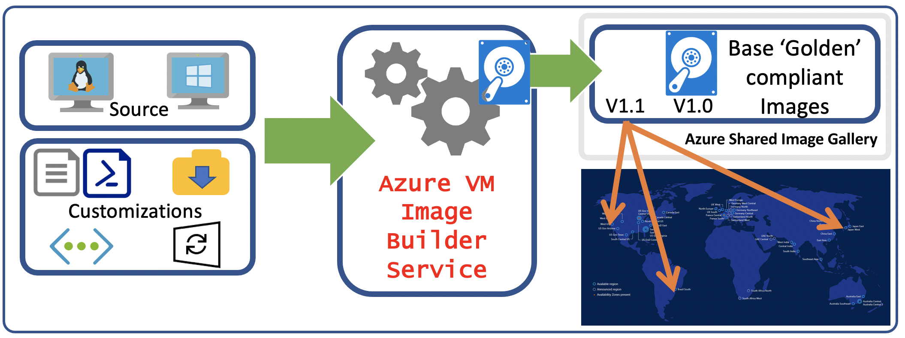

## How does Azure Image Builder work?

The Azure Image Builder (AIB) service can be integrated with existing image build pipelines for a click-and-go experience. You can call the AIB service from your pipeline. Azure Image Builder lets you start with Windows or Linux images either from the Azure Marketplace or from existing custom images, and then add your own customizations. You can also specify where you want your resulting images to be hosted in Azure Compute Gallery (formerly Shared Image Gallery), as managed images or as VHDs.

## Azure Image Builder workflow

To use Azure Image Builder, you need to create a configuration that describes your image and submit it to the service, where the image is built and then distributed. You can migrate your existing image customization pipeline to Azure as you continue to use existing scripts, commands, and processes. A high-level workflow is illustrated in the following diagram:

Azure Image Builder allows you to pass template configurations by using Azure PowerShell, the Azure CLI, or Azure Resource Manager templates, or by using a VM Image Builder DevOps task. When you submit the configuration to the service, Azure creates an image template resource. When the image template resource is created, a staging resource group is created in your Azure subscription in the following format: `IT_<DestinationResourceGroup><TemplateName>(GUID)`. The staging resource group contains files and scripts, which are referenced in the File, Shell, and PowerShell customization in the `ScriptURI` property.

To run the build, you invoke `Run` on the VM Image Builder template resource. The service then deploys additional resources for the build, such as a VM, network, disk, and network adapter. If you build an image without using an existing virtual network, VM Image Builder also deploys a public IP and network security group, and it connects to the build VM by using Secure Shell (SSH) or Windows Remote Management (WinRM) protocol. If you select an existing virtual network, the service is deployed via Azure Private Link, and a public IP address isn't required.

When the build finishes, all resources are deleted, except for the staging resource group and the storage account. You can remove them by deleting the image template resource, or you can leave them in place to run the build again.

## Azure IT organization

In the scenario described earlier regarding your IT organization, you can use Azure Image Builder to create machine images for your Azure environment using standardized VM images and create a configuration that describes your image and submit it to the service for building and distribution to the customer's Azure environment.

After the image is built, you can deploy the machine images to the customer's Azure environment and test the software to ensure that it is working correctly. Thanks to the AIB service, the entire process is much faster and more efficient for distributing applications compared to manual image creation and deployment.