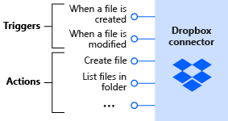
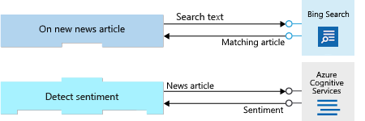
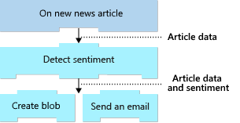

Now that we know the basics of Azure Logic Apps, let's see how it works behind the scenes. This information should help you decide whether Azure Logic Apps can work for you without any customization. So that in cases where you do need to create custom components, you're able to determine how difficult it could be.

## What is a connector?

A *connector* is a component that provides an interface to an external service. For example, the X connector allows you to send and retrieve tweets, while the Office 365 Outlook connector lets you manage your email, calendar, and contacts. Azure Logic Apps provides hundreds of prebuilt connectors that you can use to create your apps.

A connector uses the external service's REST or SOAP API to do its work. When you use a connector in your logic app workflow, the connector calls the service's underlying API for you. The following illustration shows the X connector and its use of the X REST API.

## Custom connectors

You can write custom connectors to access services that don't have prebuilt connectors. The services must have a REST or SOAP API. The requirement that the services provide an API shouldn't be too surprising since connectors are essentially wrappers around that underlying API.

To create a custom connector, you first generate an OpenAPI or Postman description of the API. You then use that API description to create a custom connector resource in the Azure portal. You can give your connector a name, an icon, and a description for each operation. The following illustration shows an example of the process. Notice that there's no coding involved.

You can use your new connector in your own apps and share it with other people in your organization. You can also submit your connector to Microsoft for certification. Once your connector is certified, it's included in the set of connectors available to all users.

## What are triggers and actions?

Workflows are built from different types of tasks. For example, in our social media monitoring scenario, the workflow starts when a new tweet is posted. The workflow then analyzes the sentiment and makes a decision, based on the sentiment score. Azure Logic Apps uses the terms *trigger*, *action*, and *control action* for these concepts. These operations are the building blocks of Azure Logic Apps. The following diagram shows how to use each type of step in the social media monitoring app.

Let's be more specific about the definitions for trigger and action:

- A *trigger* is an event that occurs when a specific set of conditions is satisfied. Triggers activate automatically when conditions are met. For example, when a timer expires or data becomes available.

- An *action* is an operation that executes a task in your business process. Actions run when a trigger activates or another action completes.

A connector is a container for related triggers and actions. Let's look at a few examples.

The X connector lets your logic app workflow interact with X. The social media monitoring app can use a trigger from the X connector to determine when new relevant tweets are available. The following diagram shows the X connector with its trigger and actions:

Next, we have the Dropbox connector. Suppose you're working with a small team on a project that stored shared data in Dropbox. You can build a workflow that detects when someone changes any files and sends a notification to the other team members. The following diagram shows the Dropbox connector with its triggers and actions:

Finally, let's look at the Twilio connector. Most connectors offer both triggers and actions, but this connector only has actions. The Twilio connector is useful when you want to send text messages for notifications. For example, you could use the Twiliio connector in the Dropbox scenario to message team members when a shared file changed. The following diagram shows the Twilio connector and its actions:

## How to build workflows from triggers and actions

You build a workflow by choosing operations, specifically, a trigger and actions. A workflow must start with a trigger. You can then follow the trigger with as many actions as you need to implement your workflow. The following diagram shows the trigger and actions used in the social media monitoring app:

:::image type="complex" source="../media/social-media-connectors.png" alt-text="Diagram shows the trigger and actions in the social media monitoring app. Each operation shows the associated external service.":::
Diagram shows the trigger and actions in the social media monitoring logic app. The diagram shows the X trigger named "When a new tweet is posted", which launches the logic app workflow. The trigger is followed by three actions: "Detect sentiment" from the Text Analytics service, "Insert row" from SQL Server, and "Send email" from Outlook.com.
:::image-end:::

## How do triggers and actions work together?

Triggers and actions are essentially function calls to an underlying API operation. Each operation has inputs and outputs. For example, the X trigger named **When a new tweet is posted** takes in a search string and returns the tweets that contain that string. The Text Analytics action named **Detect sentiment** action takes a string as input and returns the sentiment score as a floating-point number. The following diagram shows these two operations:

Azure Logic Apps automatically makes the return values available throughout the rest of the operations. This feature lets you pass the results from one operation as input to the next operation. The following diagram shows the data flow for the first two operations in the social media monitoring app.

The results or outputs from an operation are available to all subsequent steps:

## What are control actions?

Most workflows need to run different actions, based on the data that's processed. For example, a workflow might route an expense report to a different manager, based on the expense amount. In the social media monitoring app, the workflow needs to branch, based on a tweet's sentiment score. The following diagram shows the flowchart for the social media monitoring app and highlights the control logic:

*Control actions* are special actions built-in to Azure Logic Apps that provides these control constructs:

- *Condition* statements controlled by a Boolean expression.
- *Switch* statements.
- *For each* and *until* loops.
- Unconditional *branch* instructions.

The following diagram shows the use for the *condition* statement in the social media monitoring app:

## What is the workflow designer?

The workflow designer is a graphical tool for creating your workflows. The designer provides a canvas surface where you add a trigger and actions to your workflow. For example, the social media monitoring app uses the trigger named **When a new tweet is posted**, a control action known as a *condition*, and actions named **Detect sentiment**, **Insert row**, and **Send an email**. The following screenshot shows the social media monitoring workflow in the designer:

:::image type="complex" source="../media/social-media-complete-in-the-designer.png" alt-text="Screenshot shows the social media monitoring app in the workflow designer.":::
Screenshot shows an example workflow in the designer. Each step is represented as a rectangular shape for the starting trigger and each action. Arrows connect the rectangles to show the execution flow through the app.
:::image-end:::
