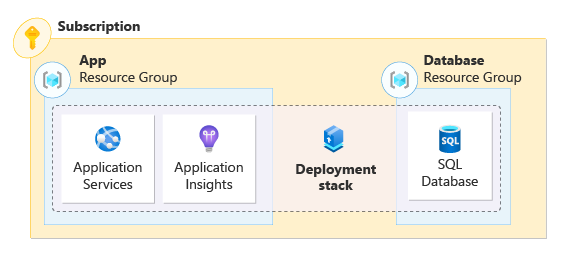

You've developed an understanding of deployment stacks and the benefits it provides for lifecycle management. Before you begin the process of building deployment stacks for your deployments, you want to learn more about the deployment stack resource.

In this unit, you learn about the deployment stacks resource and some of the operations it can perform.

## The deployment stacks resource

Azure Resource Manager (ARM) is the service that deploys and manages resources in Azure. You can use Resource Manager to create, update, and delete resources in your Azure subscription.

A deployment stack is a native Azure resource, which allows for typical ARM operations to be performed on the stack as a whole. A deployment stack can inherit an Azure policy assignment, and Azure role-based access control (RBAC) assignment, or even a Microsoft Defender for Cloud security recommendation. Within a deployment stack are pointers to all of the resources, resource groups, and management groups managed by the stack. The managed resources defined in the stack can easily be created, updated, or deleted with a single operation on the deployment stack resource.

## Deployment stacks operations

A resource provider is a collection of REST operations that enable features for a particular Azure service. For example, the Azure SQL Database service consists of a resource provider named `Microsoft.Sql` and its full resource type is `Microsoft.Sql/servers/databases`.

Deployment stacks are part of the `Microsoft.Resources` resource provider and its full resource type is `Microsoft.Resources/deploymentStacks`. Its REST operations include creating a new stack, listing a stack, updating an existing stack, or deleting a stack. For its resources, you're able the view the resources in the stack, add and remove resources, and protect resources from deletion.

Each of these operations has a few key properties that control the behavior of the stack.

### Deny settings options

*Deny settings* prevent changes to the resources within a stack. They're a specific type of permission that is assigned to a deployment stack and its managed resources. These deny settings supersede any Azure role-based access control (RBAC) permissions that may be in place.

When using deny settings, you can set a parameter that defines which operations are allowed on resources managed by the deployment stack. This parameter, known as the *deny settings mode*, determines if resources within the stack can be modified or deleted when managed by the stack. The deny settings mode has three possible values for behavior: deny delete, deny write and delete, and none.

The *deny delete* value allows resources managed by the stack to be modified, but not deleted. The *deny write and delete* value effectively makes the resources managed by the stack read-only. The *none* value allows resources managed by the stack to be modified and deleted.

Deny settings also allow you to apply the settings to child scopes and nested resources. For example, if a deployment stack, with deny settings, is created at the subscription scope, those deny settings would apply to the resource group scope as well. Additionally, any nested resources defined in Bicep files, ARM JSON templates, or template specs would inherit the values defined in the deny settings.

It's possible to override the deny settings for specific role based access control roles. Let's say that you create a deployment stack with the deny settings mode set to deny write and delete. One of the managed resources in the stack is a virtual machine. You don't want changes to be made to the configuration of the virtual machine, but you do want your administrators to be able to power it on and off. To provide the appropriate access, you exclude the "Microsoft.Compute/virtualMachines/start/action" and "Microsoft.Compute/virtualMachines/powerOff/action" actions using the *deny settings excluded actions* parameter.

Another scenario that may exist is to override the deny setting for a specific user or service principal. For example, if you're using an infrastructure as code pipeline to create your deployment stacks, the service principal executing the pipeline needs to have permission to make changes to the resources managed by the stack. The *deny settings excluded principals* parameter controls this behavior.

### Resource detachment and deletion

A resource that is no longer managed or tracked by a deployment stack, is known as a detached resource. A detached resource still exists within Azure, but the stack no longer tracks it. You're able to control how Azure handles detached resources, resource groups, and management groups with a property known as the *action on unmanage* parameter.

When using this parameter, you choose from three possible options that determine how detached resources are handled:

- Delete Resources - deletes resources and detaches resource groups and management groups.
- Delete All  - deletes resources, resource groups, and management groups.
- Detach All - detaches resources, resource groups, and management groups.

 The action on unmanage parameter can be set when creating, modifying, or deleting a deployment stack. All three operations have the ability to set the behavior of the action on unmanage parameter. Let's say that you create a deployment stack using the Azure CLI and set the action on unmanage behavior to detach all. If you delete the stack and specify the behavior as delete all, then that value takes precedence. Consider it an overwrite of the original value.
