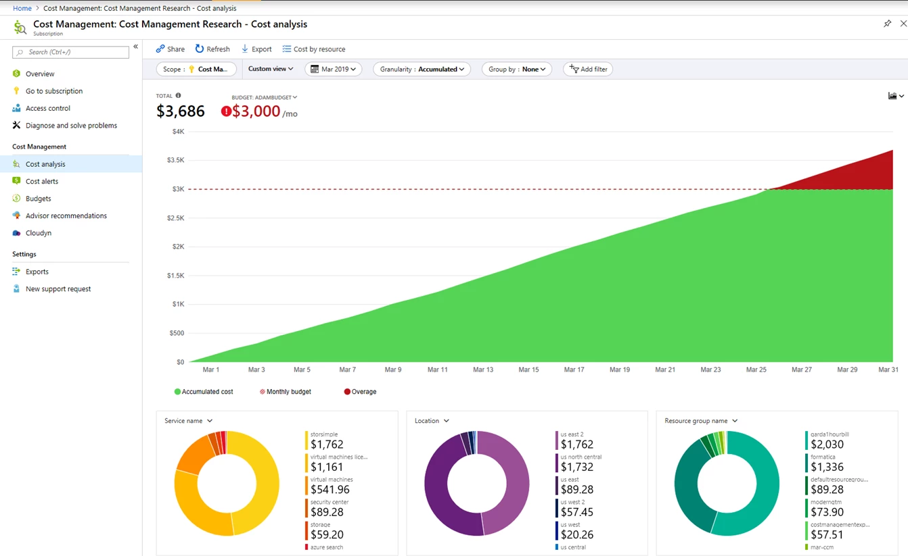

Now you feel confident in your ability to describe the process of migrating your Oracle application to Oracle Database@Azure and Azure VMs. However, you also want to convey to your managers how to optimize costs and simplify management in Azure.

When you're thinking about a cloud migration project, consider the following questions.

## How does your application fit within your organization's wider Azure strategy?

During a migration, you're primarily concerned with successfully transitioning a specific application to the cloud. But you also want to make sure each migration fits into your organization's broader effort to adopt modern cloud-hosting solutions. As such, you need to understand the goals, limitations, and overall strategy of this effort.

Find guidance to help your organization plan, manage, and govern its cloud adoption process in the [Microsoft Cloud Adoption Framework for Azure](/azure/cloud-adoption-framework/). Following the best practices in this framework can help your organization achieve the best business outcomes possible in your cloud adoption effort. When planning this effort, make sure that you've considered the following concepts:

- Fit your workload within the wider organizational [cloud adoption strategy](/azure/cloud-adoption-framework/strategy/). This strategy includes both business justification and aspirational goals for the organization's cloud adoption efforts. If your organization hasn't already defined this strategy, work with your managers and wider business team to start the process of creating one.

- Understand or help establish your organization-wide [cloud adoption plan](/azure/cloud-adoption-framework/plan/) for all cloud-hosted workloads and how that affects your particular workload migration. This plan creates actionable plans from the overall strategy and can set you up for success [managing and organizing your Azure resources](/azure/cloud-adoption-framework/ready/landing-zone/design-area/resource-org).

- Determine how your application fits into the global [management group](/azure/cloud-adoption-framework/ready/landing-zone/design-area/resource-org-management-groups) and [subscription](/azure/cloud-adoption-framework/ready/landing-zone/design-area/resource-org-subscriptions) structure. Be aware of any permissions or administrative restrictions you may need to address.

- Plan for [governance](/azure/cloud-adoption-framework/govern/) after migration, based on organizational policies and processes. If you don't have these policies and processes, you'll need to create them prior to migration.

- Identify [security](/azure/cloud-adoption-framework/secure/) and [management](/azure/cloud-adoption-framework/manage/) requirements for your workloads. Are there network or access restrictions that need to be implemented as a matter of policy? Are there logging and alerting requirements you need to meet? Are there legal or other jurisdictional issues that apply to your data?

Oracle's partnership with Azure allows you to combine management features between OCI and Azure to help achieve your governance goals. For example, you can combine Oracle and Microsoft access control and identity management by integrating [Oracle OCI Identity and Access Management (IAM) with Microsoft Entra ID (formerly Azure Active Directory)](https://blogs.oracle.com/cloudsecurity/post/managing-identity-across-oci-iam-and-azure-ad). When reviewing your governance and management plans, make sure you explore how OCI and Azure can work together.

Billing and payment for Oracle Database@Azure is handled through Azure. Payment counts toward your organization's [Microsoft Azure Consumption Commitment (MACC)](/partner-center/marketplace/azure-consumption-commitment-enrollment).

## How can you best optimize your costs on Azure?

Just as important as addressing and accommodating your organization's wider cloud adoption plans is learning how to optimize the cost of your Azure resources. Azure offers many potential cost benefits over traditional on-premises hosting, but to make the most of these benefits, be sure to proactively [plan how to manage Azure costs](/azure/cost-management-billing/understand/plan-manage-costs).

Cost optimization includes ensuring that the size and scale of your compute or storage usage is appropriate to your needs. For example, you may find that the VM sizes you chose for your app migration are larger than needed or that the VM instance count you're running to handle peak demand is much higher than during low-demand periods. Achieve savings by resizing your VMs to better match your needs or setting up scaling rules to add or remove instances on demand. Azure tools can help:

- Make sure that the size and scale of your compute or storage usage is appropriate to your needs. Achieve savings by resizing your VMs to better match your needs or setting up scaling rules to add or remove instances on demand.

- Make sure that you've got the appropriate Oracle licenses and support contracts in place. Existing Oracle customers can use the Bring Your Own License (BYOL) option or Unlimited License Agreements (ULAs). Oracle has guaranteed license mobility between on-premises and Azure licensing, and it offers pricing parity for licenses between OCI and Azure. For more information about Oracle licensing on Azure, see the [Oracle and Microsoft Strategic Partnership FAQ](https://www.oracle.com/cloud/azure/interconnect/faq/).

- Get insight into spending and areas where you could improve usage by using the [Microsoft Cost Management](/azure/cost-management-billing/costs/overview-cost-management) tools.

- Analyze deployed Azure resources and get performance and cost optimization recommendations from [Azure Advisor](/azure/advisor/advisor-overview).

- Help ensure that your solutions are reliable, secure, and performant, and optimized for costs by following the [Azure Well-Architected Framework](/azure/well-architected/) approach when designing your Azure solutions.

- Take self-paced training to learn how to manage Azure costs with the following learning path on Microsoft Learn: [Control Azure spending and manage bills with Microsoft Cost Management + Billing](/training/paths/control-spending-manage-bills/).

- Lock in pricing with [Azure Reservations](/azure/cost-management-billing/reservations/save-compute-costs-reservations) for significant savings over pay-as-you-go rates, if you can predict your cloud usage.
