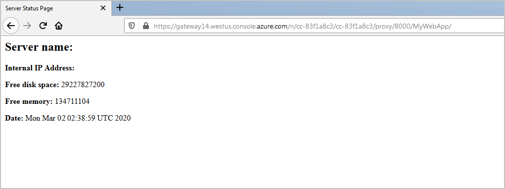

In the previous exercise, you learned how to configure your web app to use the Maven Plugin for Azure App Service. Your Maven project is properly configured and tested. You can iterate, improve, and redeploy your app to Azure. For example, let's say you want to retrieve some specific details about where Azure has deployed your application code and redeploy your web app.

In this exercise, you'll update the `index.jsp` page for your web app to include some information about the server. After testing those changes locally, you'll redeploy your web app to Azure.

## Update and test your web app

1. Use `code` to edit your `index.jsp` page:

    ```bash
    code ~/MyWebApp/src/main/webapp/index.jsp
    ```

1. Replace the contents of this file with the following HTML and inline Java code:

    ```html
    <%@ page import = "java.io.*,java.util.*, jakarta.servlet.*, java.net.InetAddress, java.io.File" %>
    <html>
    <head><title>Server Status Page</title></head>
    <body>
        <h2>Server name: <% out.print(InetAddress.getLocalHost().getHostName());%></h2>
        <p><strong>Internal IP Address:</strong> <% out.println(InetAddress.getLocalHost().getHostAddress()); %></p>
        <p><strong>Free disk space:</strong>
            <%
                File file = new File("/");
                out.println(file.getFreeSpace());
                file = null;
            %>
        </p>
        <p><strong>Free memory: </strong>
            <% 
                out.println(Runtime.getRuntime().freeMemory());
            %>
        </p>
        <p><strong>Date: </strong>
            <%
                Date date = new Date();
                out.print(date.toString());
                date = null;
            %>
        </p>
    </body>
    </html>
    ```

1. Save your changes by typing <kbd>Ctrl</kbd>+<kbd>S</kbd>.

1. Quit the code editor by typing <kbd>Ctrl</kbd>+<kbd>Q</kbd>.

1. You'll need to open a port to make the local web server available to view in a browser. In the Cloud Shell, use `curl`:

    ```bash
    curl -X POST http://localhost:8888/openPort/8000;
    ```

1. Run the app locally with the following Maven command:

    ```bash
    mvn package cargo:run
    ```

1. Open a new browser tab using the URL in the JSON, appending `MyWebApp/`. You should see the new Server Status page:

    

1. Visit the deployed app by selecting the URL in the shell to see the deployed app running on App Services.

1. Stop the web app with <kbd>Ctrl</kbd>+<kbd>C</kbd>.

1. Close the open port using `curl`.

    ```bash
    curl -X POST http://localhost:8888/closePort/8000;
    ```

## Redeploy your web app

1. Rebuild and redeploy the app:

    ```bash
    mvn clean package
    mvn azure-webapp:deploy 
    ```

    Maven displays a series of build messages, and the final message should indicate successful deployment to Azure.

    ```console
    [INFO] Successfully deployed the resources to MyWebApp-1570214065588
    [INFO] Trying to deploy artifact to MyWebApp-1570214065588...
    [INFO] Deploying (/home/cephas/MyWebApp/target/MyWebApp.war)[war]  ...
    [INFO] Application url: https://MyWebApp-1570214065588.azurewebsites.net
    [INFO] ------------------------------------------------------------------------
    [INFO] BUILD SUCCESS
    [INFO] ------------------------------------------------------------------------
    [INFO] Total time:  01:00 min
    [INFO] Finished at: 2024-05-02T12:58:05Z
    [INFO] ------------------------------------------------------------------------
    ```

1. Visit the deployed app by selecting the URL in the shell:

    :::image type="content" source="../media/6-web-app-on-tomcat-server.png" alt-text="Example web app running on Tomcat in a web browser." loc-scope="other"::: <!-- no-loc -->

## Stream logs in real time

You've now deployed and run your app on App Service. If you need to troubleshoot, you can use this Azure CLI command to get real-time log streaming from the app:

```azurecli
az webapp log tail -n <app name> -g "<rgn>[sandbox resource group name]</rgn>"
```

In the next unit, you'll learn how to authenticate your web app deployments to Azure App Service.
