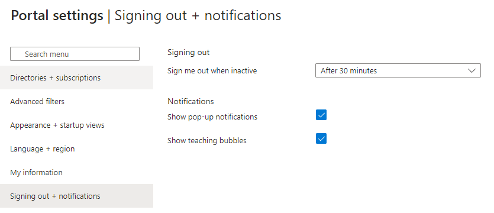

With an Azure account, you can sign into the **Azure portal**. The portal is a web-based administration site that lets you interact with Azure services and the resources you've created. Almost everything you do with Azure can be done through this web interface.

## Azure portal layout

When you first sign in to the Azure portal, the default page is **Home**.

:::image type="content" source="../media/2-azure-portal.png" alt-text="Screenshot showing the Home page of the Azure portal." lightbox="../media/2-azure-portal.png":::

You can change your default view to the customizable **Dashboard** in the portal's settings. You'll learn more about dashboards later in this module.

## Portal menu

:::row:::
    :::column:::
    :::image type="content" source="../media/3-favorites.png" alt-text="Screenshot of the portal menu and Favorites in the Azure portal.":::
    :::column-end:::
    :::column span="3":::

    In the left-hand sidebar of the portal is the portal menu, which lists different Azure services and resource types.

    Azure has many more services than what's shown in this menu. The services listed here are the ones in your **Favorites**.

    You can customize your **Favorites** with the specific resource types that you tend to create or administer most often.
    :::column-end:::
:::row-end:::

## Azure portal global controls

The Azure portal displays several icons in the status bar at the top-right side of the screen. These icons are global controls that are always available, no matter what service you're working with. Each icon provides quick access to useful functionality, such as configuring settings or viewing notifications about portal activity.

:::image type="content" source="../media/5-portal-icon-bar.png" alt-text="Screenshot of the global control icons at the top of the Azure portal.":::

If you're viewing the Azure portal on a screen with reduced horizontal space, you might need to expand an ellipsis (**...**) menu to view the global controls.

Let's walk through each of these controls to understand them better.

### Cloud Shell

Select the **Cloud Shell** icon (>_) to create a new Azure Cloud Shell session. Recall that Azure Cloud Shell is an interactive shell for managing Azure resources. This browser-based terminal lets you control and administer your Azure resources through a command-line interface built right into the portal.

### Notifications

Select the bell icon to display the **Notifications** pane. This pane gives you information about the most recent actions that have been carried out, along with their status.

### Settings

Select the gear icon to change the Azure portal settings. In the tabs at the left, there are multiple options that let you change settings such as:

- Directories and subscription management
- Inactivity sign out delay
- Default view when you first sign in
- Flyout or docked option for the portal menu
- Color and contrast themes
- Language and regional format

### Support + troubleshooting pane

Select the question mark icon to show the **Support + troubleshooting** pane. This is where you can get help if you're experiencing a problem or need support. You can also see if any ongoing health events are impacting your Azure subscription or find links to support resources.

### Feedback pane

Select the **Feedback** icon to open a pane that lets you send feedback about Azure to Microsoft. You can decide whether or not to allow Microsoft to respond to your feedback by email.

### Profile settings

If you select your name in the top right corner, a menu opens with a few options:

- Sign in with another account, or sign out entirely
- View your account profile, where you can change your password

Select the "..." button on the right-hand side for options to:

- Check your permissions
- View your bill
- Submit an idea
- Update your contact information

### Azure Marketplace

The *Azure Marketplace* is often where you start when creating new resources in Azure. The Marketplace lets you find, try, purchase, and provision applications and services from hundreds of leading service providers, all certified to run on Azure.

The solution catalog spans thousands of offerings across multiple industry categories, such as open-source container platforms, virtual machine images, databases, developer tools, and blockchain. Using Azure Marketplace, you can deploy end-to-end solutions hosted in your own Azure environment.

### Azure Advisor

Finally, the Azure Advisor is a free service built into Azure that provides recommendations on high availability, security, performance, operational excellence, and cost. Advisor analyzes your deployed services and suggests ways to improve your environment across those areas. You can view recommendations in the portal or download them in PDF or CSV format.

You can access Azure Advisor by selecting **Advisor** from the navigation menu, or search for it in the **All Services** menu.

:::image type="content" source="../media/3-advisordashboard.png" alt-text="Screenshot of the Azure Advisor Overview page in the Azure portal.":::

Now let's try some of these features out!
