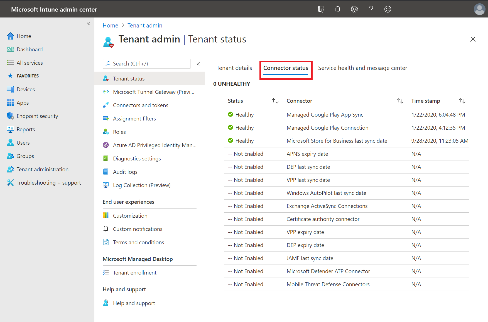

As part of the Tenant Status dashboard, you can view the status for all available connectors for Intune.

Connectors are connections you configure to external services. For example, external resources might be the *Apple Volume Purchase Program* service or the *Windows Autopilot* service. Status for these types of connectors is based on the last successful synchronization time. Connectors are also certificates or credentials that are required to connect to an external unmanaged service like *Apple Push Notification Services* (APNS) certificates. Status for this type of connector is based on the expiry timestamp of the certificate or credential.  

When you open the *Connector status* tab, any unhealthy connectors display at the top of the list. Next are connectors with warnings, and then the list of healthy connectors. Connectors you haven't yet configured appear last as *Not Enabled*. Status for this type of connector is based on the last successful synchronization time.

When you select a connector from the list, the portal presents the portal page that's relevant to that connector. From the connectors page, you can view the status for previously configured connectors, or select options to add or create a new connector of that type. For example, if you select the **VPP Expiry Date** connector, the **iOS Volume-Purchased Program Tokens** page opens, where you can view more details about that connector. You can also create a new configuration, or edit and fix issues with an existing one.
