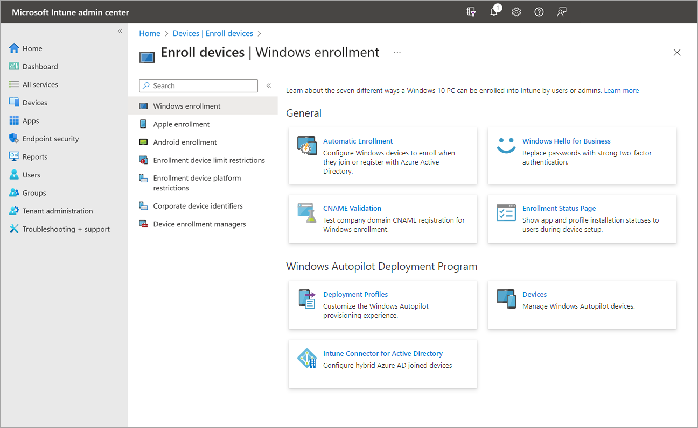

Now that your devices are provisioned, you must enroll them in Intune before you can safeguard their access to your organization's resources. In Intune, enrolling means the device is connected and Intune recognizes the device based on a mobile device management (MDM) certificate. There are several methods to enroll your workforce's devices. Each method depends on **device ownership** (personal or corporate), **device type** or platform (iOS/iPadOS, Windows, Android, macOS), and **device management requirements** (resets, affinity, locking). Let's take a look at these methods.

> [!NOTE]
> For Configuration Manager, you install the Configuration Manager client on a device, then it registers with the site.

## Device ownership

You can allow device ownership to be corporate or personal. Corporate-owned devices (CODs) include phones, tablets, and PCs the organization owns and distributes to the workforce. COD enrollment supports scenarios like automatic enrollment, shared devices, or preauthorized enrollment requirements. A common way to enroll CODs is for an administrator or manager to use the device enrollment manager (DEM). You can enroll iOS/iPadOS devices directly through Apple's Automated Device Enrollment (ADE) tools. You can also identify and tag devices with an international mobile equipment identifier (IMEI) number as corporate-owned.

Personally owned devices are often referred to as *bring your own devices* (BYOD). BYOD includes personally owned phones, tablets, and PCs. Users install and run the Company Portal app to enroll BYODs, and can do common tasks in the Company Portal. Common tasks might include enrolling devices, installing apps, and locating your organization's information, such assistance details from your IT department.

## Device type

The available device types that Intune can manage include iOS/iPadOS, Windows, Android, and macOS. These device types are also known as *platforms*. Each platform offers slightly different enrollment methods, device settings, protection-policy settings, configuration-policy settings, custom policy settings, and remote actions.

## Device management requirements

As part of the enrollment process, your organization might require specific initial actions before a device can connect to your organization to ensure protection and safe access. You can choose reset required, user affinity, and locked. **Reset required** wipes the devices during enrollment. **User affinity** associates each device with a user. **Locked** prevents users from unenrolling their device. Based on these requirements and the device type, you can choose which enrollment methods are best for your organization.
