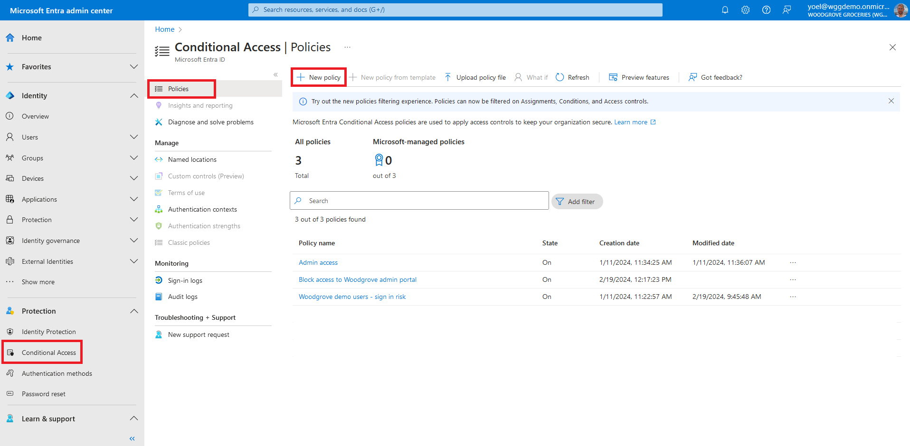
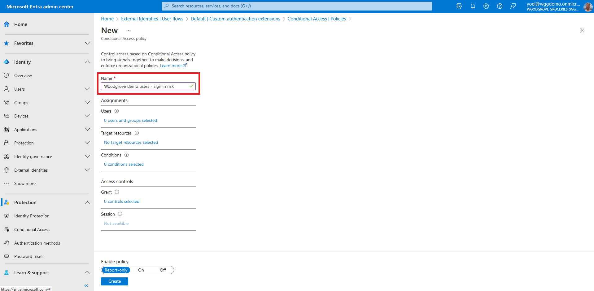
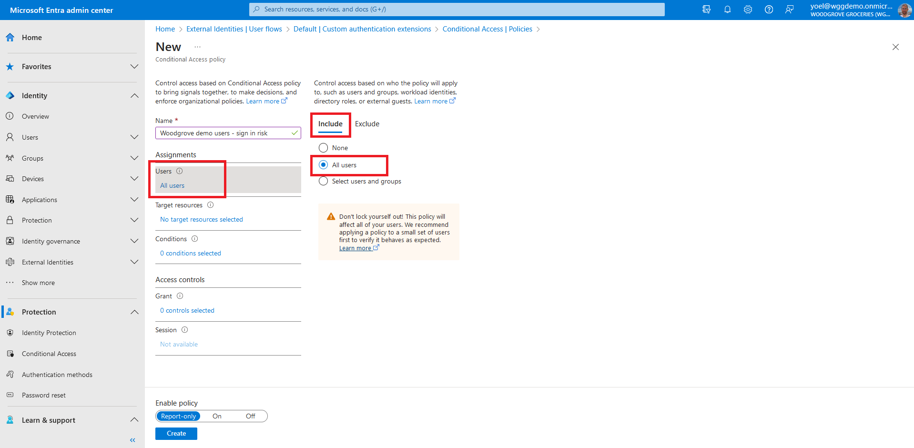
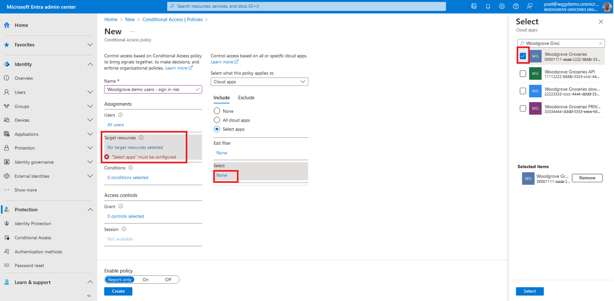
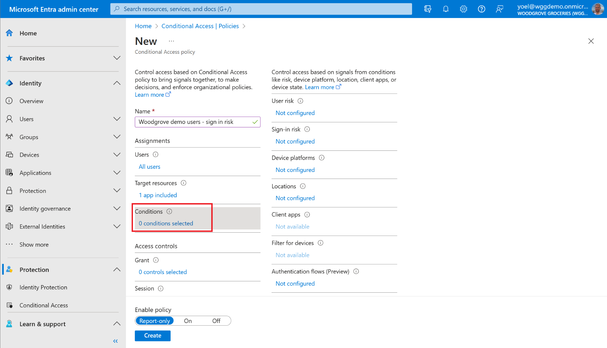
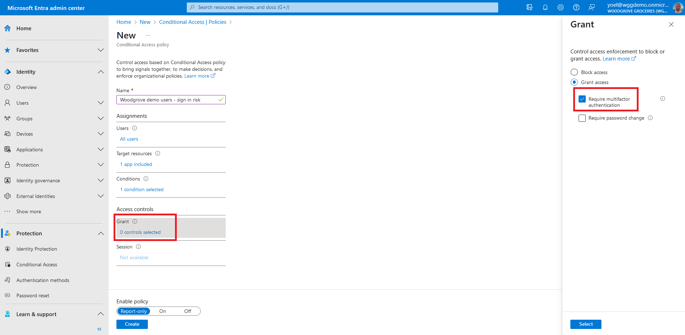
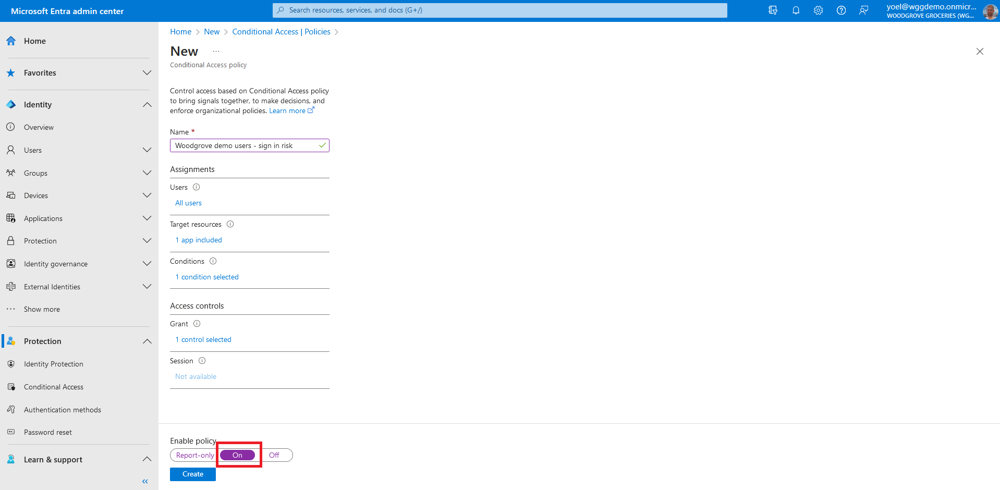

## Exercise - Enable multifactor authentication (MFA)

[Multifactor authentication (MFA)](/entra/external-id/customers/how-to-multifactor-authentication-customers) protects consumer identities by prompting them for a second verification method. Microsoft Entra Conditional Access brings signals together, to make decisions, and enforce security policies. For our groceries website, we'll enforce a Conditional Access policy that prompts for MFA. The Conditional Access policy targets all users without any condition.

You'll need at least the [Authentication Policy Administrator](/entra/identity/role-based-access-control/permissions-reference#authentication-policy-administrator) directory role to enable multifactor authentication.

::: zone pivot="microsoft-entra-admin-center"

1. Start by creating a Conditional Access policy to secure the application. Sign in to the [Microsoft Entra admin center](https://entra.microsoft.com/) and browse to **Protection** > **Conditional Access**. Then, select **New policy**.
    
1. Give your policy a **Name**, for example *sign-in risk*.
    
1. Under **Assignments**, select the link under **Users**. Then, on the **Include** tab, select **All users**. On the **Exclude** tab, you can select users and groups for your organization's emergency access or break-glass accounts.
    
1. Under **Assignments**, select **Target resources**. Then, On the **Include** tab, choose the **Select apps** option and click on the **Select** button. Find your app, select it, and then choose **Select**.
    
1. Skip the **Conditions** section and move to the next step.
    
1. Under **Access controls** > **Grant**, select **Grant access**. Then select **Require multifactor authentication**. With this grant type, users must complete additional security requirements like email, phone call, or text message.
    
1. Confirm your settings and set **Enable policy** to **On**. Select **Create** to create your policy.
    
    ***Well done!** You created a Conditional access policy that requires users to complete MFA. To check the user experience, sign-in to your application.*
::: zone-end

::: zone pivot="microsoft-graph-api"

#### Create conditional access policy
The following example creates a [conditional access policy](/graph/api/conditionalaccessroot-post-policies?view=graph-rest-beta&tabs=http). This policy targets all sign-ins for all users (except for the tenant's Global Administrator.) In the request below, replace the **{web-or-mobile-app-ID}** with your own web or mobile application (App ID, not object ID.) Note that you can add more applications.

```json
POST https://graph.microsoft.com/v1.0/identity/conditionalAccess/policies
{
    "templateId": null,
    "displayName": "Woodgrove demo - sign in risk",
    "state": "enabled",
    "sessionControls": null,
    "conditions": {
        "userRiskLevels": [],
        "signInRiskLevels": [
            "high",
            "medium"
        ],
        "clientAppTypes": [
            "all"
        ],
        "platforms": null,
        "locations": null,
        "times": null,
        "deviceStates": null,
        "devices": null,
        "clientApplications": null,
        "applications": {
            "includeApplications": [
                "{web-or-mobile-app-ID}"
            ],
            "excludeApplications": [],
            "includeUserActions": [],
            "includeAuthenticationContextClassReferences": [],
            "applicationFilter": null
        },
        "users": {
            "includeUsers": [
                "All"
            ],
            "excludeUsers": [],
            "includeGroups": [],
            "excludeGroups": [],
            "includeRoles": [],
            "excludeRoles": [],
            "includeGuestsOrExternalUsers": null,
            "excludeGuestsOrExternalUsers": null
        }
    },
    "grantControls": {
        "operator": "OR",
        "builtInControls": [
            "mfa"
        ],
        "customAuthenticationFactors": [],
        "termsOfUse": [],
        "authenticationStrength": null
    }
}
```

::: zone-end
