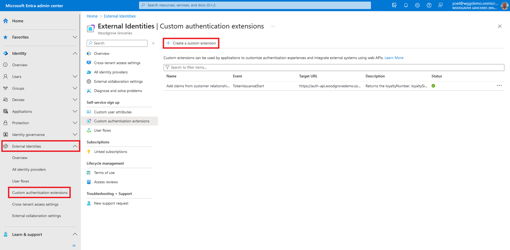
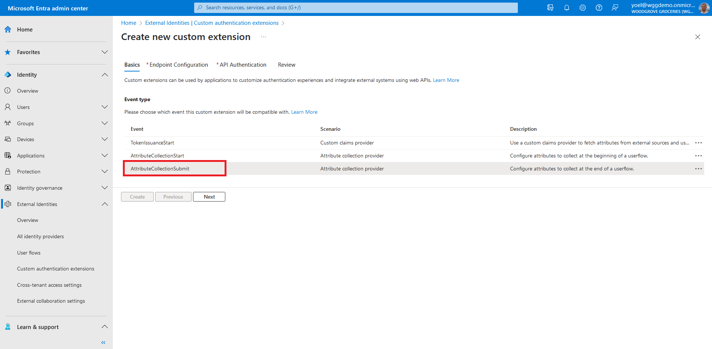
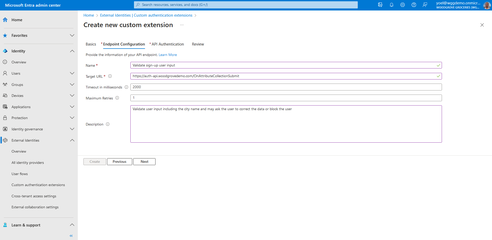
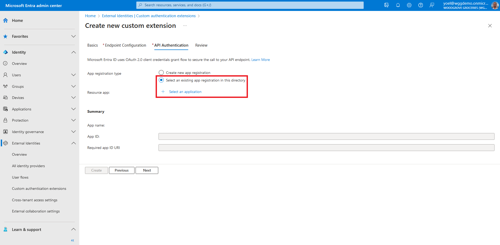
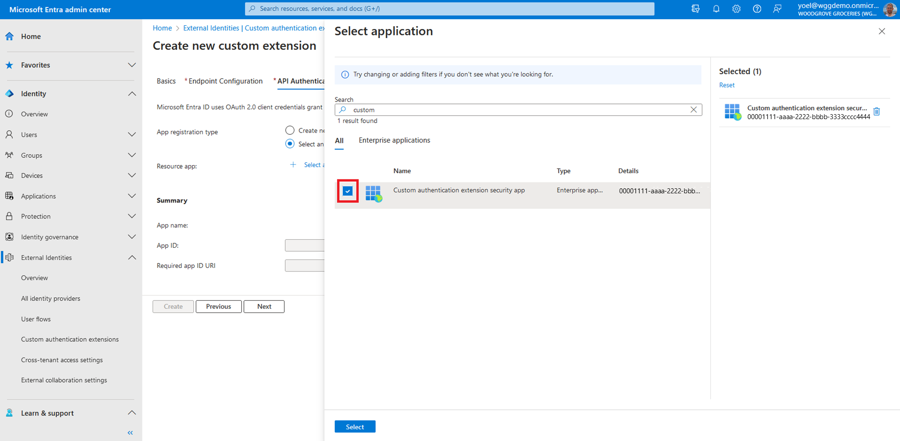
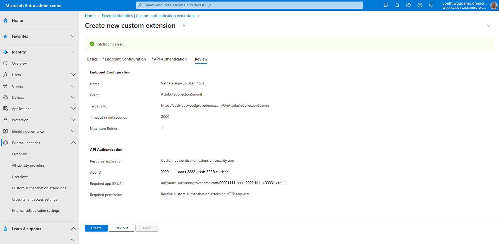
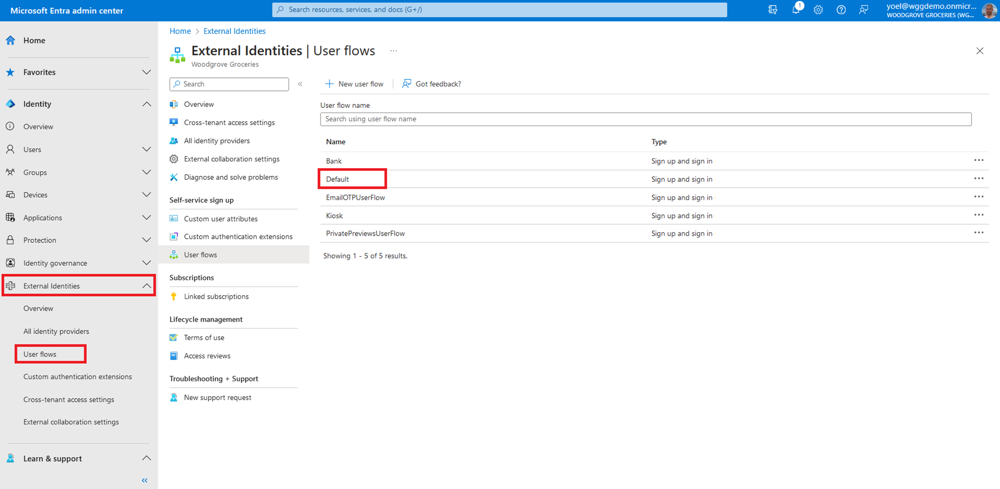
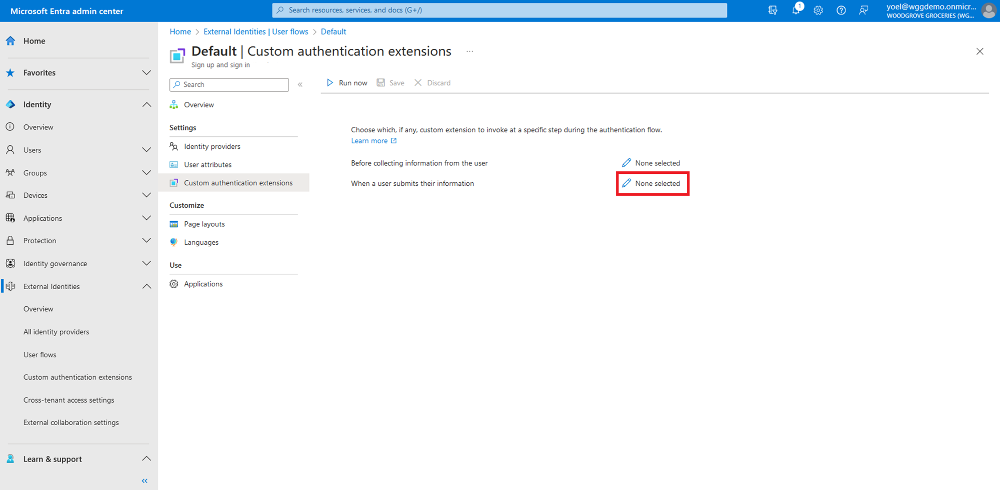
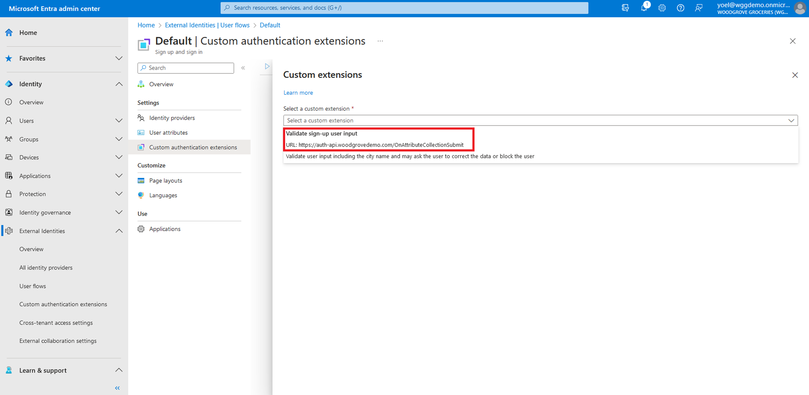

## Exercise - Validate attributes collected during sign-up

The custom authentication extension supports the [on attribute collection submit](/entra/identity-platform/custom-extension-attribute-collection?context=%2Fentra%2Fexternal-id%2Fcustomers%2Fcontext%2Fcustomers-context&tabs=start-continue%2Csubmit-continue) event. This event allows you to perform validation on attributes collected from the user during sign-up. For our groceries website, we will validate the **City** name against a list of **countries** compiled in the custom authentication extension REST API. Also, if the city contains **block**, Microsoft Entra External ID will show a **block page**. If the city contains **modify**, Microsoft Entra External ID will modify some of the attributes (display name and city.)

> [!TIP]
> You can also view an example of a .NET C# Web API that demonstrates how to use Microsoft Entra External ID's custom authentication extension for various events [here](https://github.com/microsoft/woodgrove-auth-api).
 
::: zone pivot="microsoft-entra-admin-center"

1. Start by registering a custom authentication extension that is used by Microsoft Entra External ID to call your REST API. The custom authentication extension contains information about your REST API endpoint, the attribute collection start action that it parses from your REST API, and how to authenticate to your REST API. Sign in to the [Microsoft Entra admin center](https://entra.microsoft.com/) and browse to **External Identities** > **Custom authentication extensions**. Note, you can also browse to **Applications** > **Enterprise applications** > **Custom authentication extensions**. Then, select **Create a custom extension**.
    
1. In **Basics**, select the **AttributeCollectionSubmit** event, and then select **Next**.
    
1. In **Endpoint Configuration**, fill in the following properties:
    - **Name** - A name for your custom authentication extension. For example, *Validate sign-up user input*.
    - **Target URL** - The URL of your REST API.
    - **Timeout in milliseconds** - The maximum number of retries the API endpoint will be called in case of failure. If empty, will default to service default.
    - **Maximum Retries** - The maximum number of retries the API endpoint will be called in case of failure. If empty, will default to service default.
    - **Description** - A description for your custom authentication extensions.
    To continue, select **Next**.
    
1. To ensure the communication between the custom authentication extension and your REST API are secured appropriately, multiple security controls must be applied. The first step is to create or choose an application that Microsoft Entra External ID uses. It uses the OAuth 2.0 client credentials grant flow to secure the call to your API endpoint.
If this is your first custom authentication extension, see how we have configured our [TokenIssuanceStart event](https://woodgrovedemo.com/help/TokenAugmentation). Since we already configured a custom authentication extension, in **API Authentication**, choose the **Select an existing app registration in this directory** option.

1. Select the application you configured for the other custom authentication extensions, and choose **Select**.

1. Review your configuration and select **Create**, which registers the custom authentication extension you configured and the associated application registration you selected.

1. At this point the custom authentication extension is configured in your tenant, but not used in any of the sign-up pages. Next, you will associate the custom authentication extension with one or more of your user flows. To do so, browse to **Identity** > **External Identities** > **User flows**. Then, select the user flow from the list.

1. From the menu, select **Custom authentication extensions**. To associate your custom authentication extension, select the **Before collecting information from the user** event.

1. The custom extensions configured for the **OnAttributeCollectionStart** event will be displayed. Select one of them for the attribute collection start event, and then choose **Select** to save the changes.

***Well done!** You created a custom authentication extension of type **OnAttributeCollectionSubmit**, then associated it with your user flow.*

::: zone-end

::: zone pivot="graph-api"

#### 1\. Register custom authentication extension application

If this is your first custom authentication extension, [register the custom authentication extension application](https://woodgrovedemo.com/help/TokenAugmentation#graph).

#### 2\. Register custom authentication extension

Next, you [register the custom authentication extension](/graph/api/identitycontainer-post-customauthenticationextensions?view=graph-rest-beta&tabs=http). You register the custom authentication extension by associating it with the **Custom authentication extension security app** you created, and to your REST API endpoint. Replace the following values with your own:
    - **{app-ID}** with the app ID from the previous call **Custom authentication extension security app**.
    - **{REST-API-domain}** with your rest API domain name
    - **{Endpoint-URL}** - with the RUL of your REST API endpoint

```json
POST https://graph.microsoft.com/beta/identity/customAuthenticationExtensions
{
    "@odata.type": "#microsoft.graph.onAttributeCollectionSubmitCustomExtension",
    "displayName": "Validate sign-up user input",
    "description": "Validate user input including the city name and may ask the user to correct the data or block the user",
    "behaviorOnError": null,
    "authenticationConfiguration": {
        "@odata.type": "#microsoft.graph.azureAdTokenAuthentication",
        "resourceId": "api://{REST-API-domain}/{app-ID}"
    },
    "endpointConfiguration": {
        "@odata.type": "#microsoft.graph.httpRequestEndpoint",
        "targetUrl": "{Endpoint-URL}"
    },
    "clientConfiguration": {
        "timeoutInMilliseconds": null,
        "maximumRetries": null
    }
}
```

##### Example

```json
POST https://graph.microsoft.com/beta/identity/customAuthenticationExtensions
{
    "@odata.type": "#microsoft.graph.onAttributeCollectionSubmitCustomExtension",
    "displayName": "Validate sign-up user input",
    "description": "Validate user input including the city name and may ask the user to correct the data or block the user",
    "behaviorOnError": null,
    "authenticationConfiguration": {
        "@odata.type": "#microsoft.graph.azureAdTokenAuthentication",
        "resourceId": "api://auth-api.woodgrovedemo.com/12345678-1234-1234-1234-000000000000"
    },
    "endpointConfiguration": {
        "@odata.type": "#microsoft.graph.httpRequestEndpoint",
        "targetUrl": "https://auth-api.woodgrovedemo.com/OnAttributeCollectionSubmit"
    },
    "clientConfiguration": {
        "timeoutInMilliseconds": null,
        "maximumRetries": null
    }
}
```

##### 2.1 Copy the custom authentication extension ID

From the response, copy the value of the **id**. For example:

```json
{
    "@odata.context": "https://graph.microsoft.com/beta/$metadata#identity/customAuthenticationExtensions/$entity",
    "@odata.type": "#microsoft.graph.onAttributeCollectionStartCustomExtension",
    "id": "22222222-2222-3333-3333-444444444444",
    "displayName": "Prepopulate sign-up attributes",
    "description": "Prepopulate sign-up attributes from a REST API",
}
```

##### 2.2 Create an authentication event listener

After you have registered your custom authentication extension, [create an authentication event listener](/graph/api/identitycontainer-post-authenticationeventlisteners?view=graph-rest-beta&tabs=http). In the next JSON, replace **{Custom-auth-extension-ID}** with the custom authentication extension you just created.

```json
POST https://graph.microsoft.com/beta/identity/authenticationEventListeners
{
    "@odata.type": "#microsoft.graph.onAttributeCollectionSubmitListener",
    "conditions": {
        "applications": {
            "includeAllApplications": false,
            "includeApplications": []
        }
    },
    "priority": 500,
    "handler": {
        "@odata.type": "#microsoft.graph.onAttributeCollectionSubmitCustomExtensionHandler",
        "customExtension": {
            "id": "{Custom-auth-extension-ID}"
        }
    }
}
```

##### Example

```json
POST https://graph.microsoft.com/beta/identity/authenticationEventListeners
{
    "@odata.type": "#microsoft.graph.onAttributeCollectionSubmitListener",
    "conditions": {
        "applications": {
            "includeAllApplications": false,
            "includeApplications": []
        }
    },
    "priority": 500,
    "handler": {
        "@odata.type": "#microsoft.graph.onAttributeCollectionSubmitCustomExtensionHandler",
        "customExtension": {
            "id": "22222222-2222-3333-3333-444444444444"
        }
    }
}
```

##### 2.3 Link the custom authentication extension to a user flow

[Update your user flow](/graph/api/authenticationeventsflow-update?view=graph-rest-beta&tabs=http). In the following request, replace the following values with your own:
    - **{user-flow-ID}** with your [user flow ID](/graph/api/identitycontainer-list-authenticationeventsflows?view=graph-rest-beta&tabs=http).
    - **{Custom-auth-extension-ID}** with the custom authentication extension you just created.

```json
PUT https://graph.microsoft.com/beta/identity/authenticationEventsFlows/{user-flow-ID}/microsoft.graph.externalUsersSelfServiceSignUpEventsFlow/onAttributeCollectionSubmit/microsoft.graph.onAttributeCollectionSubmitCustomExtensionHandler/customExtension/$ref
{
    "@odata.id": "https://graph.microsoft.com/beta/identity/customAuthenticationExtensions/{Custom-auth-extension-ID}"
}
```

##### Example

```json
PUT https://graph.microsoft.com/beta//identity/authenticationEventsFlows/44444444-4444-4444-4444-445555555555/microsoft.graph.externalUsersSelfServiceSignUpEventsFlow/onAttributeCollectionSubmit/microsoft.graph.onAttributeCollectionSubmitCustomExtensionHandler/customExtension/$ref
{
    "@odata.id": "https://graph.microsoft.com/beta/identity/customAuthenticationExtensions/44444444-2222-3333-3333-444444444444"
}
```

::: zone-end
