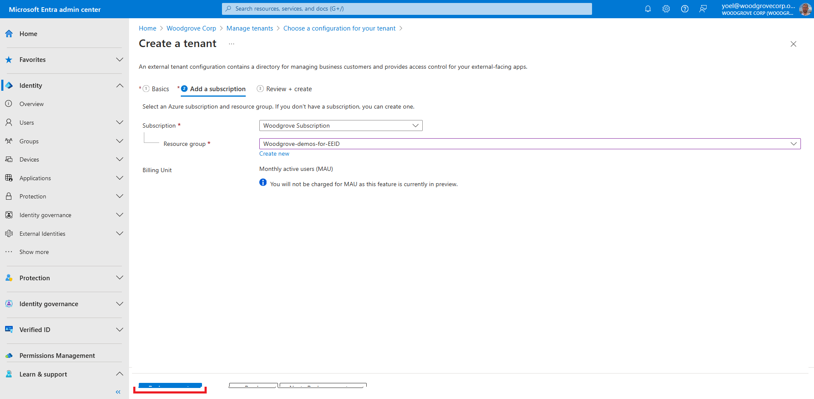
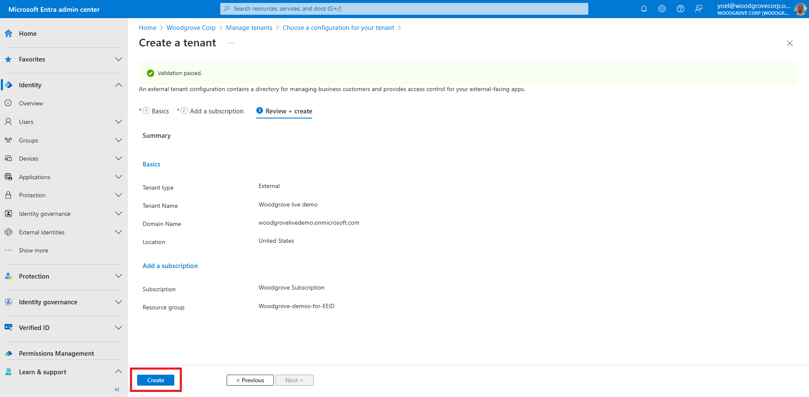
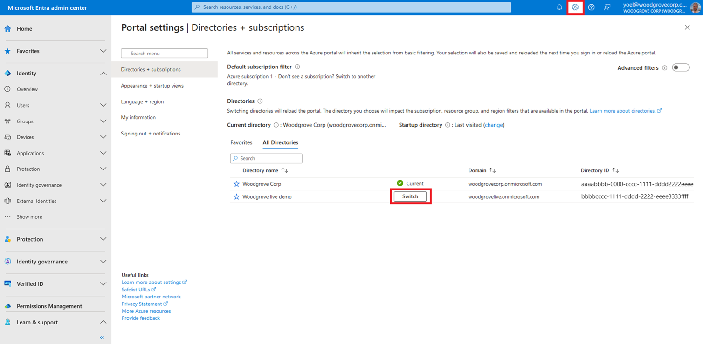

## Exercise - Create an external tenant

You'll need to create a tenant with external configuration in the [Microsoft Entra admin center](https://entra.microsoft.com/) to get started. Once this external tenant is created, you can access it in both the Microsoft Entra admin center and the Azure portal.

::: zone pivot="microsoft-entra-admin-center"

1. To create a tenant, sign in to the [Microsoft Entra admin center](https://entra.microsoft.com/) and browse to **Identity** > **Overview** . Then, select **Manage tenants**.
   
1. On the **Manage tenants**, select **Create**.
   
1. Select **External**, and then select **Continue**.
   
1. On the **Basics** tab, in the **Create a tenant** page, enter the following information: Type your desired **Tenant Name** (for example Woodgrove live demo). Type your desired **Domain Name** (for example woodgrovelive). Select your desired **Location**. This selection can't be changed later. Then, select **Next: Add a subscription**.
   
1. On the **Add a subscription** tab, enter the following information: Next to **Subscription**, select your subscription from the menu. Next to **Resource group**, select a resource group from the menu. If there are no available resource groups, select **Create new**, **add a name**, and then select **OK**. If **Resource group location** appears, select the geographic location of the resource group from the menu. Then, select **Review + Create**.
   
1. If the information that you entered is correct, select **Create**. The tenant creation process can take up to 30 minutes.
   
1. You can monitor the progress of the tenant creation process in the **Notifications** pane. Once the tenant is created, you can access it in both the Microsoft Entra admin center and the Azure portal.
   
1. Use the **Settings** icon in the top menu to **Switch** to your customer tenant you created from the **Directories + subscriptions** menu. If the tenant you created doesn't appear in the list, refresh the page (using the web browser refresh button).
   
1. Browse to **Home** > **Tenant overview** to start configuring your tenant.
   
    ***Well done!** At this point, the Microsoft Entra External ID tenant is ready to use.*
::: zone-end

::: zone pivot="graph-api"

> [!NOTE]
> Before you start, please note that for creating an external tenant, you will be using **Azure REST API** and not Microsoft Graph. Please check the links to relevant documentation that will allow you to run the REST API directly from your browser without needing to develop and register an application. The following screenshot shows how to run a particular API. 

#### 1\. Check domain name availability

Before you create a new tenant, [check the availability and validity of a domain name for the tenant](/rest/api/activedirectory/check-name-availability/check-name-availability?view=rest-activedirectory-2023-05-17-preview&tabs=HTTP). Replace the following values then run the Azure REST API request:

- **{subscriptionId}** with your Azure subscription ID.
- **{tenant-name}** with the name of the tenant you want to check. For example, *woodgrove*.

```json
   POST https://management.azure.com/subscriptions/{subscriptionId}/providers/Microsoft.AzureActiveDirectory/checkNameAvailability?api-version=2023-05-17-preview
   {
      countryCode: "US",
      name: "{tenant-name}"
   }
```

##### Example

The following example checks availability of tenant name **woodgrove** using subscription ID 12345678-0000-0000-0000-000000000000.

```json
    POST https://management.azure.com/subscriptions/12345678-0000-0000-0000-000000000000/providers/Microsoft.AzureActiveDirectory/checkNameAvailability?api-version=2023-05-17-preview
    {
      "name": "woodgrove",
      "countryCode": "US"
    }
```

##### 1.1 Check the response

Check the **nameAvailable** and **message**. The following example shows an unavailable tenant name:

```json
{
  "nameAvailable": false,
  "reason": "AlreadyExists",
  "message": "The given domain name is not available."
}   
```  

The following example shows an available tenant name:

```json
{
  "nameAvailable": true,
  "reason": null,
  "message": null
}  
```

#### 2\. Create a resource group

To create a new external tenant, you need to have a resource group where the tenant will be created. You can choose an existing one, or [create a Resource Group](/rest/api/resources/resource-groups/create-or-update?view=rest-resources-2021-04-01&tabs=HTTP#code-try-0). In the following Azure REST API, replace the:

- **{subscriptionId}** with your Azure subscription ID.
- **{resourceGroupName}** with the name of the resource group to create.
- **{azure-location}** with the location of the resource group. It cannot be changed after the resource group has been created. It must be one of the supported Azure locations.

```json
PUT https://management.azure.com/subscriptions/{subscriptionId}/resourcegroups/{resourceGroupName}?api-version=2021-04-01
{
"location": "{azure-location}"
}
```

##### Example

The following example creates a resource group named **my-resource-group** in **eastus**.

```json
PUT https://management.azure.com/subscriptions/12345678-0000-0000-0000-000000000000/resourcegroups/my-resource-group?api-version=2021-04-01
{
  "location": "eastus"
}
```

#### 3\. Create an external tenant

The following request initiates an async request to [create an external tenant](/rest/api/resources/resource-groups/create-or-update?view=rest-resources-2021-04-01&tabs=HTTP#code-try-0) linked to your subscription and within the resource group you created. In the following Azure REST API request, replace the:

- **{subscriptionId}** with your Azure subscription ID.
- **{resourceGroupName}** with the name of the resource group you created earlier.
- **{resourceName}** with the initial subdomain of the tenant. For example, *contoso*, or *woodgrove*.
- **{location}** with the location in which the resource is hosted and data resides. Can be one of 'United States', 'Europe', 'Asia Pacific', or 'Australia'.
- **{displayName}** with a display name of your tenant.

```json
PUT https://management.azure.com/subscriptions/{subscriptionId}/resourceGroups/{resourceGroupName}/providers/Microsoft.AzureActiveDirectory/ciamDirectories/{resourceName}?api-version=2023-05-17-preview
{
  "location": "{location}",
  "sku": {
    "name": "Standard",
    "tier": "A0"
  },
  "properties": {
    "createTenantProperties": {
      "displayName": "{displayName}",
      "countryCode": "US"
    }
  }
}
```

##### Example

The following example creates a resource group named **my-resource-group** in **eastus**.
The following example creates a tenant name **contoso** within in the resource group **my-resource-group** linked to the **12345678-0000-0000-0000-000000000000** subscription.

```json
PUT https://management.azure.com/subscriptions/12345678-0000-0000-0000-000000000000/resourceGroups/my-resource-group/providers/Microsoft.AzureActiveDirectory/ciamDirectories/contoso?api-version=2023-05-17-preview
{
  "location": "United States",
  "sku": {
    "name": "Standard",
    "tier": "A0"
  },
  "properties": {
    "createTenantProperties": {
      "displayName": "Contoso",
      "countryCode": "US"
    }
  }
}
```

::: zone-end
