## Exercise - Create an external tenant

You'll need to create a tenant with external configuration in the [Microsoft Entra admin center](https://entra.microsoft.com/) to get started. Once this external tenant is created, you can access it in both the Microsoft Entra admin center and the Azure portal. There are two sections to this unit: *If you don't have an Azure subscription* and *If you already have an Azure subscription*. Scroll to the unit that best matches your situation.

> [!NOTE]
> You'll need at least the [Tenant Creator](/entra/identity/role-based-access-control/permissions-reference#tenant-creator) directory role to create an external tenant. 
> [Please let us know how your proof of concept project is going. We'd love to hear from you!](https://forms.microsoft.com/r/Um1E3Sexnk)

::: zone pivot="microsoft-entra-admin-center"

#### If you don't have an Azure subscription

If you don't have an Azure subscription, you can create a trial tenant for free.

> [!IMPORTANT]
> At the end of the free trial period, extensions are not offered and your free trial tenant will be disabled and deleted if there is no Azure subscription added. You can always come back and register for another trial using the same link [aka.ms/ciam-free-trial](https://www.aka.ms/ciam-free-trial), or, if you're ready to upgrade your tenant before the trial period of 30 days is over, you can [upgrade your free trial tenant](/entra/external-id/customers/quickstart-trial-setup#upgrade-your-free-trial-by-adding-an-azure-subscription).

1. To create a trial tenant, navigate to [aka.ms/ciam-free-trial](https://www.aka.ms/ciam-free-trial).
1. On the **Sign in** page, use the sign-in box (label A) to enter your Outlook or Hotmail email. If you don't have any of those, you can select **Create one!** (label B) to create a new Outlook account. Alternatively, you can also sign in with your GitHub account (label C).
   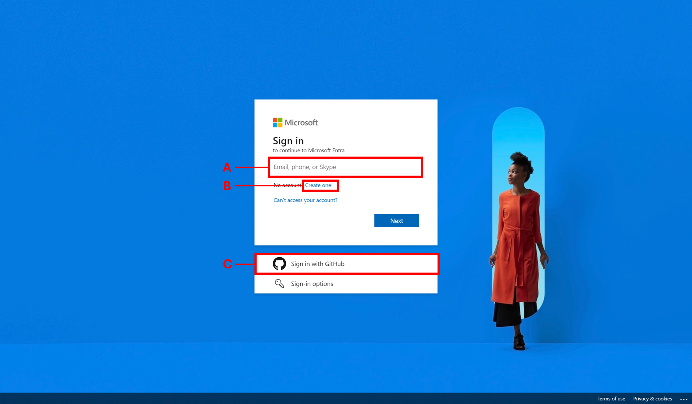
1. Once you're signed in or have created an account, you'll be redirected to Microsoft Entra admin center. This is the start of setting up your free trial tenant. To customize the tenant domain and name, as well as location, select *Change settings*.
   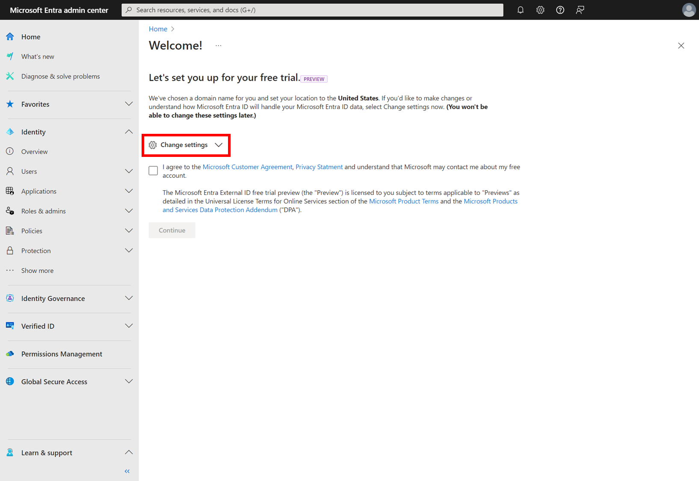
1. You'll see the following fields are customizable for your free trial tenant:
  - **Tenant name:** you can include your company name and the fact that this is a test external tenant. For example, *Woodgrove CIAM Dev*
  - **Domain name:** for best practices, it's good to include the purpose of the tenant. For example, if your developer team is trying out the product with a possibility to upgrade later, you might want to add *dev* after your company name, like this: *woodgrove-ciam-dev*.
  - **Location:** Specify the location for this trial tenant.
  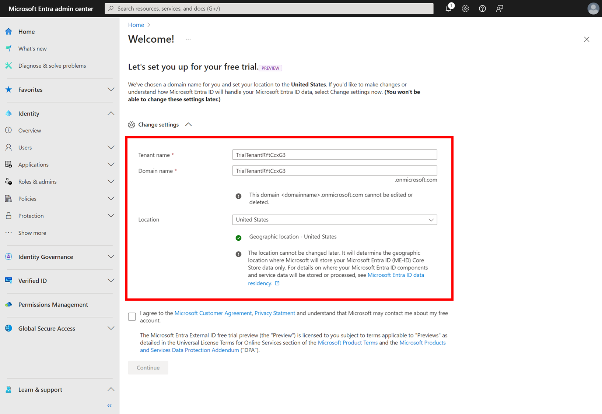
1. When you're done, check the checkbox to agree to Microsoft Customer Agreement and Privacy Statement, then select **Continue**. It will take a few minutes for the next step to launch.
  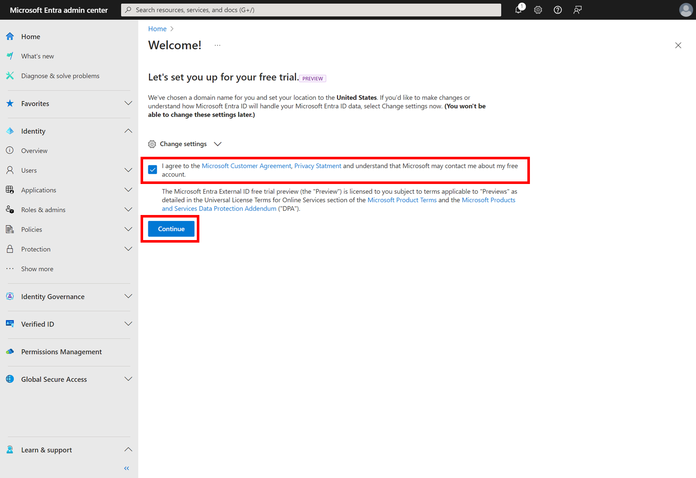
1. You may encounter a dialogue twice that asks if you want to leave the site. Select **Leave** twice. This happens because the Microsoft Entra admin center is trying to leave the free trial setup experience and launch the *get started guide* titled *Sign in your users in 3 easy steps*.
  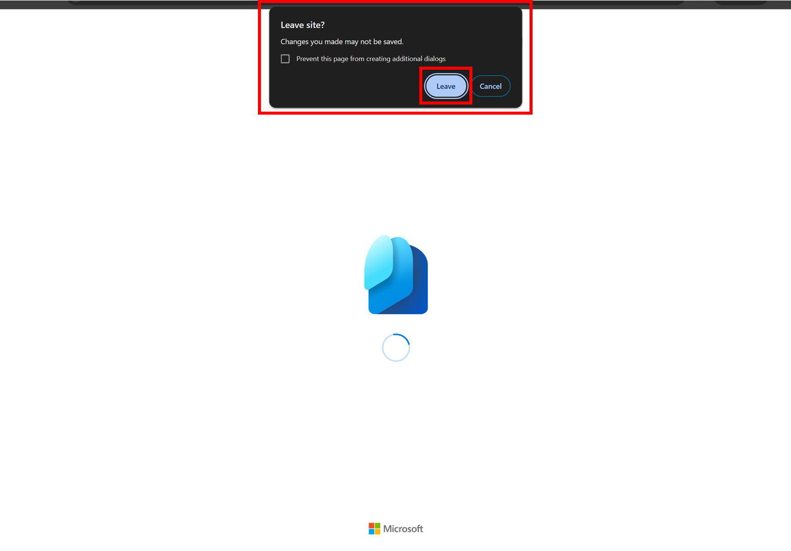
1. The *Sign in your users in 3 easy steps* guide, also known as *get started guide*, has launched. You can select how you would like your customers to sign in and the branding they'll see.
  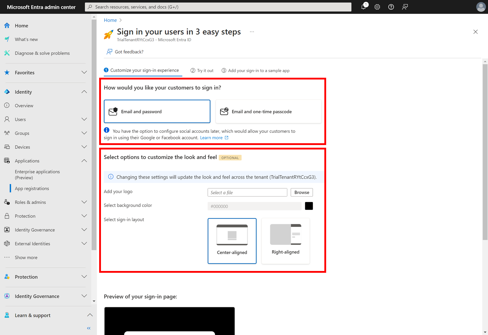
1. You can scroll down to view a preview of your sign-in page. When you're done, select **Continue**.
  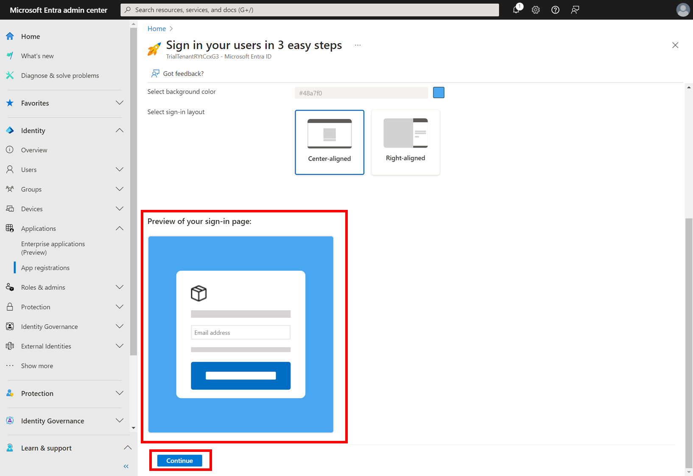
1. Wait for a few minutes until the **Run it now** button is ready. When it's ready, select **Run it now** to view the sign-in experience. 
  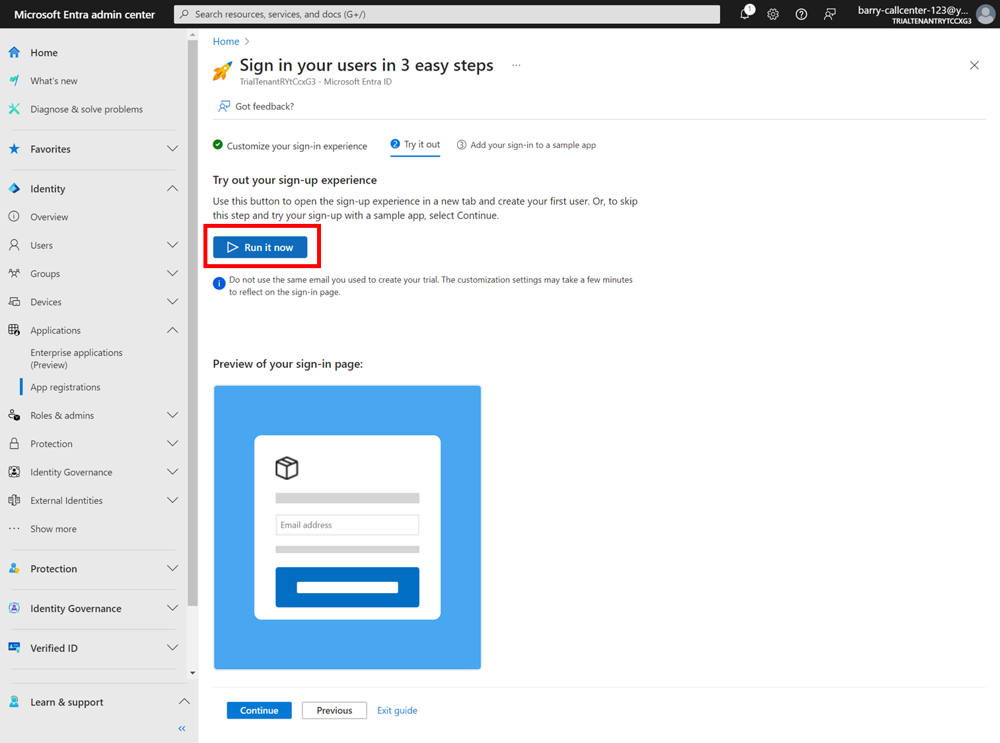
1. The preview will launch, reflecting the customizations you've made so far.
  
1. Come back to the Microsoft Entra admin center, and select **Continue**. If you want to make changes to the customizations so far, select **Previous**.
  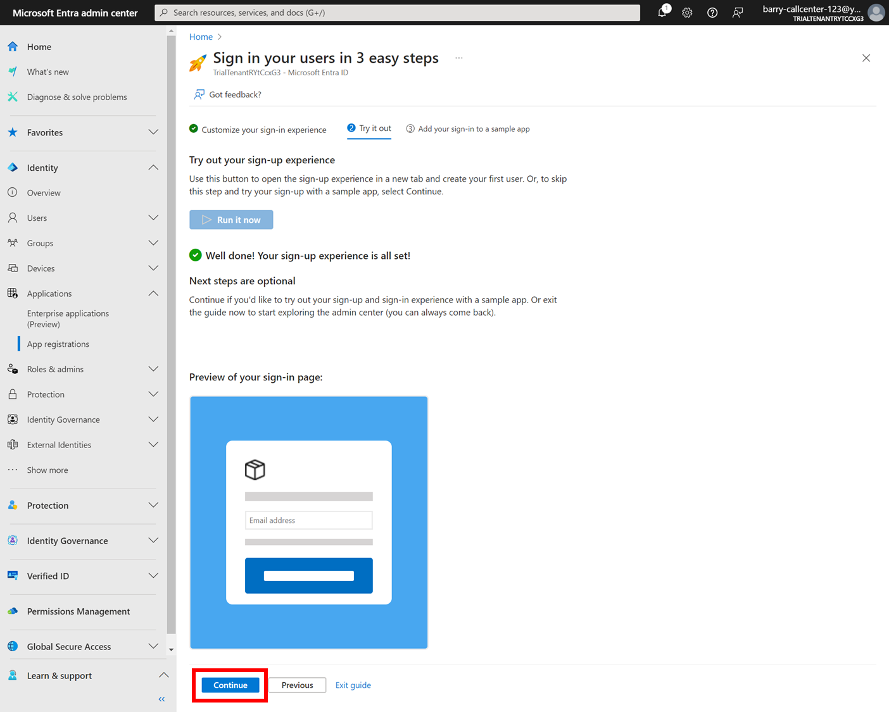
1. (This step is optional) Finally, you can add your sign-in experience to a sample app. Select from the options *Single Page Application (SPA)*, *Web application*, *Desktop app*, and *Mobile app*.
  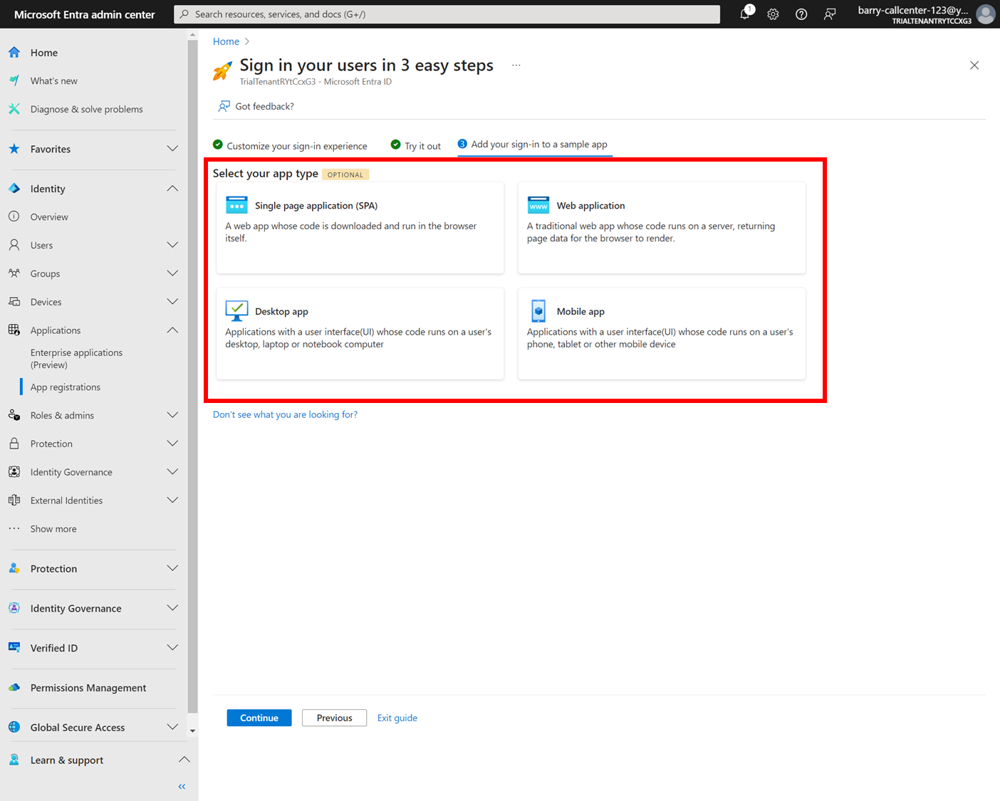
1. (This step is optional) Depending on the app type you selected earlier, you can view languages to choose from. Under *Set up and run the sample app*, you have the option to download your sample app and run the code in your environment. Select **Continue** when you're done downloading the sample code you need.
  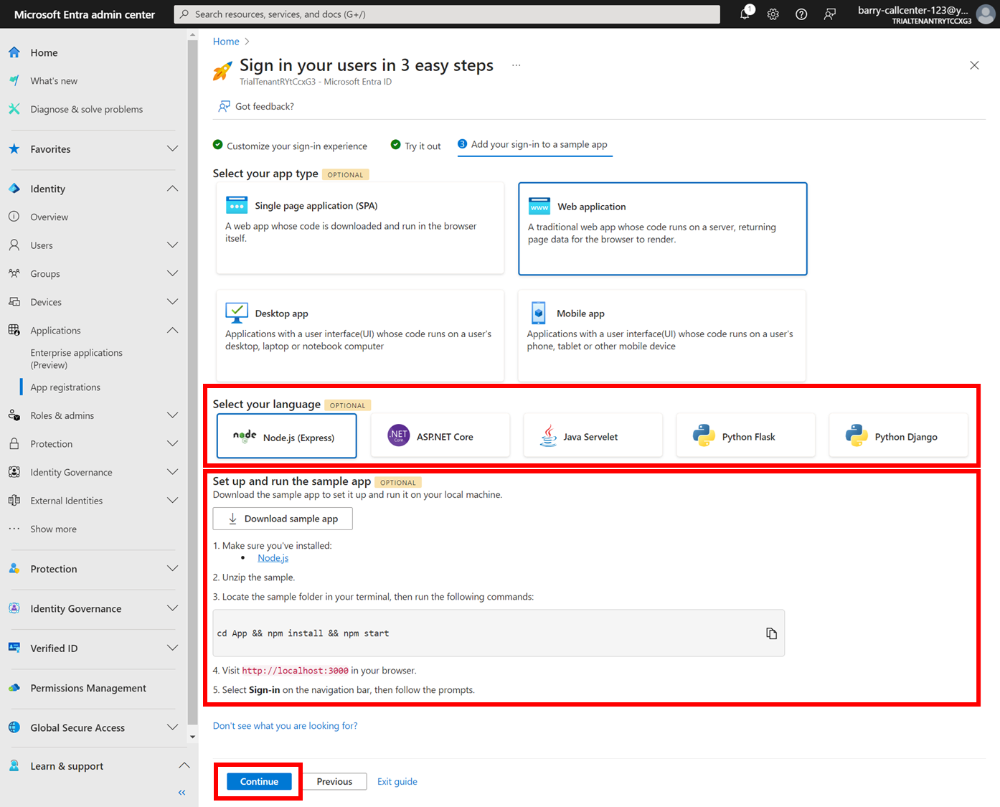

#### If you already have an Azure subscription

1. To create a tenant, sign in to the [Microsoft Entra admin center](https://entra.microsoft.com/) and browse to **Identity** > **Overview** . Then, select **Manage tenants**.
   
1. On the **Manage tenants** page, select **Create**.
   
1. Select **External**, and then select **Continue**.
   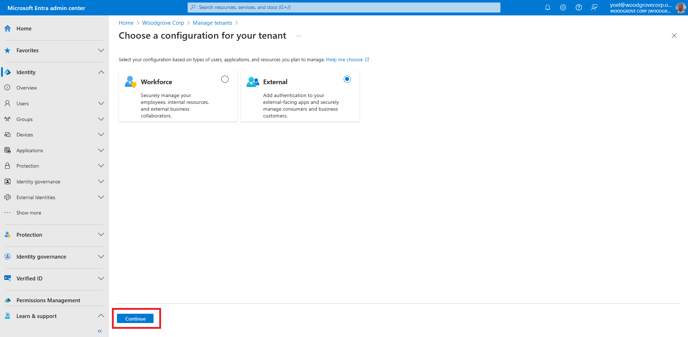
1. On the **Basics** tab, in the **Create a tenant** page, enter the following information: Type your desired **Tenant Name** (for example Woodgrove live demo). Type your desired **Domain Name** (for example woodgrovelive). Select your desired **Location**. This selection can't be changed later. Then, select **Next: Add a subscription**.
   
1. On the **Add a subscription** tab, enter the following information: Next to **Subscription**, select your subscription from the menu. Next to **Resource group**, select a resource group from the menu. If there are no available resource groups, select **Create new**, add a name, and then select **OK**. If **Resource group location** appears, select the geographic location of the resource group from the menu. Then, select **Review + Create**.
   
1. If the information that you entered is correct, select **Create**. The tenant creation process can take up to 30 minutes.
   
1. You can monitor the progress of the tenant creation process in the **Notifications** pane. Once the tenant is created, you can access it in both the Microsoft Entra admin center and the Azure portal.
   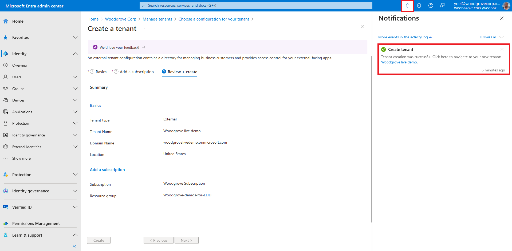
1. Use the **Settings** icon in the top menu to **Switch** to your customer tenant you created from the **Directories + subscriptions** menu. If the tenant you created doesn't appear in the list, refresh the page (using the web browser refresh button).
   
1. Browse to **Home** > **Tenant overview** to start configuring your tenant.
   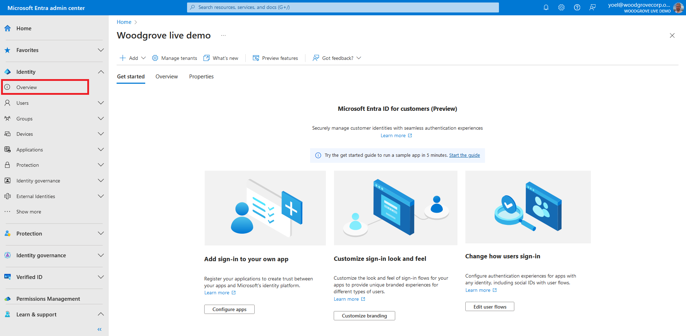
    ***Well done!** At this point, the Microsoft Entra External ID tenant is ready to use.*
::: zone-end

::: zone pivot="microsoft-graph-api"

> [!NOTE]
> Before you start, please note that for creating an external tenant, you will be using **Azure REST API** and not Microsoft Graph. You can follow [the link to check the availability and validity of a domain name for the tenant](/rest/api/activedirectory/check-name-availability/check-name-availability?view=rest-activedirectory-2023-05-17-preview&tabs=HTTP) to run the REST API directly from your browser. The following screenshot shows where to select after following the link and also demonstrates how to run a particular API. 

#### 1. Check domain name availability

Before you create a new tenant, [check the availability and validity of a domain name for the tenant](/rest/api/activedirectory/check-name-availability/check-name-availability?view=rest-activedirectory-2023-05-17-preview&tabs=HTTP). Replace the following values then run the Azure REST API request:

- **{subscriptionId}** with your Azure subscription ID.
- **{tenant-name}** with the name of the tenant you want to check. For example, *woodgrove*.

```json
   POST https://management.azure.com/subscriptions/{subscriptionId}/providers/Microsoft.AzureActiveDirectory/checkNameAvailability?api-version=2023-05-17-preview
   {
      countryCode: "US",
      name: "{tenant-name}"
   }
```

##### Example

The following example checks availability of tenant name **woodgrove** using subscription ID aaaa0a0a-bb1b-cc2c-dd3d-eeeeee4e4e4e.

```json
    POST https://management.azure.com/subscriptions/aaaa0a0a-bb1b-cc2c-dd3d-eeeeee4e4e4e/providers/Microsoft.AzureActiveDirectory/checkNameAvailability?api-version=2023-05-17-preview
    {
      "name": "woodgrove",
      "countryCode": "US"
    }
```

##### 1.1 Check the response

Check the **nameAvailable** and **message**. The following example shows an unavailable tenant name:

```json
{
  "nameAvailable": false,
  "reason": "AlreadyExists",
  "message": "The given domain name is not available."
}   
```  

The following example shows an available tenant name:

```json
{
  "nameAvailable": true,
  "reason": null,
  "message": null
}  
```

#### 2. Create a resource group

To create a new external tenant, you need to have a resource group where the tenant will be created. You can choose an existing one, or [create a Resource Group](/rest/api/resources/resource-groups/create-or-update?view=rest-resources-2021-04-01&tabs=HTTP#code-try-0). In the following Azure REST API, replace the:

- **{subscriptionId}** with your Azure subscription ID.
- **{resourceGroupName}** with the name of the resource group to create.
- **{azure-location}** with the location of the resource group. It can't be changed after the resource group has been created. It must be one of the supported Azure locations.

```json
PUT https://management.azure.com/subscriptions/{subscriptionId}/resourcegroups/{resourceGroupName}?api-version=2021-04-01
{
"location": "{azure-location}"
}
```

##### Example

The following example creates a resource group named **my-resource-group** in **eastus**.

```json
PUT https://management.azure.com/subscriptions/aaaa0a0a-bb1b-cc2c-dd3d-eeeeee4e4e4e/resourcegroups/my-resource-group?api-version=2021-04-01
{
  "location": "eastus"
}
```

#### 3. Create an external tenant

The following request initiates an async request to [create an external tenant](/rest/api/resources/resource-groups/create-or-update?view=rest-resources-2021-04-01&tabs=HTTP#code-try-0) linked to your subscription and within the resource group you created. In the following Azure REST API request, replace the:

- **{subscriptionId}** with your Azure subscription ID.
- **{resourceGroupName}** with the name of the resource group you created earlier.
- **{resourceName}** with the initial subdomain of the tenant. For example, *contoso*, or *woodgrove*.
- **{location}** with the location in which the resource is hosted and data resides. Can be one of 'United States', 'Europe', 'Asia Pacific', or 'Australia'.
- **{displayName}** with a display name of your tenant.

```json
PUT https://management.azure.com/subscriptions/{subscriptionId}/resourceGroups/{resourceGroupName}/providers/Microsoft.AzureActiveDirectory/ciamDirectories/{resourceName}?api-version=2023-05-17-preview
{
  "location": "{location}",
  "sku": {
    "name": "Standard",
    "tier": "A0"
  },
  "properties": {
    "createTenantProperties": {
      "displayName": "{displayName}",
      "countryCode": "US"
    }
  }
}
```

##### Example

The following example creates a resource group named **my-resource-group** in **eastus**.
The following example creates a tenant name **contoso** within in the resource group **my-resource-group** linked to the **aaaa0a0a-bb1b-cc2c-dd3d-eeeeee4e4e4e** subscription.

```json
PUT https://management.azure.com/subscriptions/aaaa0a0a-bb1b-cc2c-dd3d-eeeeee4e4e4e/resourceGroups/my-resource-group/providers/Microsoft.AzureActiveDirectory/ciamDirectories/contoso?api-version=2023-05-17-preview
{
  "location": "United States",
  "sku": {
    "name": "Standard",
    "tier": "A0"
  },
  "properties": {
    "createTenantProperties": {
      "displayName": "Contoso",
      "countryCode": "US"
    }
  }
}
```

::: zone-end
