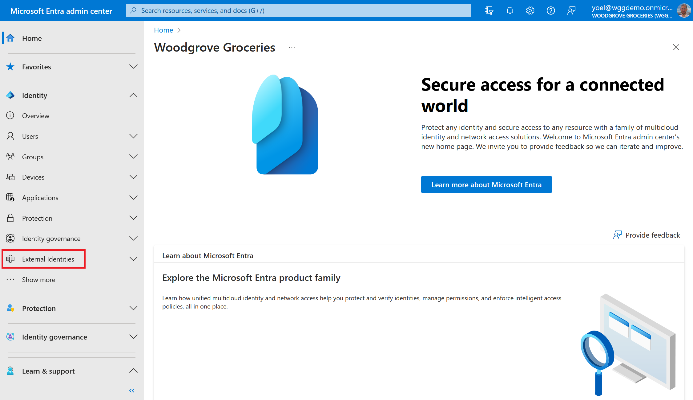
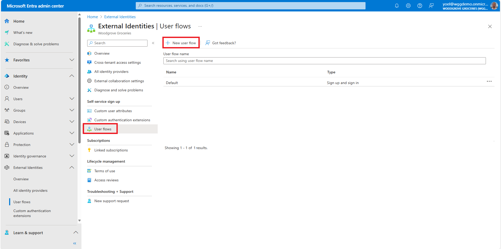
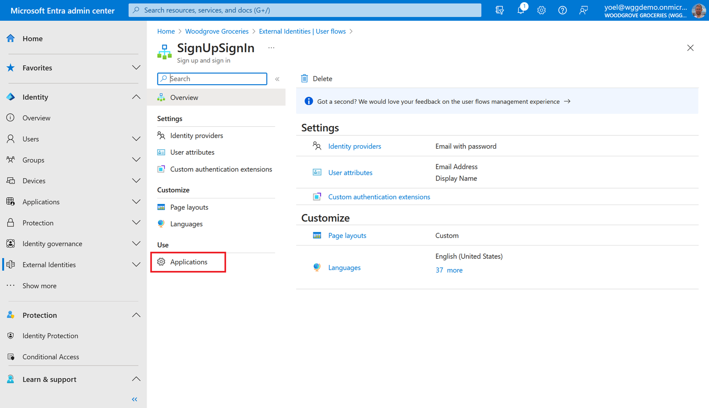
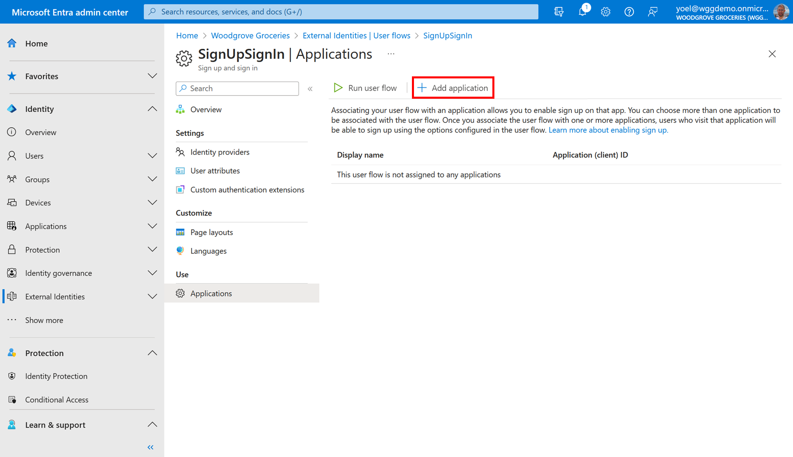
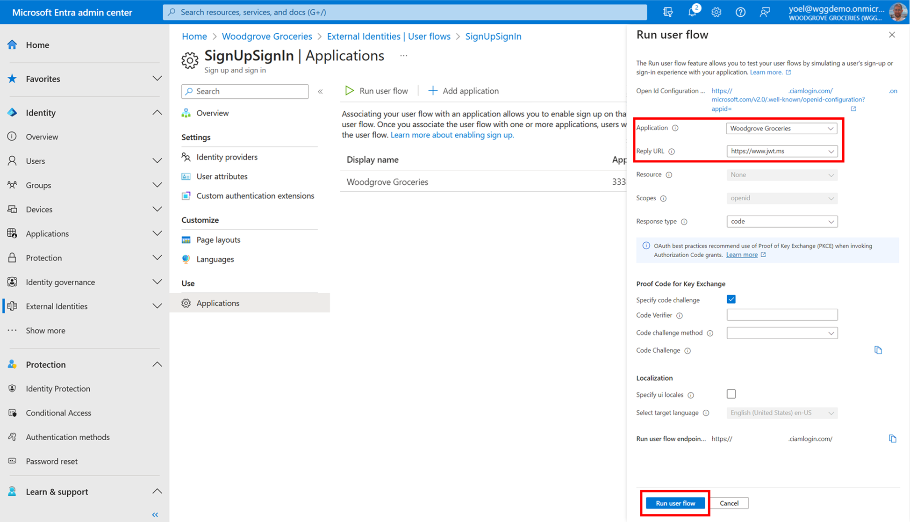
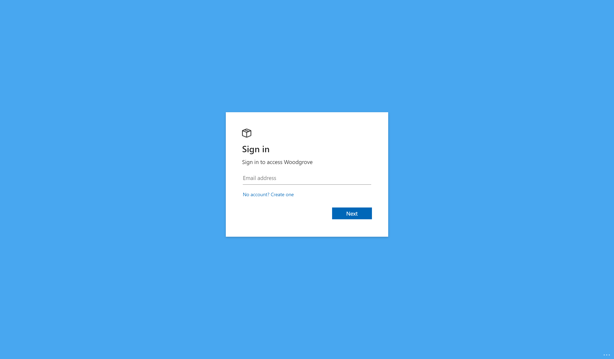

## Exercise - Create a sign-up and sign-in user flow

A [user flow](/entra/external-id/customers/how-to-user-flow-sign-up-sign-in-customers) defines the series of sign-up steps customers follow and the sign-in methods they can use (such as email and password, one-time passcodes, or social accounts from Google or Facebook). You can also collect information from customers during sign-up by selecting from a series of built-in user attributes or adding your own custom attributes. You can create multiple user flows if you have multiple applications that you want to offer to customers.

> [!NOTE]
> You'll need at least the [External ID User Flow Administrator](/entra/identity/role-based-access-control/permissions-reference#external-id-user-flow-administrator) directory role to create user flows.
>
> Do you have feedback? [Please let us know how your proof of concept project is going. We'd love to hear from you!](https://forms.microsoft.com/r/Um1E3Sexnk)

::: zone pivot="microsoft-entra-admin-center"

1. To create a sign-up and sign-in user flow, sign in to the [Microsoft Entra admin center](https://entra.microsoft.com/) and browse to **Identity** > **External Identities**.
    
1. From the menu, select **User flows**. Then, select **New user flow**.
    
1. On the **Create** page, enter a **Name** for the user flow (for example, "SignUpSignIn"). Then, under **Identity providers**, select the **Email Accounts** check box, and then select one of these options. If you configured other identity providers, you can select them.
    
1. Under **User attributes**, choose the attributes you want to collect from the user during sign-up. Select **Show more** to choose from the full list of attributes, including Job Title, Display Name, and Postal Code and more. Then, select **Create** to create the user flow.
    
1. From the list, select the user flow you created.
    
1. The following steps activate the sign-up and sign-in experience (the user flow) for users who visit your application. In the left menu, under **Use**, select **Applications**.
    
1. Select **Add Application**
    
1. Select the application from the list. Or use the search box to find the application, and then select it. Choose **Select**.
    
1. The application is now linked to the user flow. Select **Run user flow** to preview the experience.
    
1. In the *Run user flow* pane that opens to the right, make sure that the correct **Application** and **Reply URL** are selected. Then, select **Run user flow**. 
    
1. **Well done!** You successfully created a user flow and linked an application! 
    > [!TIP]
    > You can always use the **Run user flow** button to preview the sign in experience.
    *When users sign in to the groceries website, they'll come across the sign-in and sign-up experience configured in the user flow.*
    

::: zone-end

::: zone pivot="microsoft-graph-api"

#### 1. Create a user flow

To create a user flow, you create an [authentication events flow](/graph/api/identitycontainer-post-authenticationeventsflows?view=graph-rest-beta&tabs=http) object that is of the type specified in the request body.

```json
POST https://graph.microsoft.com/beta/identity/authenticationEventsFlows
{
    "@odata.context": "https://graph.microsoft.com/beta/$metadata#identity/authenticationEventsFlows/$entity",
    "@odata.type": "#microsoft.graph.externalUsersSelfServiceSignUpEventsFlow",
    "displayName": "Default sign-up and sign-in",
    "description": "Woodgrove default sign-up and sign-in flow",
    "priority": 500,
    "conditions": {
        "applications": {
            "includeAllApplications": false
        }
    },
    "onInteractiveAuthFlowStart": {
        "@odata.type": "#microsoft.graph.onInteractiveAuthFlowStartExternalUsersSelfServiceSignUp",
        "isSignUpAllowed": true
    },
    "onAuthenticationMethodLoadStart": {
        "@odata.type": "#microsoft.graph.onAuthenticationMethodLoadStartExternalUsersSelfServiceSignUp",
        "identityProviders": [
            {
                "@odata.type": "#microsoft.graph.builtInIdentityProvider",
                "id": "EmailPassword-OAUTH"
            }
        ]
    },
    "onAttributeCollection": {
        "@odata.type": "#microsoft.graph.onAttributeCollectionExternalUsersSelfServiceSignUp",
        "accessPackages": [],
        "attributeCollectionPage": {
            "customStringsFileId": null,
            "views": [
                {
                    "title": null,
                    "description": null,
                    "inputs": [
                        {
                            "attribute": "email",
                            "label": "Email Address",
                            "inputType": "text",
                            "defaultValue": null,
                            "hidden": true,
                            "editable": false,
                            "writeToDirectory": true,
                            "required": true,
                            "validationRegEx": "^[a-zA-Z0-9.!#$%&amp;&#8217;'*+/=?^_`{|}~-]+@[a-zA-Z0-9-]+(?:\\.[a-zA-Z0-9-]+)*$",
                            "options": []
                        },
                        {
                            "attribute": "displayName",
                            "label": "Display Name",
                            "inputType": "text",
                            "defaultValue": null,
                            "hidden": false,
                            "editable": true,
                            "writeToDirectory": true,
                            "required": true,
                            "validationRegEx": "^.*",
                            "options": []
                        },
                        {
                            "attribute": "country",
                            "label": "Country/Region",
                            "inputType": "radioSingleSelect",
                            "defaultValue": null,
                            "hidden": false,
                            "editable": true,
                            "writeToDirectory": true,
                            "required": false,
                            "validationRegEx": "^.*",
                            "options": [
                                {
                                    "label": "Australia",
                                    "value": "au"
                                },
                                {
                                    "label": "Spain",
                                    "value": "es"
                                },
                                {
                                    "label": "United States",
                                    "value": "us"
                                }
                            ]
                        },
                        {
                            "attribute": "city",
                            "label": "City",
                            "inputType": "text",
                            "defaultValue": null,
                            "hidden": false,
                            "editable": true,
                            "writeToDirectory": true,
                            "required": false,
                            "validationRegEx": "^.*",
                            "options": []
                        }
                    ]
                }
            ]
        },
        "attributes": [
            {
                "id": "email"
            },
            {
                "id": "city"
            },
            {
                "id": "country"
            },
            {
                "id": "displayName"
            }
        ]
    },
    "onUserCreateStart": {
        "@odata.type": "#microsoft.graph.onUserCreateStartExternalUsersSelfServiceSignUp",
        "userTypeToCreate": "member",
        "accessPackages": []
    }
}
```

##### 1.1 Copy the user flow ID

From the response, copy the value of the user flow **id**. For example:

```json
{
    "@odata.context": "https://graph.microsoft.com/beta/$metadata#identity/authenticationEventsFlows/$entity",
    "@odata.type": "#microsoft.graph.externalUsersSelfServiceSignUpEventsFlow",
    "id": "aaaaaaaa-0000-1111-2222-bbbbbbbbbbbb",
    "displayName": "Default sign-up and sign-in1",
    "description": "Woodgrove default sign-up and sign-in flow",
    ...
}      
```

#### 2. Add your application to the user flow
To [add or link an application to a user flow](/graph/api/authenticationconditionsapplications-post-includeapplications?view=graph-rest-beta&tabs=http), use the following Microsoft Graph request. Replace the **{user-flow-ID}** with your [user flow ID](/graph/api/identitycontainer-list-authenticationeventsflows?view=graph-rest-beta&tabs=http). Replace the **{app-ID}** with your [application ID](/graph/api/application-list?view=graph-rest-beta&tabs=http).

```json
POST https://graph.microsoft.com/beta/identity/authenticationEventsFlows/{user-flow-ID}/conditions/applications/includeApplications
{
    "@odata.type": "#microsoft.graph.authenticationConditionApplication",
    "appId": "{app-ID}"
}
```

::: zone-end
