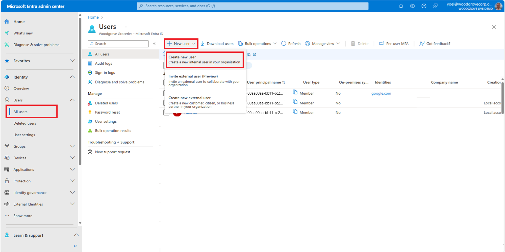
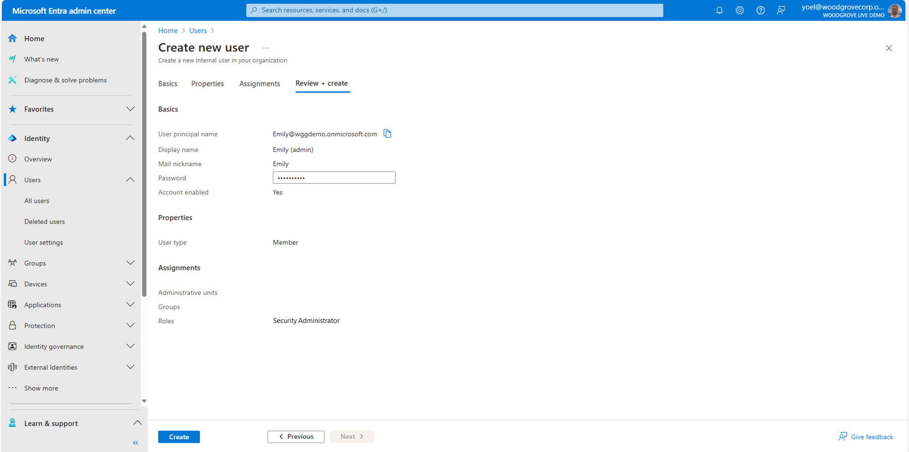

## Exercise - Add an admin account

In Microsoft Entra External ID, an external tenant represents your directory of consumer and guest accounts. With an administrator role, work and guest accounts can [manage the tenant](/entra/external-id/customers/quickstart-tenant-setup).

You'll need at least the [User Administrator](/entra/identity/role-based-access-control/permissions-reference#user-administrator) directory role to create an admin account. **This role is a privileged role**. [Please read about best practices for working with privileged roles](/entra/identity/role-based-access-control/privileged-roles-permissions?tabs=admin-center#best-practices-for-using-privileged-roles).

[Please let us know how your proof of concept project is going. We'd love to hear from you!](https://forms.microsoft.com/r/Um1E3Sexnk)

::: zone pivot="microsoft-entra-admin-center"

1. To add an admin account, sign in to the [Microsoft Entra admin center](https://entra.microsoft.com/) with at least Privileged Role Administrator permissions and browse to **Identity** > **Users** > **All users**. Then, select **New user** > **Create new user**.
    
1. On the **Create new user** page, enter the following information:
    - Under **Basics**, enter information for this admin: 
        1. **User principal name** (Required) - The user name of the new user. For example, emily@woodgrovelive.com. 
        1. **Display name** - The name of the new user. For example, Emily Doe.
    -  Under **Password**, copy the autogenerated password provided in the **password box**. You'll need to give this password to the admin to sign in for the first time.
    
1. Under **Properties**, you can also enter a **First name** and **Last name** along with some other properties.
    
1. To add administrative permissions for the user, add them to one or more of the administrator roles in Microsoft Entra ID. Under **Assignments**, select **Add role**. Then, find the role you want to assign to this user, and choose **Select**.
    
1. To create the account, select **Create**.
    
    ***Well done!** The admin is created and added to your customer tenant. It's preferable to have at least one admin account native to your customer tenant assigned the Global Administrator role. This account can be considered a break-glass account or emergency access account.*

::: zone-end

::: zone pivot="microsoft-graph-api"

#### 1. Create a user

To [create a user](/graph/api/user-post-users?view=graph-rest-1.0&tabs=http), replace the following values in the Microsoft Graph request:

- **displayName** with the user display name.
- **mailNickname** with a mail alias for the user. This property must be specified when a user is created.
- **userPrincipalName** with the principal name (UPN) of the user. The general format is alias@domain, where the domain must be present in the tenant's collection of verified domains.
- **password** with a temporary password that you will share with the user. During the first sign-in, the user will be asked to change their password.

##### Example

The following example shows how to create a new user account for Adele Vance.

```json
POST https://graph.microsoft.com/v1.0/applications
{
    "accountEnabled": true,
    "displayName": "Adele Vance",
    "mailNickname": "AdeleV",
    "userPrincipalName": "AdeleV@wggdemo.onmicrosoft.com",
    "passwordProfile": {
        "forceChangePasswordNextSignIn": true,
        "password": "A1bC2dE3fH4iJ5kL6mN7oP8qR9sT0u"
    }
}
```

##### 1.1 Copy the user ID

From the response, copy the value of the **id**. For example:

```json
{
    "@odata.context": "https://graph.microsoft.com/v1.0/$metadata#users/$entity",
    "id": "00aa00aa-bb11-cc22-dd33-44ee44ee44ee",
    ...
}        
```

#### 2. Assign an admin role

After the new user is created, [create a (unified) role assignment](/graph/api/rbacapplication-post-roleassignments). In the following Microsoft Graph request, replace the:

- **{user-id}** with the user **id** from the previous step.
- **{role-id}** with one of the [Microsoft Entra built-in roles](/entra/identity/role-based-access-control/permissions-reference).

```json
POST https://graph.microsoft.com/v1.0/roleManagement/directory/roleAssignments
{
    "principalId": "{user-id}",
    "roleDefinitionId": "{role-id}",
    "directoryScopeId": "/"
}
```

##### Example

The following example assigns the **Security Administrator** role to Adele Vance

```json
POST https://graph.microsoft.com/v1.0/roleManagement/directory/roleAssignments
{
    "principalId": "00aa00aa-bb11-cc22-dd33-44ee44ee44ee",
    "roleDefinitionId": "194ae4cb-b126-40b2-bd5b-6091b380977d",
    "directoryScopeId": "/"
}
```

::: zone-end
