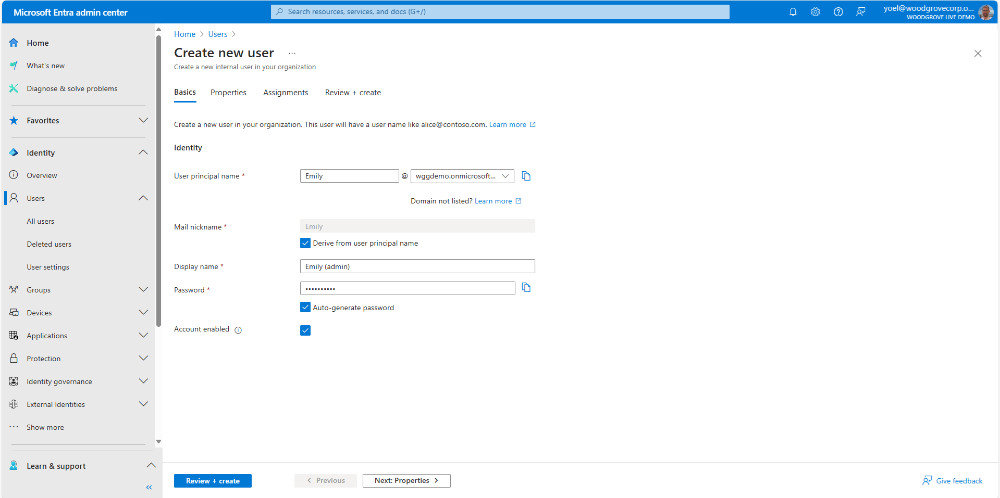
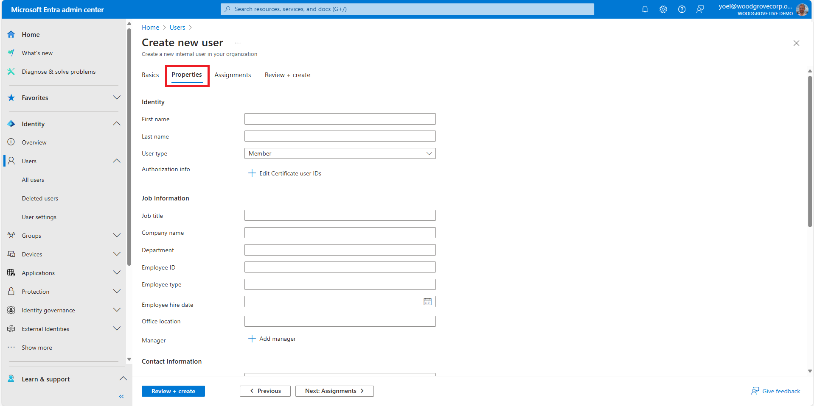
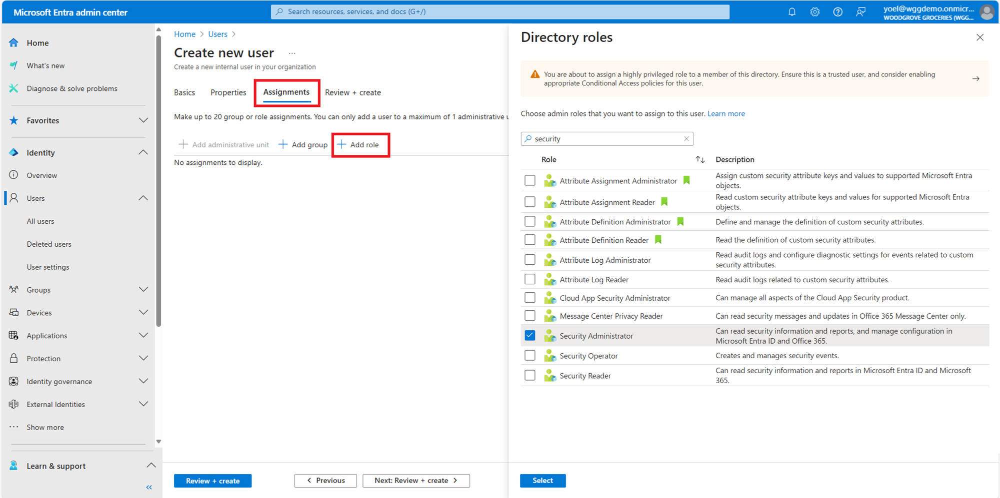

## Exercise - Add an admin account

In Microsoft Entra External ID, an external tenant represents your directory of consumer and guest accounts. With an administrator role, work and guest accounts can [manage the tenant](/entra/external-id/customers/quickstart-tenant-setup).

::: zone pivot="microsoft-entra-admin-center"

1. To add an admin account, sign in to the [Microsoft Entra admin center](https://entra.microsoft.com/) with Global Administrator or Privileged Role Administrator permissions and browse to **Identity** > **Users** > **All users**. Then, select **New user** > **Create new user**.
    
1. On the **New user** page, under **Select template**, select **Create user**. 
    - Under **Identity**, enter information for this admin: 
        1. **User name** - The user name of the new user. For example, emily@woodgrovelive.com. 
        1. **Name** - The name of the new user. For example, Emily Doe. Optionally, you can also enter a **First name** and **Last name**.
    -  Under **Password**, copy the autogenerated password provided in **Initial password**. You'll need to give this password to the admin to sign in for the first time.
    
1. To add administrative permissions for the user, add them to a Microsoft Entra role. You can assign the user to be a **Global Administrator** or one or more of the limited administrator roles in Microsoft Entra ID. Scroll down to the **Roles** section, and select a role in the directory. Then, choose **Select**.
    
1. To create the account, scroll down and select **Create**.
    
    ***Well done!** The admin is created and added to your customer tenant. It's preferable to have at least one admin account native to your customer tenant assigned the Global Administrator role. This account can be considered a break-glass account or emergency access account.*

::: zone-end

::: zone pivot="graph-api"

Graph API tutorial coming soon.

::: zone-end