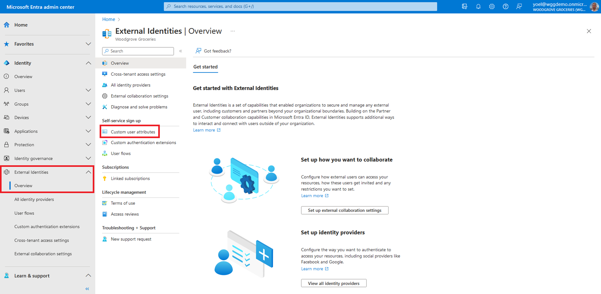
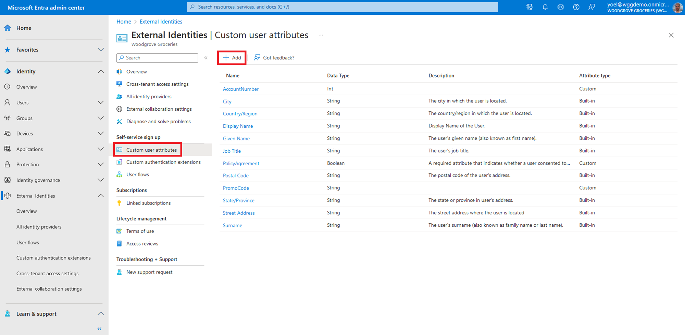
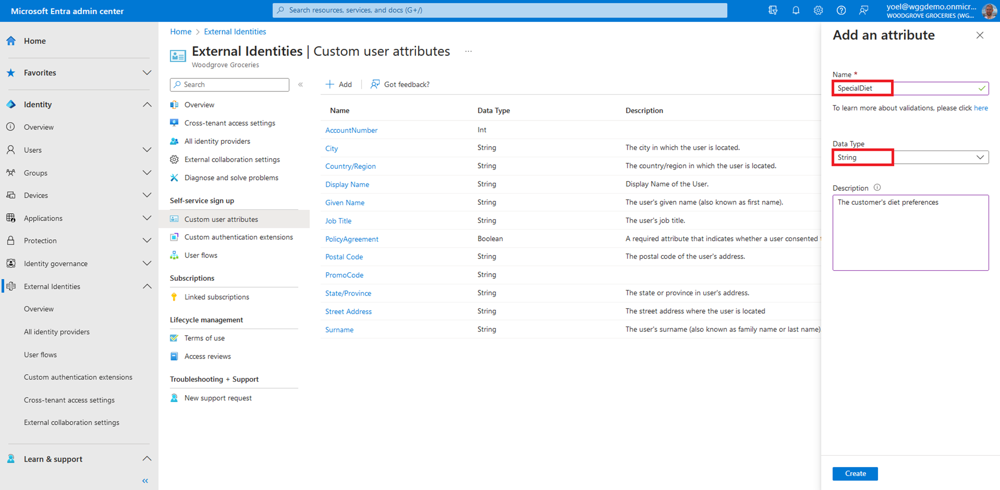
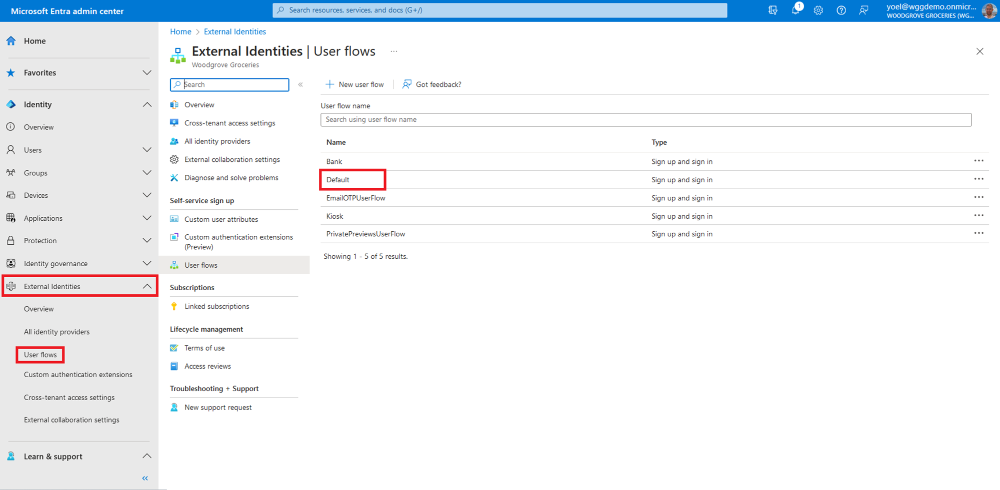
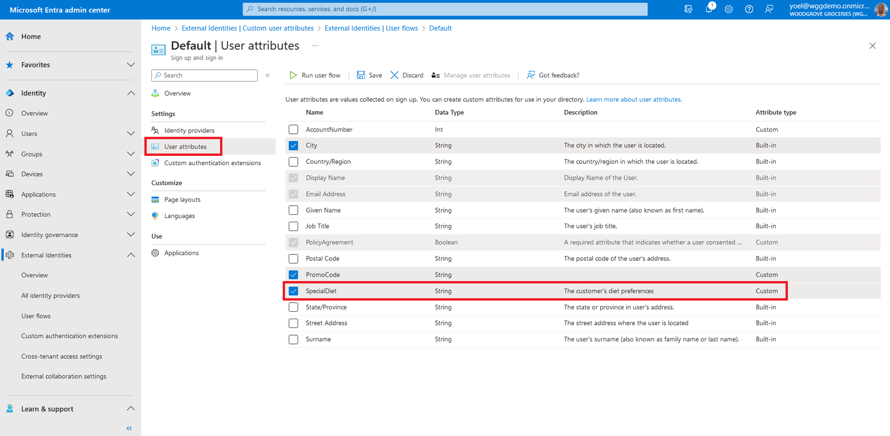
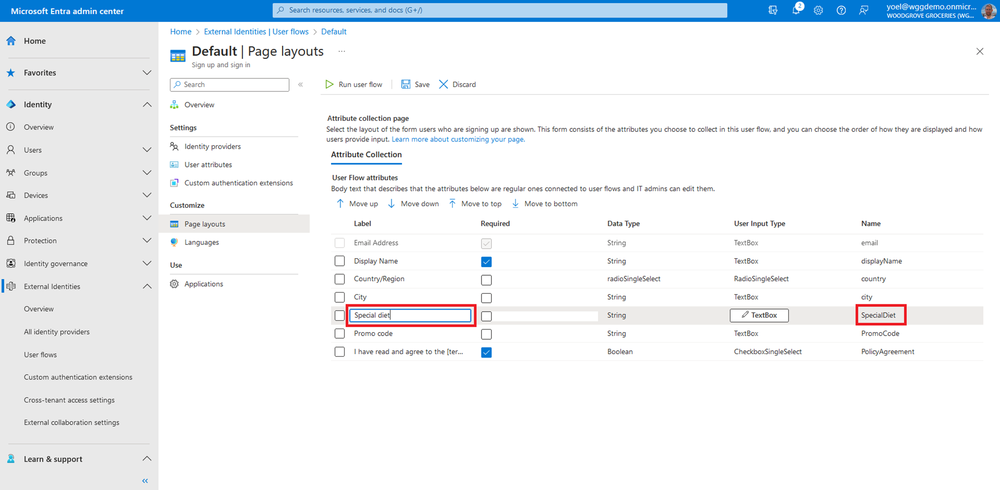

## Exercise - Collect user attributes during sign-up

[User attributes](/entra/external-id/customers/how-to-define-custom-attributes) are values collected from the user during self-service sign-up. In the user flow settings, you can select from a set of built-in user attributes you want to collect from customers. You can also create custom user attributes and add them to your user flow during sign-up. On the sign-up page, the user enters the information, and it's stored with their profile in your directory. For the purposes of the online groceries website, we will use a combination of built-in attributes and a custom attribute called **special diet**.

::: zone pivot="microsoft-entra-admin-center"

1. We start by creating the **special diet** custom user attribute. To do so, sign in to the [Microsoft Entra admin center](https://entra.microsoft.com/) and browse to **External Identities** > **Overview**. Then, select **Custom user attributes**.
    
1. The list contains all user attributes available in the tenant, including any custom user attributes that have been created. The **Attribute type** column indicates whether an attribute is built-in or custom. Select **Add** to add a new attribute.
    
1. In the **Add an attribute** pane, enter a **Name** for the custom attribute. For example, *SpecialDiet*. In **Data Type**, choose **String**. In the **Description**, enter a description of the custom attribute for internal use. This description isn't visible to the user.
    
1. After you add the custom user attribute to your tenant, proceed to include the custom user attribute in a sign-up flow. Browse to **Identity** > **External Identities** > **User flows**. Then, select a user flow from the list.
    
1. Select **User attributes**. The list includes any custom user attributes you defined as described in the previous section. For example, the new **SpecialDiet** now appears in the list. Choose all the attributes you want to collect from the user during sign-up, and select **Save**.
    
1. As the final step, you will configure the sign-up page layout. In **Page layouts**, you can indicate which attributes are required and arrange the displayed order. You can also edit attribute labels, create radio buttons or checkboxes, and more. For our groceries website, we will add a label to the attribute named **SpecialDiet**. Under **Customize**, select **Page layouts**. The attributes you chose to collect will appear. Edit the label for any attribute by selecting the value in the **Label** column and modifying the text.
    
    ***Well done!** You added a custom attribute to your tenant, added the custom attribute to a user flow, then added a label to the attribute.*

::: zone-end

::: zone pivot="graph-api"

#### 1\. Create a custom attribute

To create a [custom attribute](/graph/api/identityuserflowattribute-post?view=graph-rest-beta&tabs=http), run the following Microsoft Graph request.

```json
POST https://graph.microsoft.com/beta/identity/userFlowAttributes
{
    "displayName": "SpecialDiet",
    "description": "Customer's special diet",
    "dataType": "string"
}
```

##### 1.1 Copy the custom attribute

From the response, copy the value of the custom attribute **id**. For example:

```json
{
    "@odata.context": "https://graph.microsoft.com/beta/$metadata#identity/userFlowAttributes/$entity",
    "id": "extension_12345678900000000000000012345678_SpecialDiet",
    "displayName": "SpecialDiet",
    "description": "Customer's special diet",
    "userFlowAttributeType": "custom",
    "dataType": "string"
}   
```

#### 2\. Add attribute to a user flow

To [add an attribute to a user flow](/graph/api/onattributecollectionexternalusersselfservicesignup-post-attributes?view=graph-rest-beta&tabs=http), run the Microsoft Graph request below. Replace the **{user-flow-ID}** with your [user flow ID](/graph/api/identitycontainer-list-authenticationeventsflows?view=graph-rest-beta&tabs=http). Replace the **{attribute-ID}** with your [attribute ID](/graph/api/identityuserflowattribute-list?view=graph-rest-beta&tabs=http) from the previous step.

```json
POST https://graph.microsoft.com/beta/identity/authenticationEventsFlows/{user-flow-ID}/microsoft.graph.externalUsersSelfServiceSignUpEventsFlow/onAttributeCollection/microsoft.graph.onAttributeCollectionExternalUsersSelfServiceSignUp/attributes/$ref
{
    "@odata.id":"https://graph.microsoft.com/beta/identity/userFlowAttributes/{attribute-ID}"
}
```

##### Example

```json
POST https://graph.microsoft.com/beta/identity/authenticationEventsFlows/{user-flow-ID}/microsoft.graph.externalUsersSelfServiceSignUpEventsFlow/onAttributeCollection/microsoft.graph.onAttributeCollectionExternalUsersSelfServiceSignUp/attributes/$ref
{
    "@odata.id":"https://graph.microsoft.com/beta/identity/userFlowAttributes/{attribute-ID}"
}
```

#### 3\. (Optional) Update the page layout
Usually the attribute appears at the bottom of the sign-up page. You can [update the sign-up page layout](/graph/api/authenticationeventsflow-update?view=graph-rest-beta&tabs=http). In Page layouts, you can indicate which attributes are required and arrange the display order. You can also edit attribute labels, create radio buttons or checkboxes, and more.

To do so, you need to update the user flow. In the request body, supply only the values for properties that should be updated. Existing properties that aren't included in the request body maintains their previous values or becomes recalculated based on changes to other property values.

> [!WARNING]
> The **inputs** collection must contain all of the attributes. To add or remove attributes, make sure to include all other attributes.

Replace the **{user-flow-ID}** with your [user flow ID](/graph/api/identitycontainer-list-authenticationeventsflows?view=graph-rest-beta&tabs=http). Replace the **{attribute-ID}** with your [attribute ID](/graph/api/identityuserflowattribute-list?view=graph-rest-beta&tabs=http).

```json
PATCH https://graph.microsoft.com/beta/identity/authenticationEventsFlows/{user-flow-ID}
{
    "@odata.type": "#microsoft.graph.externalUsersSelfServiceSignUpEventsFlow",
    "onAttributeCollection": {
        "@odata.type": "#microsoft.graph.onAttributeCollectionExternalUsersSelfServiceSignUp",
        "attributeCollectionPage": {
            "customStringsFileId": null,
            "views": [
                {
                    "title": null,
                    "description": null,
                    "inputs": [
                        {
                            "attribute": "email",
                            "label": "Email Address",
                            "inputType": "text",
                            "defaultValue": null,
                            "hidden": true,
                            "editable": false,
                            "writeToDirectory": true,
                            "required": true,
                            "validationRegEx": "^[a-zA-Z0-9.!#$%&amp;&#8217;'*+/=?^_`{|}~-]+@[a-zA-Z0-9-]+(?:\\.[a-zA-Z0-9-]+)*$",
                            "options": []
                        },
                        {
                            "attribute": "displayName",
                            "label": "Display Name",
                            "inputType": "text",
                            "defaultValue": null,
                            "hidden": false,
                            "editable": true,
                            "writeToDirectory": true,
                            "required": true,
                            "validationRegEx": "^.*",
                            "options": []
                        },
                        {
                            "attribute": "country",
                            "label": "Country/Region",
                            "inputType": "radioSingleSelect",
                            "defaultValue": null,
                            "hidden": false,
                            "editable": true,
                            "writeToDirectory": true,
                            "required": false,
                            "validationRegEx": "^.*",
                            "options": [
                                {
                                    "label": "Australia",
                                    "value": "au"
                                },
                                {
                                    "label": "Spain",
                                    "value": "es"
                                },
                                {
                                    "label": "United States",
                                    "value": "us"
                                }
                            ]
                        },
                        {
                            "attribute": "city",
                            "label": "City",
                            "inputType": "text",
                            "defaultValue": null,
                            "hidden": false,
                            "editable": true,
                            "writeToDirectory": true,
                            "required": true,
                            "validationRegEx": "^.*",
                            "options": []
                        },                        {
                            "attribute": "{attribute-ID}",
                            "label": "Special diet",
                            "inputType": "text",
                            "defaultValue": null,
                            "hidden": false,
                            "editable": true,
                            "writeToDirectory": true,
                            "required": false,
                            "validationRegEx": "^.*",
                            "options": []
                        }
                    ]
                }
            ]
        }
    }
}
```

::: zone-end
