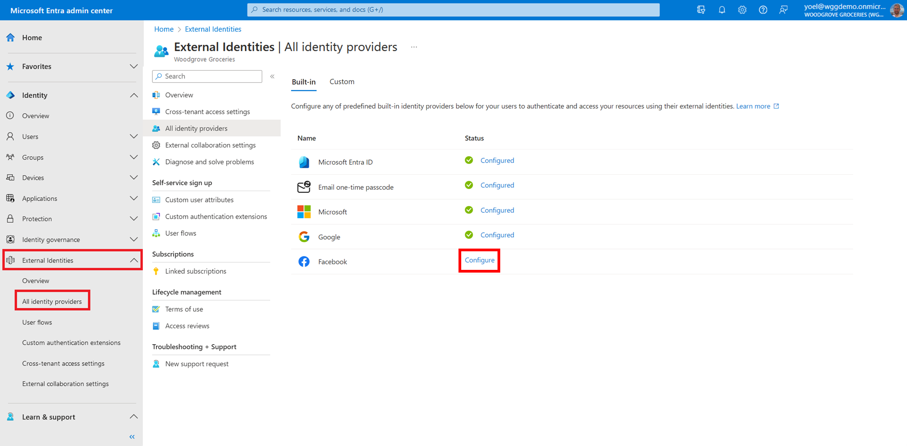
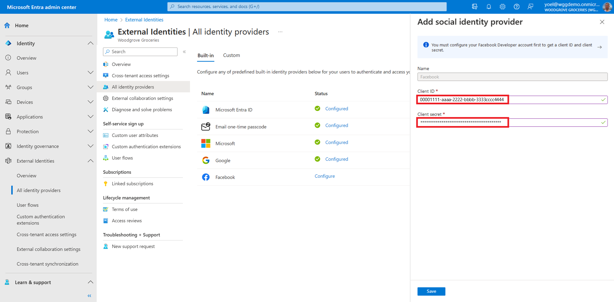
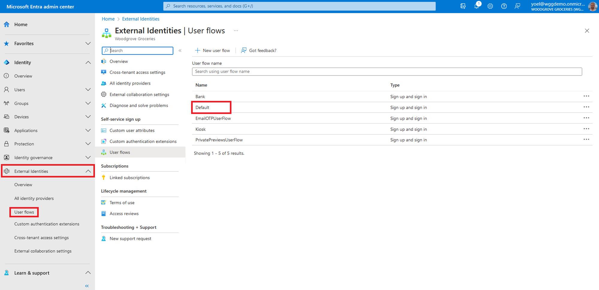
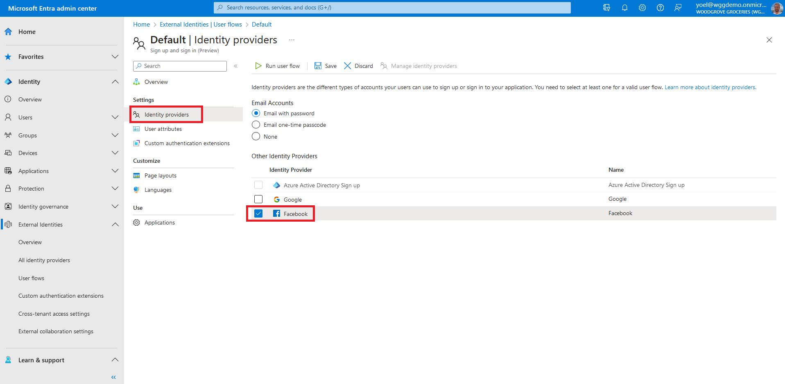

## Exercise - Enable social identity provider sign-in

By setting up federation with social identity providers, you can allow customers to sign in to your applications with their own social accounts, such as [Facebook](/entra/external-id/customers/how-to-facebook-federation-customers) or [Google](/entra/external-id/customers/how-to-google-federation-customers). This demo shows how to add Facebook as one of your application's sign-in options. On the sign-in page, customers can sign in to Microsoft Entra ID with Facebook. The steps in this tutorial also apply to other identity providers, such as Google.

::: zone pivot="microsoft-entra-admin-center"

1. To add Facebook as an identity provider, you first need to create an application in Facebook. Then, configure the federation in Microsoft Entra External ID. After you create an application in Facebook, sign in to the [Microsoft Entra admin center](https://entra.microsoft.com/) and browse to **External Identities** > **All identity providers**. Then, select **Configure** next to **Facebook**.
    
1. For the **Client ID**, enter the client ID of the Facebook application that you created earlier. For the **Client secret**, enter the client secret that you recorded. Then, select **Save**.
    
1. At this point, the Facebook identity provider has been set up in your Microsoft Entra ID, but it's not yet available in any of the sign-in pages. You need to add the Facebook identity provider to a user flow. In your external tenant, browse to **Identity** > **External Identities** > **User flows**. Then, select the user flow where you want to add the Facebook identity provider.
    
1. Under **Settings**, select **Identity providers**. Under **Other Identity Providers**, select **Facebook**. At the top of the pane, select **Save**.
    
    ***Well done!** You successfully added the Facebook identity provider to your tenant, then enabled  sign-in with Facebook in your user flow.*

::: zone-end

::: zone pivot="microsoft-graph-api"

#### 1\. Register Facebook

To add Facebook as an identity provider, you first need to [create an application in Facebook](/entra/external-id/customers/how-to-facebook-federation-customers) identity provider. Then, [register the identity provider](/graph/api/identitycontainer-post-identityproviders?view=graph-rest-beta&tabs=http) in your Microsoft Entra External ID tenant with the following Microsoft Graph. Replace the **{Facebook app ID}** with the App ID of the Facebook application that you created earlier. Replace the **{Facebook app secret}** with the App Secret that you recorded.

```json
POST https://graph.microsoft.com/beta/identityProviders
{
    "type": "Facebook",
    "name": "Facebook",
    "clientId": "{Facebook app ID}",
    "clientSecret": "{Facebook app secret}"
}
```

In some tenants it may be:

```json
{
    "@odata.type": "#microsoft.graph.socialIdentityProvider",
    "displayName": "Facebook",
    "identityProviderType": "Facebook",
    "clientId": "{Facebook app ID}",
    "clientSecret": "{Facebook app secret}"
}
```

##### 1.1 Add Facebook identity provider to a user flow

After you register the Facebook identity provider to your Microsoft Entra External ID tenant, you can [add it to your user flow](/graph/api/onauthenticationmethodloadstartexternalusersselfservicesignup-post-identityproviders?view=graph-rest-beta&tabs=http). In the following Microsoft Graph, replace the **{user-flow-ID}** with your [user flow ID](/graph/api/identitycontainer-list-authenticationeventsflows?view=graph-rest-beta&tabs=http).

```json
POST https://graph.microsoft.com/beta/identity/authenticationEventsFlows/{user-flow-ID}/microsoft.graph.externalUsersSelfServiceSignUpEventsFlow/onAuthenticationMethodLoadStart/microsoft.graph.onAuthenticationMethodLoadStartExternalUsersSelfServiceSignUp/identityProviders/$ref
{
    "@odata.id": "https://graph.microsoft.com/beta/identityProviders/Facebook-OAUTH"
}
```

#### 2\. Register Google
To add Google as an identity provider, you first need to [create an application in Google](/entra/external-id/customers/how-to-google-federation-customers) identity provider. Then, [register the identity provider](/graph/api/identitycontainer-post-identityproviders?view=graph-rest-beta&tabs=http) in your Microsoft Entra External ID tenant. Replace the **{Google app ID}** with the App ID of the Google application that you created earlier. Replace the **{Google app secret}** with the App Secret that you recorded.

```json
POST https://graph.microsoft.com/beta/identityProviders
{
    "type": "Google",
    "name": "Google",
    "clientId": "{Google app ID}",
    "clientSecret": "{Google app secret}"
}
```

In some tenants it may be:

```json
POST https://graph.microsoft.com/beta/identityProviders
{
    "@odata.type": "#microsoft.graph.socialIdentityProvider",
    "displayName": "Google",
    "identityProviderType": "Google",
    "clientId": "{Google app ID}",
    "clientSecret": "{Google app secret}"
}
```

##### 2.1 Add Google identity provider to a user flow

After you register the Google identity provider to your Microsoft Entra External ID tenant, you can [add it to your user flow](/graph/api/onauthenticationmethodloadstartexternalusersselfservicesignup-post-identityproviders?view=graph-rest-beta&tabs=http). In the following Microsoft Graph request, replace the **{user-flow-ID}** with your [user flow ID](/graph/api/identitycontainer-list-authenticationeventsflows?view=graph-rest-beta&tabs=http).

```json
POST https://graph.microsoft.com/beta/identity/authenticationEventsFlows/{user-flow-ID}/microsoft.graph.externalUsersSelfServiceSignUpEventsFlow/onAuthenticationMethodLoadStart/microsoft.graph.onAuthenticationMethodLoadStartExternalUsersSelfServiceSignUp/identityProviders/$ref
{
    "@odata.id": "https://graph.microsoft.com/beta/identityProviders/Google-OAUTH"
}
```

::: zone-end
