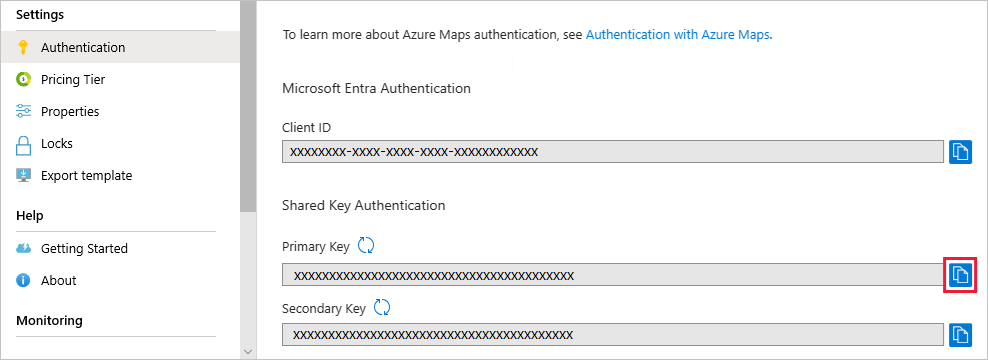

In this unit, you first create an Azure Maps account. Then, navigate the Azure portal to extract a string called the *Primary Key*. This string is needed to verify that you have an account, when writing the code section of this module.

## Create an Azure Maps account

1. Right-click on [Azure portal](https://portal.azure.com/learn.docs.microsoft.com?azure-portal=true), and select **Open in new window**.

1. Select **+ Create a resource**. Type "Maps" into the search bar, and select **Azure Maps**.

1. Select **Create**.

    

1. On the **Create an Azure Maps Account resource** screen, select the **Concierge Subscription** and the resource group for the sandbox, which begins with **learn-**.

1. For the **Name**, enter something appropriate, *MyAzureMaps*, or similar.

1. Select the **Region** you're closest to.

    :::image type="content" source="../media/2-create-azure-maps-account.png" alt-text="Screenshot showing the dialog to create an app in Azure." lightbox="../media/2-create-azure-maps-account.png":::

1. Leave **Pricing tier** at its default value. It's free anyway! Read, and select the checkbox covering the License and Privacy Statement.

1. Select **Review + create**.

1. Verify that validation is successful, and then select **Create**.

1. It might take a few seconds for the resource to be deployed. When you get the deployment message, select **Go to resource**.

1. The **Overview** pane displays.

### Extract the Primary Key

1. Look down the left menu, find **Settings**, and then select **Authentication**.

1. Notice that some strings, including the **Primary Key**, are displayed on this screen. Use the icon to the far right of the string, and copy the key to the clipboard.

    

1. Paste the string into a text file. This key is the only authentication you need to connect an app to your Maps resource.

1. It's now OK to close the Azure portal.

Before we build the app to use this key, let's go over some of the features Azure Maps has for route finding.
