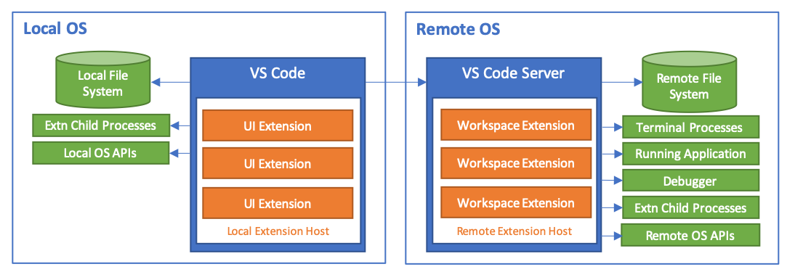

In this project, you can use GitHub Codespaces to develop the minigame application.  You can use Codespaces to develop console applications in Python without having to install Python or any other tools on your local computer.

## 1. GitHub account and services

To get started, you need a GitHub account. If you don't have an account, create one for free at [github.com](https://github.com/). Sign in to your GitHub account and make sure to enable GitHub Codespaces and GitHub Copilot services.

### GitHub Codespaces

[GitHub Codespaces](https://docs.github.com/en/codespaces) is a cloud-based development environment that enables you to swiftly set-up a comprehensive workspace for your project. It's accessible to developers in all organizations, providing up to 60 hours of free usage every month. GitHub Codespaces and Dev Containers are closely related as Codespaces uses Dev Containers to provide a cloud-based development environment.

#### What is a Dev Container?

Dev Containers, also known as Development containers, are a feature within Visual Studio Code that enables you to define and configure a development environment using a Docker container. GitHub Codespaces makes use of this technology, allowing users to create customizable and reproducible development environments directly within their browser or in Visual Studio Code. This integration ensures a smooth and efficient development experience, providing developers with a consistent and personalized environment for their projects.

**GitHub Codespaces** is accessible through both Visual Studio Code and a browser-based editor. This diagram from the official [Visual Studio Code docs](https://code.visualstudio.com/docs/remote/containers) illustrates this functionality.

> [!div class="mx-imgBorder"]
> 

### GitHub Copilot

GitHub Copilot is an AI pair programmer that offers autocomplete-style suggestions as your code. You can receive suggestions from GitHub Copilot either by starting to write the code you want to use, or by writing a natural language comment describing what you want the code to do.

Activating a GitHub Copilot trial on your GitHub:

- On the top-right corner of any page, click your profile picture and then **Settings.**
- On the "Code, planning, and automation" section of the sidebar, click **GitHub Copilot.**
- Click "Start free trial" and pick whether you want to pay per month or per year and click Proceed to get access to Copilot.
- Follow the steps to verify your payment details and click Send.
- Choose your preferences and click Save and begin.

> [!NOTE]
> Students can claim the GitHub Student Developer Pack at [GitHub Student Developer Pack - GitHub Education](https://education.github.com/pack). This offer includes access to Codespaces, GitHub Copilot, and Azure for Students and other benefits.

## 2. Setting up your environment

Having GitHub Codespaces and GitHub Copilot enabled in your GitHub account, you also need to make a copy of the [template repository](https://github.com/MicrosoftDocs/mslearn-challenge-project-create-mini-game-with-copilot) in your GitHub account using the `Fork` function. At the end of the repository fork, you have a copy of the template repository in your GitHub account. You use this repository to develop the minigame application.

> [!div class="mx-imgBorder"]
> 

On the repository page that was created, select the `Code` button and, in the Codespaces tab, select `Create codespace on main`. In a few moments, Codespaces creates a development environment for you.

> [!div class="mx-imgBorder"]
> 

When Codespaces finishes creating the development environment, you see a Visual Studio Code window in the browser. You can use Visual Studio Code in the browser to develop the minigame application.

> [!div class="mx-imgBorder"]
> 
