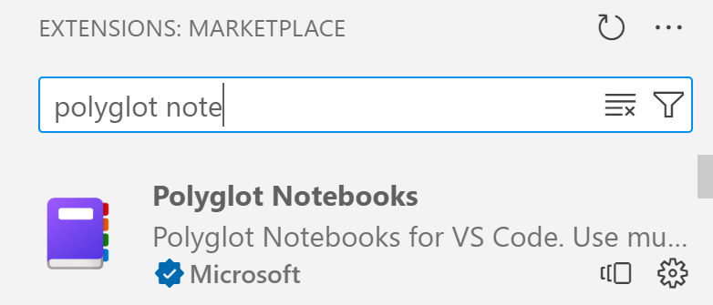
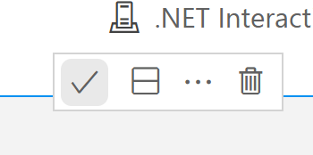

In this exercise, you'll learn how to set up your environment and run your first Polyglot Notebook.

## Set up environment

There are three things you need to be able to use Polyglot Notebooks: Visual Studio Code, the latest .NET runtime, and a Visual Studio Code extension.

- [Install Visual Studio Code](https://code.visualstudio.com/)
- [Install the latest .NET runtime](https://dotnet.microsoft.com/download/dotnet/8.0)
- Install the **Polyglot Notebooks** extension in Visual Studio Code. You can also select and [install the extension](https://marketplace.visualstudio.com/items?itemName=ms-dotnettools.dotnet-interactive-vscode).



Congratulations! You successfully installed all the tools you need to begin building with Polyglot Notebooks.

## Create and run a Notebook

Next, let's create our first Notebook and learn to work with both text and code.

1. Via the command palette, type **Polyglot** and select the command **Polyglot Notebook: Create new blank notebook**.

    

    > [!NOTE]
    > When you run this for the first time, you might see a message on the bottom right that begins with *Installing .NET Interactive*; don't panic, that's normal.

1. You're presented with choosing a file format, **.dib** or **.ipynb**. Select **.ipynb**

1. Next, you're asked to select a default language. Select **C#**. At this point, a Notebook with a code cell is created.

1. Type the code into the code cell. To run the code, select the **Run** icon next to the cell.

    ```csharp
    Console.WriteLine("Hello from Polyglot");
    ```

    

You should see the text "Hello from Polyglot" below the cell.

## Create markdown cell

So far, you created a Notebook, wrote some code, and ran it successfully. Notebooks are great because they allow you to blend both text and code, so let's create markdown cell next to add some text.

1. Hover over the code cell until the commands **+ Markdown** and **+ Code** appear, then select **+ Markdown**. You can also select **+ Markdown** at the top-left of the taskbar.

    

    You should now see a markdown cell in your code cell.

    > [!NOTE]
    > You can also hover underneath an element to create either a code or markdown cell. You decide if you want to add a cell at the top or below an element to best fit your use case.

1. Type the following text in the markdown cell you created:

    ```markdown
    ## Printing text in C# with Console.WriteLine
    To print text with C#, you can use code like this:
    Console.WriteLine("Hello World!");
    ```

1. To confirm the changes, select the **Check mark** icon on the top-right of the cell:

    

    Your Notebook should now look like the following image, consisting of a markdown cell on top and code element underneath:

    

Congrats, you managed to successfully install Polyglot Notebooks, create a Notebook, author text and code cells, and even run code. In future sections, we'll explore more advanced features.
