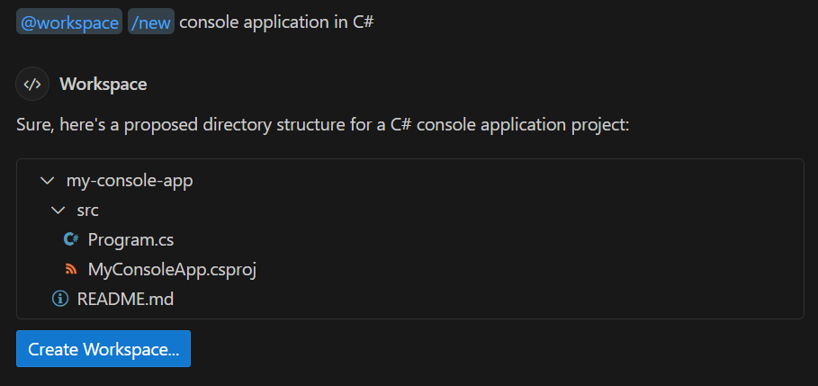
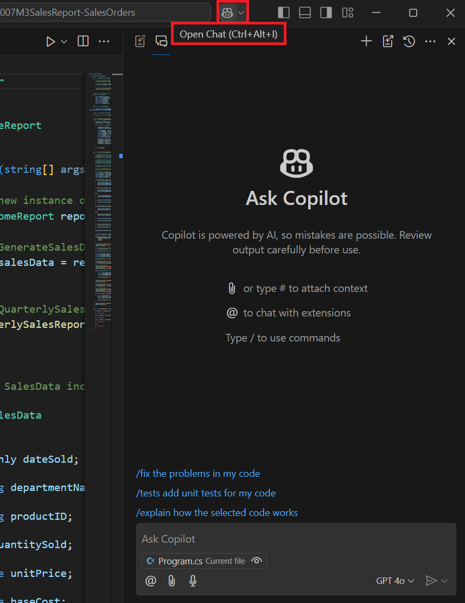
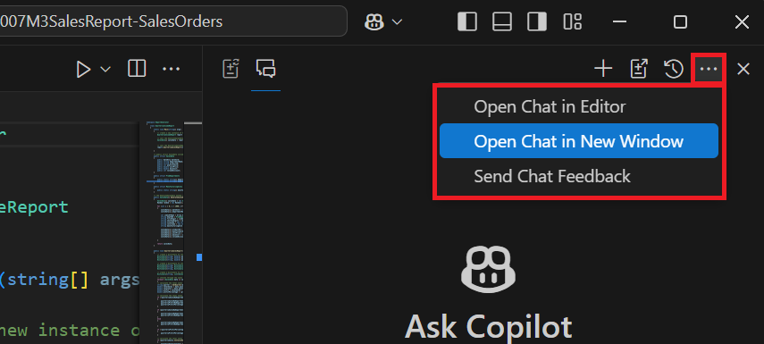
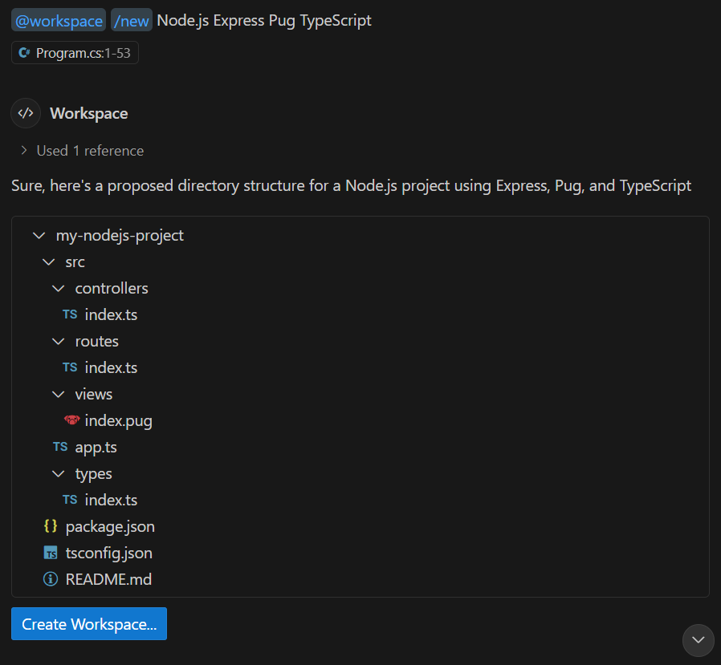
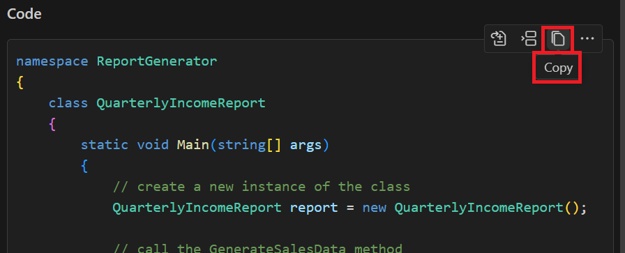
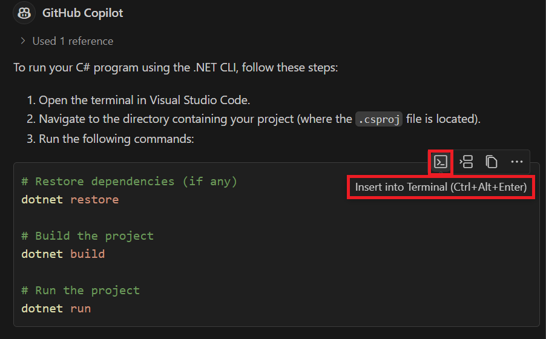
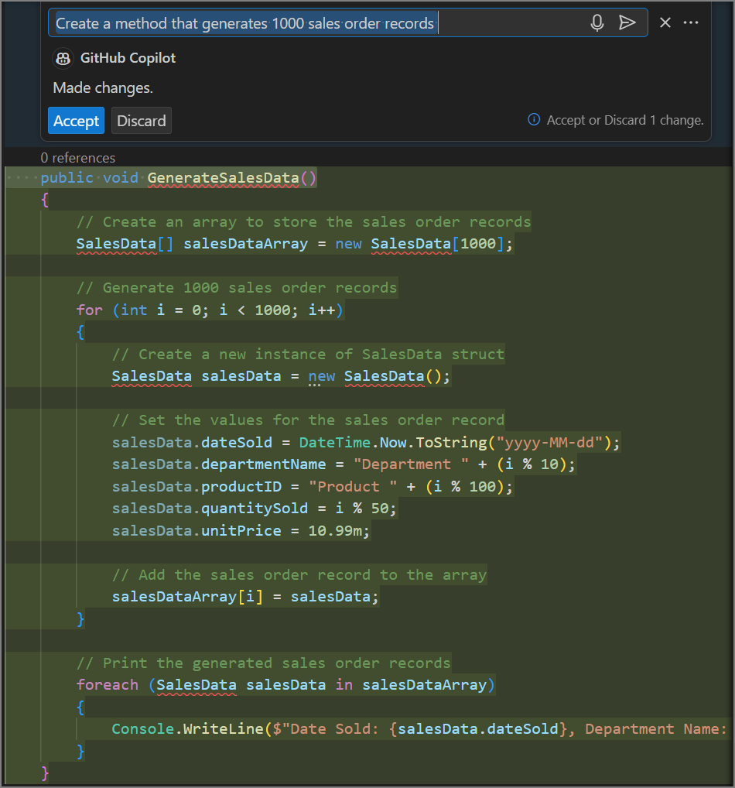
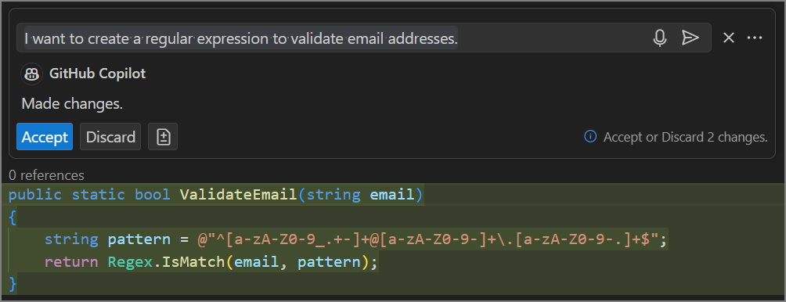

Visual Studio Code implements GitHub Copilot using two extensions, GitHub Copilot and GitHub Copilot Chat. These extensions increase developer productivity by generating suggestions that extend or improve your applications. Each extension provides a set of features that help you develop code more efficiently:

- The GitHub Copilot extension generates code completion suggestions using the code you enter in the editor or your code comments.
- The GitHub Copilot Chat extension generates code suggestions based on chat interactions or smart actions that act on selected code.

> [!NOTE]
> In this module, you use the GitHub Copilot extensions to develop new features and applications. There are two separate modules that cover using GitHub Copilot to create unit tests and improve existing code.

## GitHub Copilot tools in Visual Studio Code

Visual Studio Code provides easy access to the following GitHub Copilot and GitHub Copilot Chat features:

- **Code line completions**: Use code line completions to write code more efficiently.
- **Inline chat**: Start an inline chat conversation directly from the editor for help while you're coding.
- **Chat view**: Open an AI assistant on the side that can help you at any time.
- **Quick Chat**: Ask a quick question and get back into what you're doing.
- **Smart actions**: Run smart actions to complete certain tasks without even having to write a prompt.

The GitHub Copilot extensions bring the power of AI into the Visual Studio Code environment.

## Generate code using code line completions with GitHub Copilot

GitHub Copilot generates code line completions as you enter code. The code that's already in your application provides context that GitHub Copilot uses to generate accurate suggestions. For example, suppose you're working on a class that processes customer expenditures. The class uses a list that contains expenditures for all customers. You need to create a method that returns the sum of all expenditures. If you start entering the method signature, GitHub Copilot generates a suggestion that completes the code line.

If you're satisfied with the suggestion, press the Tab key or select **Accept**. Autocompletions save you time and help you to write code accurately by supplying the names of variables and other code elements.

You can also use code line completions to view different options for constructing your code. For example, if you start typing the call statement for a method, GitHub Copilot provides suggestions that implement the various method overloads. You can cycle through the suggestions and accept the option that matches your intent. You could also reject all of the suggestions. This process helps you to quickly explore different coding styles and techniques.

GitHub Copilot also generates code line completion suggestions from code comments. For example, if you type a comment that describes a method you want to create, GitHub Copilot generates a suggestion for the method signature and implementation.

Notice that the suggested code completion uses information from your existing code and the code comment that describes the method.

Developers use code completions to accelerate the development of an initial code structure.

## Generate code using GitHub Copilot Chat

GitHub Copilot Chat helps you create code using chat interfaces and smart actions. For example, if you enter a prompt asking GitHub Copilot Chat to create a new method, GitHub Copilot can provide suggestions for one or more method signatures and implementations. Reviewing, and then accepting or discarding the suggestions helps you create an initial version of your code more quickly and accurately.

> [!NOTE]
> The GitHub Copilot Chat extension for Visual Studio Code includes a chat interface that processes user input. This training uses the terms *question* and *prompt* when referring to the input you provide during a chat session.

GitHub Copilot Chat is especially helpful when you need to develop code that implements unfamiliar resources, such as a new library, framework, or API. When you submit a prompt that describes your requirement, GitHub Copilot Chat generates suggestions that demonstrate how to achieve your goal. Reviewing the suggestions can also teach you how to implement the new resources.

Providing GitHub Copilot Chat with prompts or questions that include a clear scope and intent improves the generated responses. You can ask questions that provide context and describe your requirements in a conversational style. GitHub Copilot Chat uses the information you provide to generate code suggestions that meet your needs and match your coding style.

You can use chat participants, slash commands, and chat variables to clarify the context of your prompts.

- Chat participants, such as `@workspace` or `@terminal`, help GitHub Copilot Chat understand the context of your question.
- Slash commands, such as `/explain` or `/new`, help Copilot Chat understand the intent or purpose of your question.
- Chat variables, such as `#file` or `#editor`, help Copilot Chat focus on something specific when considering the larger context of your question.

Using these specialized descriptors helps GitHub Copilot Chat generate more accurate and useful responses.

You can combine chat participants with slash commands to perform specific actions. For example, you could scaffold a new C# console application by using the following prompt: `@workspace /new console application in C#`. This prompt includes a chat participant (`@workspace`) and a slash command (`/new`) to help GitHub Copilot Chat perform the intended task.

GitHub Copilot can scaffold more complex workspaces. For example, the following prompt creates the workspace for a Node.js application that uses the Express framework, the Pug template engine, and TypeScript: `@workspace /new Node.js Express Pug TypeScript`.

### Generate code with GitHub Copilot Chat using the Chat view

The Chat view in Visual Studio Code provides an AI assistant that can help you develop your code. You can ask questions and get help from the AI assistant without leaving the Visual Studio Code environment. The Chat view helps you to develop code and explore coding options. You can also use the Chat view to ask questions about existing code, to get help with errors or logic issues, and to get information about using resources. The Chat view can help you learn new coding techniques, explore different coding styles, and improve your coding skills.

The Chat view enables a chat conversation with GitHub Copilot in Visual Studio Code's Side Bar panel. You can access the Chat view by selecting **Chat** from the Activity Bar, or by pressing **Ctrl** + **Alt** + **I**. The Chat view displays a greeting message and sample questions the first time you open it.

If you need access to other Visual Studio Code views while using the Chat interface, you can open Chat in the editor by selecting **Open Chat in Editor** from the Chat view's context menu.

GitHub Copilot Chat provides rich and interactive results that include the following elements:

- Simple text. For example, to provide a natural language response to a question.
- Images. For example, to show a diagram or a screenshot.
- Buttons. For example, to trigger an action.
- References. For example, a Uniform Resource Identifiers (URIs) where you can find more information.
- File trees. For example, to show a workspace preview when a chat participant proposes to create a new workspace.

The following example shows the response for a prompt that's used to create an Express app. GitHub Copilot Chat provides a simple text explanation, a tree view showing a suggested workspace structure, and a button that can be used to create the new workspace.

GitHub Copilot maintains a history of your conversation. The history is used to improve the responses and follow-up questions provided by GitHub Copilot Chat.

#### Manage code blocks in the Chat view

Depending on your question, GitHub Copilot Chat may return source code in the response. Source code is displayed as a code block, and you can manage the code in a few different ways.

If you hover the mouse pointer over the code block, options for managing the code block are displayed. Your initial options are **Copy** and **Apply in Editor (Ctrl+Enter)**.

The More Actions (...) button displays the options to **Insert Into New File** and **Insert into Terminal (Ctrl+Alt+Enter)**.

If Copilot Chat detects that a code block contains a command, you can run it directly in the integrated terminal with **Insert into Terminal (Ctrl+Alt+Enter)**. This option creates or opens the active terminal and inserts the command text, ready for you to run.

### Generate code with GitHub Copilot Chat using inline chat

The inline chat interface provides access to powerful AI features while keeping focused on your code. When you're working in the code editor, you can open the inline chat by pressing `Ctrl` + `I` on the keyboard.

You can use inline chat in the following ways:

- To ask questions about existing code.
- To modify or replace existing code.
- To generate new code.

#### Create a new feature using inline chat

The inline chat interface can be used to develop new code features. For example, you can use inline chat to create a new user interface component, a new API endpoint, or a new data processing pipeline.

You can create a new code feature using inline chat by completing the following steps:

1. Select code in the editor.

1. Open the inline chat interface by pressing **Ctrl** + **I** on the keyboard.

1. Enter a prompt that describes the feature you want to create.

1. Review the suggestions provided by Copilot Chat, and refine your prompt if necessary.

1. Once you're satisfied, accept a suggestion.

Here's an example that demonstrates how to create a new method using inline chat:

#### Create regular expressions using inline chat

Regular expressions are patterns used to match character combinations in strings. Some developers find regular expressions challenging to write because they can be complex and difficult to understand.

The inline chat interface can be used to generate regular expressions quickly and accurately. For example, you can use inline chat to generate regular expressions for validating email addresses, phone numbers, postal codes, and other data patterns.

You can create a regular expression using inline chat by completing the following steps:

1. Select code in the editor.

1. Open the inline chat interface by pressing **Ctrl** + **I** on the keyboard.

1. Enter a prompt that describes the data pattern you need to validate.

1. Review the suggestions provided by Copilot Chat, and once you're satisfied, accept a suggestion.

Here's an example that demonstrates how to create a regular expression for email addresses using inline chat:

It's always important to review the responses generated by GitHub Copilot Chat.

Copilot Chat suggests the following regular expression can be used to validate email addresses: `^[a-zA-Z0-9_.+-]+@[a-zA-Z0-9-]+\.[a-zA-Z0-9-.]+$`.

Let's take a minute to evaluate the suggested regular expression.

`^`: This symbol indicates the start of a line. The email address must start here.

`[a-zA-Z0-9_.+-]+`: This part of the expression matches one or more (+) of the characters inside the square brackets ([]). The characters can be lowercase (a-z), uppercase (A-Z), numeric (0-9), or special characters like underscore (_), period (.), plus (+), or hyphen (-).

`@`: This part of the expression is the "at" symbol (@). It's a literal character in the email address.

`[a-zA-Z0-9-]+`: This part of the expression is similar to the first, but it's for the domain name portion of the email. It can contain one or more lowercase, uppercase, numeric, or hyphen (-) characters.

`\.`: This part of the expression is a literal period (.) character. It separates the domain name from the domain extension.

`[a-zA-Z0-9-.]+`: This part of the expression matches the domain extension. It can contain one or more lowercase, uppercase, numeric, hyphen (-), or period (.) characters.

`$`: This symbol indicates the end of a line. The email address must end here.

Overall, this regular expression is a good starting point for validating email addresses, but it has some limitations and may not cover all valid email formats. You may want to consider using more comprehensive patterns or even dedicated email validation libraries for critical applications.

## Summary

The GitHub Copilot extensions help developers write code faster and with fewer errors. The GitHub Copilot extension generates code completion suggestions using the code you enter in the editor or your code comments. The GitHub Copilot Chat extension generates code suggestions based on chat interactions or smart actions that act on selected code.
