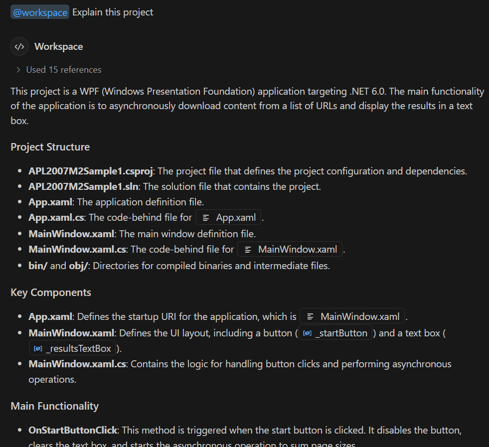
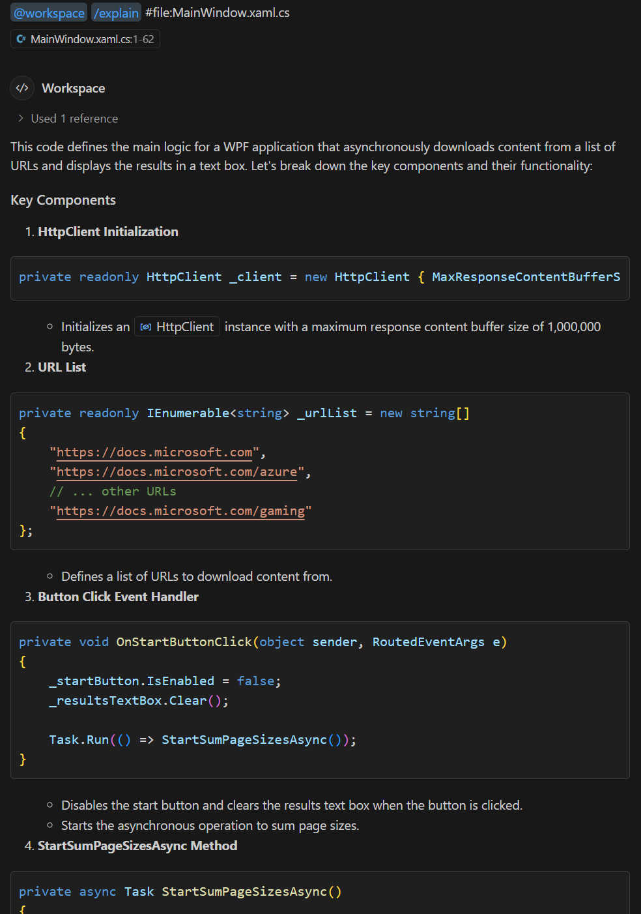
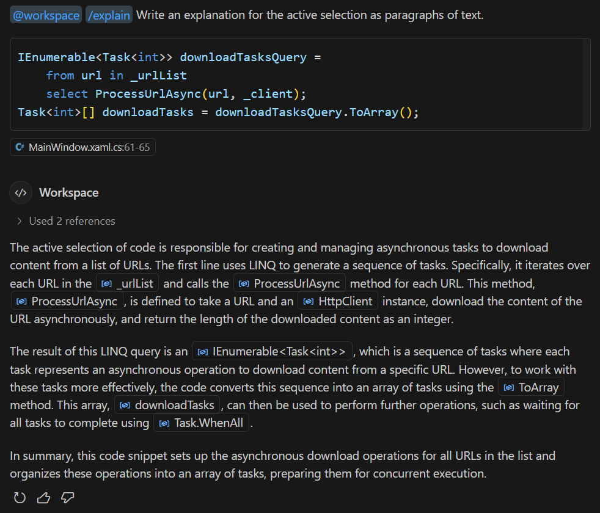
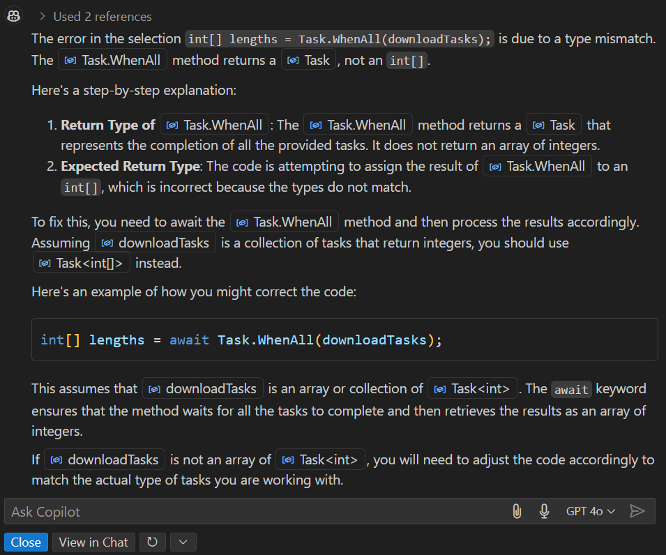
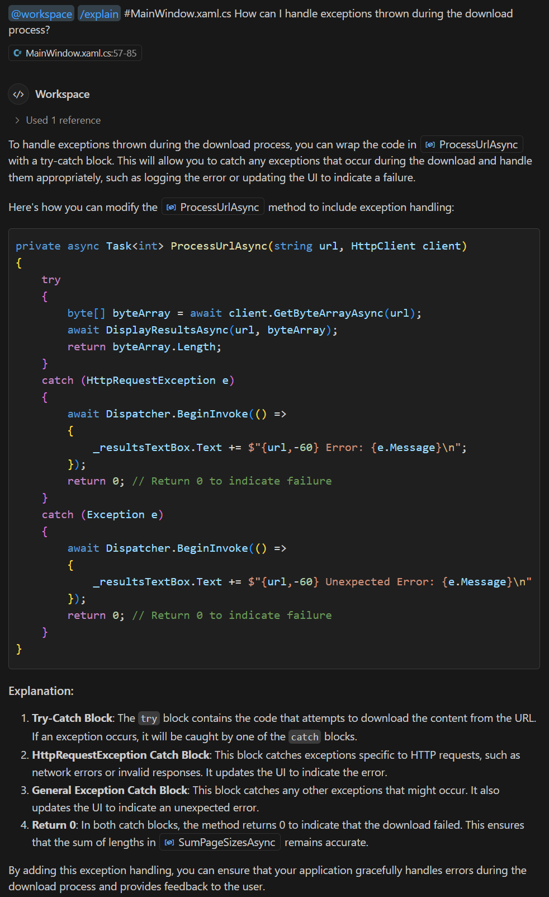
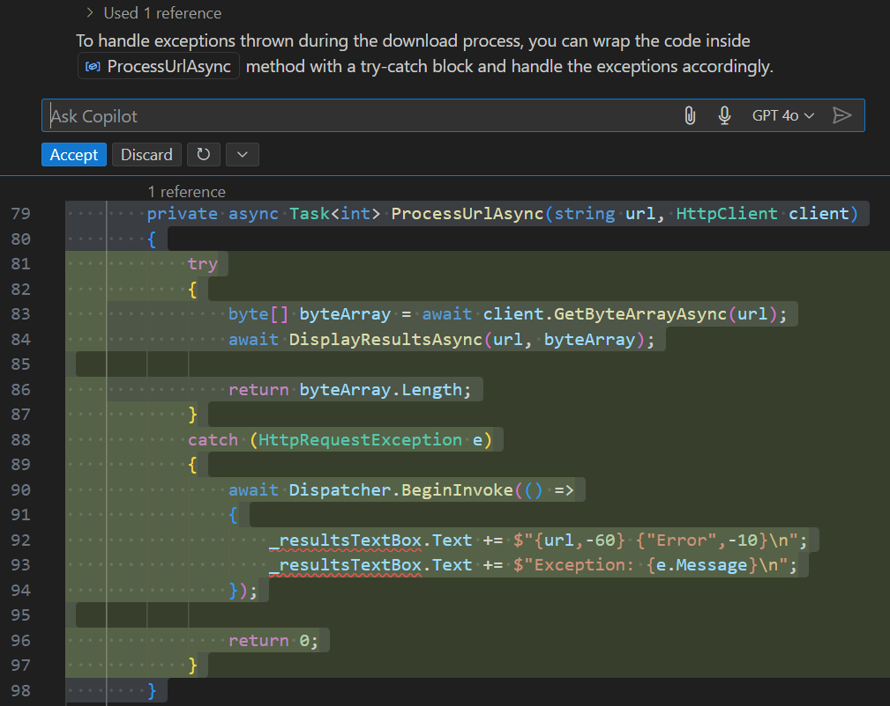

GitHub Copilot Chat uses conversational AI assistance and smart commands to help you with coding-related tasks. One example is the ability to explain unfamiliar and complex code.

You can use GitHub Copilot Chat to generate explanations for a number of reasons. For example:

- GitHub Copilot Chat can explain an entire workspace or specific project files when you join an existing project.
- GitHub Copilot Chat can explain specific code lines or sections when code is complex or difficult to understand.
- GitHub Copilot Chat can explain errors in your code and suggest ways to fix them.
- GitHub Copilot Chat can explain how to add features to your project and provide code snippets that demonstrate how to implement the new code.

### Prepare sample apps in your Visual Studio Code environment

This module includes practice activities that use GitHub Copilot Chat and prepared code samples. The activities are designed for an environment that includes the following resources:

- Visual Studio Code.
- The C# Dev Kit extension for Visual Studio Code.
- The GitHub Copilot and GitHub Copilot Chat extensions for Visual Studio Code. A GitHub account with an active subscription for GitHub Copilot is required.
- Sample code projects created using C#.

> [!NOTE]
> If you have not already installed Visual Studio Code and the required extensions, complete those installations before continuing.

To prepare for the exercises in this module, complete the following steps:

1. To download a zip file containing the sample apps, select the following link: [SampleApps](https://raw.githubusercontent.com/MicrosoftLearning/APL-2007-Accelerate-app-development-by-using-GitHub-Copilot/master/LearnModuleExercises/Downloads/SampleApps.zip).

1. Unzip the download files.

    Unzip the files in your development environment. Consider using your PC as your development environment so that you have access to your code after completing this module. If you aren't using your PC as your development environment, you can unzip the files in a sandbox or hosted environment.

    1. On your local machine, navigate to your downloads folder.
    1. Right-click **SampleApps.zip**, and then select **Extract all**.
    1. Select **Show extracted files when complete**, and then select **Extract**.
    1. Make note of the extracted folder location.

1. Copy the extracted **SampleApps** folder to your Windows Desktop folder.

    The **SampleApps** folder contains a collection of sample apps, including the **APL2007M2Sample1** code project that you use in this exercise.

1. Open the **APL2007M2Sample1** folder in Visual Studio Code.

    1. Open Visual Studio Code on your PC.
    1. In Visual Studio Code, on the **File** menu, select **Open Folder**.
    1. Navigate to the Windows Desktop folder, open the **SampleApps** folder, and locate the **APL2007M2Sample1** folder.
    1. Select **APL2007M2Sample1** and then select **Select Folder**.

    The Visual Studio Code EXPLORER view should show a APL2007M2Sample1 code project containing the following files:

    - APL2007M2Sample1.csproj
    - APL2007M2Sample1.sln
    - App.xaml
    - App.xaml.cs
    - MainWindow.xaml
    - MainWindow.xaml.cs

You're now ready to use GitHub Copilot Chat to complete this exercise.

### Workspace and project file explanations

GitHub Copilot Chat can help you understand new projects or specific project files. You can use a combination `@workspace`, `/explain`, and `#file` in the Chat view or a Quick Chat window to generate an explanation of your project or specific project files.

Use the following steps to complete this section of the exercise:

1. On Visual Studio Code's top menu bar, select **Open Chat**.

    The Open Chat button is located on the menu bar at the top of the Visual Studio Code window, just to the right of the Searchbox. It displays a small GitHub Copilot logo.

1. Use the following command to ask Copilot Chat to explain the `APL2007M2Sample1` project:

    ```plaintext
    @workspace Explain this project
    ```

1. Take a minute to review the response in the Chat view.

    GitHub Copilot Chat generates an explanation of the APL2007M2Sample1 project that's similar to the following response:

    > [!IMPORTANT]
    > GitHub Copilot Chat uses an AI model to generate responses. The responses you receive are similar to the responses shown in this training, but they aren't identical.

    

1. At the bottom of the Chat view, notice that GitHub Copilot Chat has suggested a follow-up question.

    

    The response you receive may include a different follow-up question.

    GitHub Copilot Chat builds a history of your chat conversation. The history helps GitHub Copilot Chat understand your interests. As you build a chat history, the AI model learns from your interactions and provides more relevant follow-up questions. Exploring "random" follow-up questions isn't recommended.

1. Open the `MainWindow.xaml.cs` file in the editor.

1. Use the following command to ask Copilot to explain the `MainWindow.xaml.cs` file:

    ```plaintext
    @workspace /explain #file:MainWindow.xaml.cs
    ```

1. Take a minute to review the response in the Chat view.

    The response should be similar to the following information:

    

    Notice that GitHub Copilot Chat generates a detailed explanation of the `MainWindow.xaml.cs` file. The explanation includes information about the file's purpose, structure, and key components. You may also see a section that describes potential issues and improvements.

    Once again, GitHub Copilot Chat suggests a follow-up question. Although GitHub Copilot Chat suggests great follow-up questions, we suggest that you continue on to the next section of this exercise.

    > [!IMPORTANT]
    > GitHub Copilot Chat maintains a history of your chat conversation. As you continue to ask questions, it refines its responses accordingly. The context of your questions, especially in regard to your code project, influences GitHub Copilot Chat's subsequent responses. This helps it to provide more accurate and relevant responses. It also means the response you receive for a particular question is likely to vary based on your conversation history.

### Selected code explanations

Even experienced developers encounter code that's difficult to understand. Rather than spending time trying to decipher complex code, you can ask GitHub Copilot Chat to provide an explanation. Chat view, inline chat, and smart actions can each be used to generate explanations for selected code lines or sections.

In this section of the exercise, you use the **Explain** smart action to generate an explanation of selected code lines.

1. Ensure that you have the `MainWindow.xaml.cs` file open in the editor.

1. Scroll down to locate the `SumPageSizesAsync()` method.

    ```csharp
    private async Task SumPageSizesAsync()
    {
        var stopwatch = Stopwatch.StartNew();
    
        IEnumerable<Task<int>> downloadTasksQuery =
            from url in _urlList
            select ProcessUrlAsync(url, _client);
    
        Task<int>[] downloadTasks = downloadTasksQuery.ToArray();
    
        int[] lengths = Task.WhenAll(downloadTasks);
        int total = lengths.Sum();
    
        await Dispatcher.BeginInvoke(() =>
        {
            stopwatch.Stop();
    
            _resultsTextBox.Text += $"\nTotal bytes returned:  {total:#,#}";
            _resultsTextBox.Text += $"\nElapsed time:          {stopwatch.Elapsed}\n";
        });
    }
    ```

1. Select the following code lines, and then use the **Explain** smart action to generate an explanation.

    To select the **Explain** smart action, right-click the selected code lines, select **Copilot**, and then select **Explain** from the context menu.

    ```csharp

    IEnumerable<Task<int>> downloadTasksQuery =
        from url in _urlList
        select ProcessUrlAsync(url, _client);

    Task<int>[] downloadTasks = downloadTasksQuery.ToArray();

    ```

1. Take a minute to review the response in the Chat view.

    

1. Notice the level of detail included in the explanation.

    GitHub Copilot Chat generates detailed explanations that include information about the selected code lines, their purpose, and how they work. Responses include code snippets and natural language descriptions that help you understand the code.

### Error explanations

Managing errors is an essential aspect of software development. Some errors are easy to spot and fix, while others can be more challenging. When you encounter an error in your code that's difficult to understand, you can ask GitHub Copilot Chat to provide an explanation. For example, you can ask GitHub Copilot Chat to explain why a specific line of code is causing an error.

Use the following steps to complete this section of the exercise:

1. Ensure that you have `MainWindow.xaml.cs` open in the editor.

1. In the `SumPageSizesAsync()` method, locate the following code line:

    ```csharp
    int[] lengths = Task.WhenAll(downloadTasks);
    ```

1. Hover the mouse cursor over `downloadTasks` to display the error message.

    

    Error messages don't always explain how to fix coding issues. When the solution isn't obvious, you can ask GitHub Copilot Chat to explain an error and suggest ways to fix it.

1. Select the code line containing the error, and then press `Ctrl` + `I` to open an inline chat.

1. To generate an explanation for the error, enter the following prompt:

    ```plaintext
    /explain why is the selection causing an error
    ```

1. Take a minute to review the response in the Chat view.

    

    Notice that the response includes information about the error and suggestions for fixing it. In this case, GitHub Copilot Chat explains that the `Task.WhenAll(downloadTasks)` line is causing an error because it's missing the `await` keyword. The response also provides a code snippet that shows how to fix the error by adding the `await` keyword before the `Task.WhenAll(downloadTasks)` line.

1. Use the explanation provided by GitHub Copilot Chat to fix the error in your code.

    Add the `await` keyword before the `Task.WhenAll(downloadTasks)` line, as shown in the following code snippet:

    ```csharp
    int[] lengths = await Task.WhenAll(downloadTasks);
    ```

    After you make this change, the error should be resolved.

1. Save your changes to the `MainWindow.xaml.cs` file.

### New feature or functionality explanations

GitHub Copilot Chat can explain how to add new features or functionality to your project.

Consider the APL2007M2Sample1 project. Your code downloads web pages and calculates the total size of the downloaded pages. Suppose you need to add exception handling to the application. In this section of the exercise, you use GitHub Copilot Chat to explain how to manage exceptions during the download process.

Use the following steps to complete this section of the exercise:

1. Select the code lines that include the `SumPageSizesAsync` and `ProcessUrlAsync` methods.

1. In the Chat view, to have GitHub Copilot Chat explain how to handle exceptions thrown during the download process, enter the following question:

    ```plaintext
    @workspace /explain #MainWindow.xaml.cs How can I handle exceptions thrown during the download process?
    ```

1. Take a minute to review the response in the Chat view.

    Copilot Chat generates a response that's similar to the following explanation:

    

    The response provides a detailed explanation of how to handle exceptions thrown during the download process. You also get a code snippet that implements the suggested exception handling code. You can copy the code snippet or insert it into your code project at the location of the cursor.

    Rather than copying or inserting the code snippet from the Chat view, the next step investigates using the inline chat to implement the suggested exception handling code.

1. To ask inline chat how to implement exception handling, select the `ProcessUrlAsync` method, press `Ctrl` + `I`, and then enter the following prompt:

    ```plaintext
    How can I handle exceptions thrown during the download process?
    ```

1. Take a minute to review the inline response.

    

1. To accept the proposed error handling code, select **Accept**.

    Notice that the proposed `try-catch` block is implemented.

1. Save your changes to the `MainWindow.xaml.cs` file.

### Summary

In this exercise, you used GitHub Copilot Chat to generate explanations for code lines, errors, and new features. GitHub Copilot Chat provides a powerful set of features that can help you ramp up on new project quickly. By using the inline chat and Chat view, you can get help from GitHub Copilot Chat without leaving the Visual Studio Code environment. GitHub Copilot Chat's AI model generates accurate and useful responses that can help you become a more efficient and effective developer.
