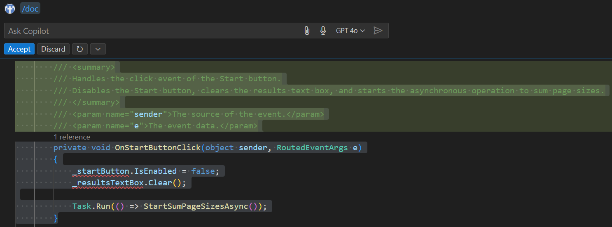
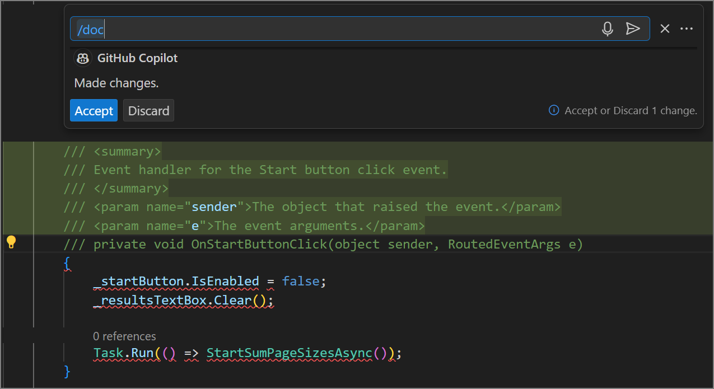
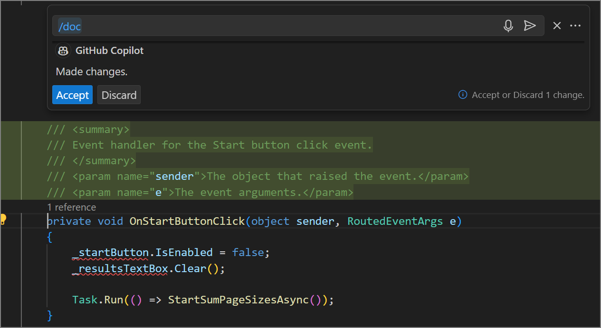
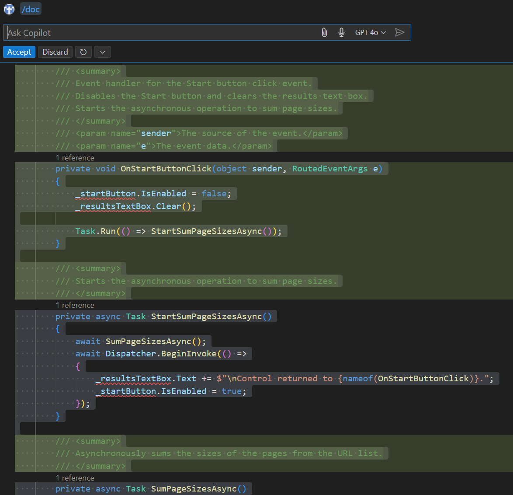

Documenting your code is an important aspect of the software development process. Inline documentation (code comments) help developers understand the codebase, its purpose, and how to use it.

GitHub Copilot Chat can help you document your code quickly and accurately. You have a few options for generating inline documentation using GitHub Copilot Chat:

- Construct your own natural language prompt that can be used to generate specific documentation.
- Use the `/doc` command during an inline chat session to generate comments for selected code.
- Use the **Generate Docs** smart action to generate comments for selected code.

Properly documenting your code creates a more readable and maintainable codebase that's easier for other developers to understand and work with.

### Generate inline code documentation using the Chat view

In this exercise, you use GitHub Copilot Chat to generate inline code documentation for the `APL2007M2Sample1` project.

Use the following steps to complete this section of the exercise:

1. Ensure that you have the `APL2007M2Sample1` project open in Visual Studio Code.

1. Open the `MainWindow.xaml.cs` file.

1. Select all of the code starting from the namespace declaration to the end of the file.

1. Open the Chat view.

1. To see how GitHub Copilot Chat would document the selected code, enter the following prompt:

    ```output
    @workspace #selection generate inline code documentation for the selected code
    ```

1. Take a minute to review the suggested code documentation.

    The generated response should look similar to the following code sample:

    ```csharp
    namespace ParallelAsyncExample
    {
        public partial class MainWindow : Window
        {
            // HttpClient instance with a maximum response content buffer size of 1,000,000 bytes
            private readonly HttpClient _client = new HttpClient { MaxResponseContentBufferSize = 1_000_000 };
    
            // List of URLs to download content from
            private readonly IEnumerable<string> _urlList = new string[]
            {
                "https://docs.microsoft.com",
                "https://docs.microsoft.com/azure",
                "https://docs.microsoft.com/powershell",
                "https://docs.microsoft.com/dotnet",
                "https://docs.microsoft.com/aspnet/core",
                "https://docs.microsoft.com/windows",
                "https://docs.microsoft.com/office",
                "https://docs.microsoft.com/enterprise-mobility-security",
                "https://docs.microsoft.com/visualstudio",
                "https://docs.microsoft.com/microsoft-365",
                "https://docs.microsoft.com/sql",
                "https://docs.microsoft.com/dynamics365",
                "https://docs.microsoft.com/surface",
                "https://docs.microsoft.com/xamarin",
                "https://docs.microsoft.com/azure/devops",
                "https://docs.microsoft.com/system-center",
                "https://docs.microsoft.com/graph",
                "https://docs.microsoft.com/education",
                "https://docs.microsoft.com/gaming"
            };
    
            // Event handler for the start button click event
            private void OnStartButtonClick(object sender, RoutedEventArgs e)
            {
                // Disable the start button and clear the results text box
                _startButton.IsEnabled = false;
                _resultsTextBox.Clear();
    
                // Start the asynchronous operation to sum page sizes
                Task.Run(() => StartSumPageSizesAsync());
            }
    
            // Starts the asynchronous operation to sum page sizes
            private async Task StartSumPageSizesAsync()
            {
                // Perform the main download operation
                await SumPageSizesAsync();
    
                // Update the UI to re-enable the start button and indicate that control has returned
                await Dispatcher.BeginInvoke(() =>
                {
                    _resultsTextBox.Text += $"\nControl returned to {nameof(OnStartButtonClick)}.";
                    _startButton.IsEnabled = true;
                });
            }
    
            // Asynchronously sums the sizes of the pages from the URLs
            private async Task SumPageSizesAsync()
            {
                // Start a stopwatch to measure elapsed time
                var stopwatch = Stopwatch.StartNew();
    
                // Create tasks to download content from each URL
                IEnumerable<Task<int>> downloadTasksQuery =
                    from url in _urlList
                    select ProcessUrlAsync(url, _client);
    
                // Convert the sequence of tasks into an array
                Task<int>[] downloadTasks = downloadTasksQuery.ToArray();
    
                // Wait for all tasks to complete and sum the lengths of the downloaded content
                int[] lengths = await Task.WhenAll(downloadTasks);
                int total = lengths.Sum();
    
                // Update the UI with the total bytes and elapsed time
                await Dispatcher.BeginInvoke(() =>
                {
                    stopwatch.Stop();
                    _resultsTextBox.Text += $"\nTotal bytes returned:  {total:#,#}";
                    _resultsTextBox.Text += $"\nElapsed time:          {stopwatch.Elapsed}\n";
                });
            }
    
            // Asynchronously processes a URL by downloading its content and returning the length of the content
            private async Task<int> ProcessUrlAsync(string url, HttpClient client)
            {
                try
                {
                    // Download the content of the URL
                    byte[] byteArray = await client.GetByteArrayAsync(url);
    
                    // Update the UI with the URL and content length
                    await DisplayResultsAsync(url, byteArray);
    
                    // Return the length of the downloaded content
                    return byteArray.Length;
                }
                catch (HttpRequestException e)
                {
                    // Handle HTTP request exceptions by updating the UI with an error message
                    await Dispatcher.BeginInvoke(() =>
                    {
                        _resultsTextBox.Text += $"{url,-60} {"Error",-10}\n";
                        _resultsTextBox.Text += $"Exception: {e.Message}\n";
                    });
    
                    // Return 0 to indicate failure
                    return 0;
                }
            }
    
            // Updates the UI with the URL and the length of the downloaded content
            private Task DisplayResultsAsync(string url, byte[] content) =>
                Dispatcher.BeginInvoke(() =>
                    _resultsTextBox.Text += $"{url,-60} {content.Length,10:#,#}\n")
                          .Task;
    
            // Disposes of the HttpClient instance when the window is closed to free up resources
            protected override void OnClosed(EventArgs e) => _client.Dispose();
        }
    }
    ```

    The response includes suggested code comments and *a portion* of the associated code. Some of your code may be omitted for brevity. You could manually move code comments into the actual code file.

    Inline chat provides a more direct approach for adding comments to your code.

### Generate inline code documentation using inline chat

1. Scroll to the top of the `MainWindow.xaml.cs` file.

1. Select the `OnStartButtonClick` method.

1. To open an inline chat, press `Ctrl` + `I`.

1. To generate inline documentation for the `OnStartButtonClick` method, enter the following prompt:

    ```output
    /doc
    ```

1. Take a minute to review the code documentation generated.

    

    Notice that the suggested documentation for the `OnStartButtonClick` method includes a summary and descriptions of the two parameters. When a method includes a return value, a description of the return value is also included.

    > [!IMPORTANT]
    > Always review the GitHub Copilot's suggested updates before accepting. If you discover an issue in a suggested code update, you can either discard the update or attempt to correct the issue before accepting the suggested code update.

    The following screenshots show a suggestion that inadvertently comments out a method declaration and how to correct the suggestion before accepting the update.

    

    In this case, it's easy to correct the suggestion before accepting the update. Position the cursor on the code line that comments out the declaration, and then use the Backspace key to remove the comment characters.

    After you backspace over the comment characters, the method declaration should be restored.

    

1. To discard the suggested update, select **Discard**.

    In the next section, you generate documentation for all of the methods at once.

### Generate inline code documentation using the **Generate Docs** smart action

The **Generate Docs** smart action is another way to generate inline code documentation. You can use this smart action to generate comments that describe the selected code.

Use the following steps to complete this section of the exercise:

1. In the Visual Studio Code editor, select all of the methods *inside* the `MainWindow` class.

1. Right-click the selected code, select **Copilot**, and then select **Generate Docs**.

    Wait for the documentation to be generated.

1. Review the suggested changes.

    Notice that the generated documentation includes comments for each of the methods.

    

    > [!IMPORTANT]
    > If you find issues in the generated documentation, modify the suggested changes before continuing.

1. Select **Accept**.

    Each of the methods in the `MainWindow` class now includes generated comments.

### Summary

In this exercise, you used GitHub Copilot Chat to generate inline code documentation for the `APL2007M2Sample1` app. You learned how to generate inline code documentation using the Chat view, inline chat, and the **Generate Docs** smart action. By generating code comments, you can create a more readable and maintainable codebase that's easier for other developers to understand and work with. Inline code documentation is an essential part of software development that helps developers understand the codebase, its purpose, and how to use it.
