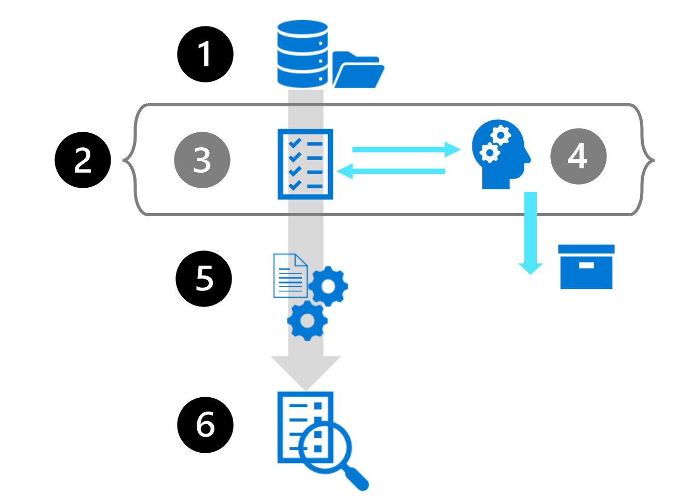
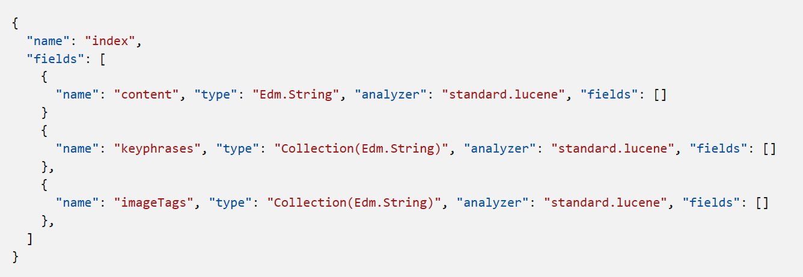

A *search index* contains your searchable content. In an **Azure AI Search** solution, you create a search index by moving data through the following **indexing** pipeline: 

1. *Start* with a **data source**: the storage location of your original data artifacts, such as PDFs, video files, and images. For Azure AI Search, your data source could be files in Azure Storage, or text in a database such as Azure SQL Database or Azure Cosmos DB.

1. **Indexer**: automates the movement data from the *data source* through *document cracking* and *enrichment* to *indexing*. An indexer automates a portion of data ingestion and exports the original file type to JSON (in an action called JSON serialization).

1. **Document cracking**: the indexer opens files and extracts content.  

1. **Enrichment**: the indexer moves data through **AI enrichment**, which implements Azure AI on your original data to extract more information. AI enrichment is achieved by adding and combining skills in a *skillset*. A skillset defines the operations that extract and enrich data to make it searchable. These AI skills can be either built-in skills, such as text translation or Optical Character Recognition (OCR), or custom skills that you provide. Examples of AI enrichment include adding captions to a photo and evaluating text sentiment. AI enriched content can be sent to a **knowledge store**, which persists output from an AI enrichment pipeline in tables and blobs in Azure Storage for independent analysis or downstream processing.  

1. **Push to index**: the serialized JSON data populates the *search index*.

1. *The result* is a populated **search index** which can be explored through queries. When users make a search query such as "coffee", the search engine looks for that information in the search index. A search index has a structure similar to a table, known as the index *schema*. A typical search index schema contains *fields*, the field's data type (such as string), and *field attributes*. The fields store searchable text, and the field attributes allow for actions such as filtering and sorting. Below is an example of a search index schema: 

