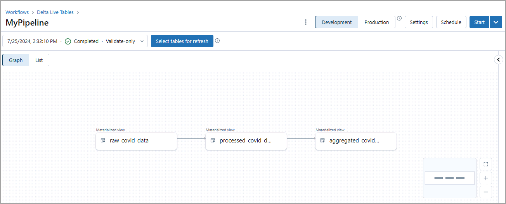

Delta Live Tables (DLT) integrated with Azure Databricks provides a framework for building and managing real-time data processing pipelines, and simplifying the management of complex data pipelines. DLT reduces the complexity and operational overhead associated with real-time data processing by automating much of the data pipeline management, making it easier to derive insights and respond to data in real time. Azure Databricks supports a wide range of data ingestion interfaces, facilitating the capture and immediate processing of streaming data. The power of DLT lies in its ability to automatically handle error logging, retries, and updates, which help to maintain data integrity. DLT also allows you to monitor the performance and health of your pipelines through the Databricks workspace, enabling proactive management and optimization of your real-time data operations.

## Setting up DLT for real time data processing
Setting up DLT for real time data processing involves:

- Creating DLT Pipelines
- Integrating with data sources
- Implementing data transformations
- Monitoring and managing pipeline health

### Create DLT pipelines
Create Delta Live Tables pipelines in your Azure Databricks workspace. These pipelines allow you to define your data transformations using Python or SQL. You can specify source data, transformation logic, and output targets. Once your pipeline is set up, DLT automatically manages it.

### Integrate with data sources
After creating a DLT pipeline, connect to real-time data sources, such as event hubs or IoT devices. Azure Databricks supports various connectors that facilitate the ingestion of streaming data.

### Implement data transformations
After you integrate your pipeline with data sources, configure Delta Live Tables to apply transformation logic on the streaming data. DLT automatically handles dependencies, error handling, and updates to downstream tables based on your transformation logic.

### Monitor and manage pipeline health

The final step in setting up DLT for real time data processing is to monitor and manage pipeline health. You can use the built-in monitoring features of DLT to track the health and performance of your pipelines. Adjustments to scaling, troubleshooting, and optimizing performance can be managed directly from the Databricks interface.
