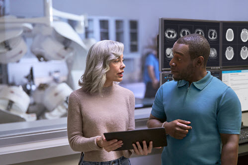
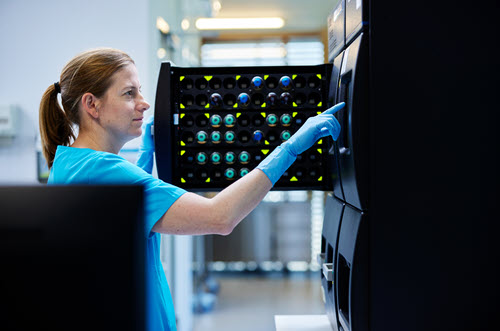

This unit focuses on Life Sciences and Pharmaceutical Healthcare scenarios. We discuss health providers’ scenarios in a later unit.

## AI opportunities

These scenarios cover some of the main advantages of implementing AI solutions in the Life Sciences and Pharmaceutical Healthcare sector.

#### Reduce research and development (R&D) costs

The pharmaceutical industry deals with a staggering volume of research data, encompassing scientific papers, extensive databases, and experimental findings. Document AI technologies offer substantial benefits by efficiently analyzing and summarizing this wealth of information. For example, AI-driven data analysis has expedited the discovery of potential gene therapy applications, allowing researchers to pinpoint promising genetic targets for specific diseases. Additionally, through generative AI, like Azure OpenAI Services, researchers can engage in natural language conversations to retrieve critical insights from complex research documents.

#### Facilitate decentralized drug trials 

Traditional drug trials have conventionally relied on centralized healthcare settings, potentially introducing biases, and excluding certain demographic groups. AI, however, offers a multifaceted solution to enhance the entire drug trial process. Firstly, it plays a pivotal role in trial design optimization by harnessing historical trial data to craft more adaptive and efficient protocols while identifying the most pertinent endpoints and biomarkers. Secondly, AI embraces real-world evidence by aggregating diverse data sources, such as wearables, environmental data, and electronic health records. This way, it continually gauges a drug's real-world safety and effectiveness, extending beyond controlled clinical trials. Lastly, AI streamlines data analysis by adeptly processing extensive clinical trial data, enabling the discernment of subtle yet pivotal trends and correlations often overlooked by traditional statistical approaches. This holistic approach dramatically expedites drug development and validation, ushering in a new era of innovation. 

#### Optimize supply chain

Many pharmaceutical products require specialized storage and transportation conditions to maintain their efficacy and safety. AI-driven supply chain optimization can address these challenges effectively. For instance, AI algorithms can monitor environmental conditions in real-time, ensuring that temperature-sensitive medications are stored and transported within specified ranges. Furthermore, AI can forecast demand with remarkable accuracy, minimizing overstocking and wastage of pharmaceutical products while ensuring a consistent supply for patients.

#### Accelerate time to market

As in every industry, it’s fundamental to get drugs to market as fast as possible. All these use cases optimize the time you need to get your product ready, so you can launch it faster. For example, in drug candidate screening, AI algorithms can analyze vast chemical datasets to identify potential drug compounds faster than traditional methods. Moreover, AI-enabled clinical trial recruitment can match eligible patients with suitable trials more efficiently, reducing enrollment times. As a result, pharmaceutical companies can bring life-saving medications to market more swiftly, gaining a competitive edge in the industry.

## Frequent use cases

You achieve these benefits with a wide range of healthcare AI solutions powered by Microsoft AI. Most of these applications follow a copilot-approach, designed to assist healthcare professionals so they can be more productive. The goal is to amplify their expertise, not to replace them.

Here are some examples of what organizations in the sector are doing:

|||
|-|-|
|**Research assistants** | AI-driven research assistants excel in navigating and analyzing vast datasets. For instance, these solutions can swiftly scour extensive medical literature databases, aiding researchers in identifying noteworthy trends, correlations, and knowledge gaps. As an illustration, in the field of cancer research an AI research assistant can swiftly analyze a multitude of oncology publications, pinpointing emerging treatment modalities and potential drug candidates.|
|**Drug development** | Generative AI plays a pivotal role in accelerating drug discovery. Consider a scenario where AI algorithms analyze chemical structures and propose potential molecular combinations for drug candidates. This preliminary screening significantly reduces the time and resources required for early-stage drug development, allowing researchers to concentrate on the most promising compounds with a higher likelihood of success.|
|**Team communication** | Interdisciplinary collaboration within the Life Sciences, Pharmaceuticals, and Healthcare sectors can sometimes be challenging due to differing communication styles and priorities. AI-powered virtual assistants can bridge these gaps by offering real-time language translation services and facilitating seamless communication among team members. As an example, an AI-driven communication tool might translate a radiologist's findings into terminology easily comprehensible to all care team members. This solution ensures clear and efficient decision-making during a complex medical procedure.|

Next, let’s discover the most useful AI use cases for health providers and how Microsoft AI can empower you to implement them.
