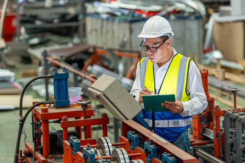

The manufacturing sector collects the largest volume of data of any global industry each year, but it only uses a fraction of the industrial data collected in factories. Let's take a look at how Siemens partnered with Microsoft to develop a real-time, data-driven operations solution for global manufacturers to achieve breakthrough performance by continuously improving sustainability, resilience, and profitability.

One of the main advantages of the Azure AI environment is that it enables you to develop solutions faster and more efficiently. Siemens’ experience provides a good example of how to streamline AI industrial processes thanks to Microsoft products.

## The organization

**Siemens** is a German manufacturing company founded in 1847. It’s the largest manufacturing company in Europe and a global market leader in industrial automation and industrial software. Siemens provides innovative solutions for various industries, such as energy, healthcare, mobility, and infrastructure.

Historically, the company has played a vital role in technological innovation. It was deeply involved in the development of the first mass-produced computers, home appliances, televisions, and many other devices. Now, Siemens is incorporating AI into their business processes to keep their competitive edge.

## The challenge

Siemens realized that they needed to massively adopt AI to support all their departments. For example, they’ve used **forecasting AI models** to predict increased demand to better adjust production and sales planning for a long time.

However, the development process for these AI systems was **costly, slow, and confusing**. Business users who required an AI solution depended on data analysts to develop it, and the collaboration between them was often full of noise and misunderstandings. Data analysts lacked a platform that would allow them to reuse code and components, so they had to build every new model from scratch. The process was highly inefficient and could take several months.

Siemens realized that they needed to change their AI development process. They needed a robust, fast, and reliable **AI platform** to develop, test, and deploy models in a scalable way.

## The solution

The solution creates a common data foundation by capturing and contextualizing data from the entire factory to deliver a system-wide view of the end-to-end manufacturing process. The addition of a generative AI copilot, powered by Azure OpenAI, further democratizes industrial data with generative AI, making plant data, analytics, and insights even more accessible and impactful for everyone—from shop floor operators to executives.​

To build this shared, scalable AI platform, Siemens relied on the Microsoft Azure infrastructure. The result, known as [ai:attack], is built upon Azure Machine Learning and incorporates other Azure services.

The solution offers a customizable template for the entire company. It provides a standard for all data science projects to follow, so it’s easier to reuse assets. The Azure infrastructure ensures easy access to all stakeholders, which also improves cross-team collaboration.

Thanks to Azure AI Services, it includes several standardized AI services. For example, it includes Azure AI Vision models for quality control that detect damaged devices. Besides, the platform uses the Azure Machine Learning feature to automatically train the AI models. These functionalities improve the performance of all teams and save much time.

## The results

The [ai:attack] initiative is already yielding positive results. The **drop in the development time for AI models** is significant. While implementing a new AI solution used to take several months, now it only requires a few weeks.

Likewise, **code maintenance** is now much easier and faster thanks to standardization. Before, maintaining the code of three projects required three data analysts, whereas today a single worker can maintain code for many projects.

Next, let’s wrap up everything you learned with a knowledge check.
