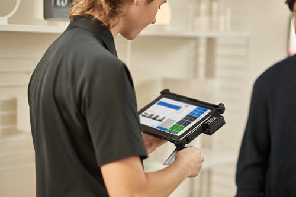

Retail business is complex. It involves many different professional profiles, tasks, and processes. Accordingly, AI solutions can fit into several steps of the business to optimize and expand it.

## Productivity

Boosting productivity is one of the major priorities of today’s organizations. Products such as Microsoft 365 Copilot and Microsoft Power BI include features to make you more productive.

* **Analyze sales data**: Transforming data into actionable insights is often time-consuming. Tools like Microsoft Power BI help you save time by identifying trends and patterns.
* **Assist in inventory management and sales forecasting**: Managers spend much time anticipating sales volumes and managing inventory accordingly. AI-powered productivity solutions help managers with these tasks.
* **Boost customer service productivity**: Customers expect helpful, quick answers, which can become overwhelming for customer service workers. Products like Microsoft 365 Copilot can ensure timely and efficient customer service. For example, they draft responses to emails, summarize lengthy threads, and flag important items.
* **Accelerate documentation development**: Salespeople, customers, and decision makers need product descriptions, reports, and other documents. Microsoft 365 Copilot assists you, so you spend less time writing and editing them.

## Contextual interactions

Current shopping experiences generate great amounts of data. AI solutions allow customers and retail professionals to interact with a conversational interface to get more insights out of this data.

* **Offer tailored product recommendations**: Microsoft AI products like Azure AI Services and Dynamics 365 Copilot include features for hyper-personalization. These functionalities enable your teams to suggest products based on browsing history or past purchases.
* **Customize marketing campaigns**: Similarly, you can use the same services to personalize your marketing campaigns for more precise targeting, which increases their impact.
* **Implement better virtual assistants**: OpenAI Service, Azure AI Services, Dynamics 365 Copilot, Power Virtual Agents, and AI features in Power Platform help you build more natural, powerful virtual assistants. Solutions for internal use support retail professionals by processing and organizing large amounts of sales data, customer feedback, and inventory details. Meanwhile, virtual assistants can also allow customers to ask in-depth questions about products currently in inventory.
* **Offer onboarding and help desks for training**: You can build interactive training materials with OpenAI Service and Azure AI Services. They can be helpful to train new employees in store layouts, product details, and company policies. You can also design them for immersive and personalized training and role-playing.

## Amplified automation

A typical AI strategy to improve productivity is automation, which can be useful in many retail jobs.

* **Search complex documents**: Products like Azure AI Document Intelligence, Azure OpenAI Services, and Azure AI Search enable you to easily find insights in lengthy, dense documents. Thanks to these tools, retail organizations can process and organize sales data, customer feedback, and inventory details.
* **Anticipate inventory and supply chain management**: Azure Machine Learning, Microsoft Power BI, and Azure OpenAI Services can do predictive analytics, that is, use historic and present data to forecast future scenarios. In retail, this technique is helpful to anticipate inventory needs and sales. This task is key to optimizing your supply chain.
* **Automate reporting**: A modern organization requires many reports if they want to take decisions based on data. Solutions like Azure OpenAI Services, Microsoft Power BI, and Azure Synapse Analytics help you automate the generation of these reports, which otherwise takes much time. This way, retail companies can quickly profit from sales reports, customer trends, and financial forecasts.

## Intuitive discovery

There are other ways in which AI enables retail organizations to get more insight from already available information. This task is vital in post-sales to fully understand successful and unsuccessful customer experiences.

* **Analyze post-sales data**: Customers leave much information for retailers to use, such as customer interactions, product reviews, and online conversations. However, the amount and diversity of information is often challenging. Azure OpenAI Services performs multi-informational search to extract insights from all this data.
* **Improve contact-center analytics**: Other source of insights in post-sales is the calls received in the contact center. Azure AI Services and Microsoft Power BI include features to help with this task. For example, AI solutions can transcribe and analyze customer service calls for actionable insights. You can also provide real-time coaching for contact-center staff. Finally, the AI systems feed new and updated information into contact-center knowledge bases to improve responses for customers.
* **Benefit from sentiment analysis**: In post-sales, you need more than abstract data, you must understand how the customer feels about the purchase. Azure AI Services incorporates AI models to detect these nuances. You can use them to gauge customer satisfaction, brand perception, and product opinions.

> [!TIP]
> Think about what other opportunities you hope to realize with AI in your organization.
> 

Now, let’s see how real companies are implementing these scenarios. The next unit explores initiatives to improve customer experience in physical grocery stores.
