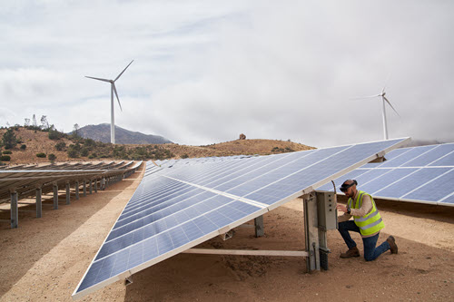
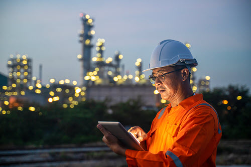
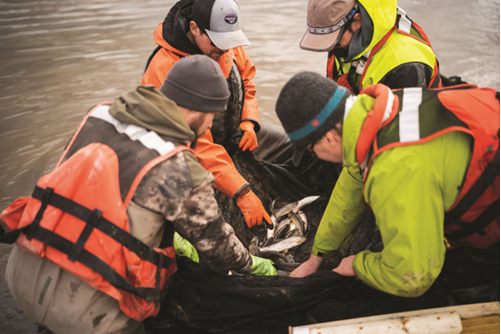

Sustainability initiatives can take many forms, and sustainable projects can take place in a wide range of sectors. Let’s see some examples of how AI can improve their efficiency.

## Agriculture

Data-based decision making can substantially improve farming productivity and sustainability. This management style is known as **precision farming**. It involves using information such as soil maps, climatic data, and crop data to estimate the treatment the crop needs and at what time. These practices help use the right measure of pesticides or nutrients required, which minimizes waste and eventual pollution. Farmers can combine them with other sustainable AI practices, such as intelligent harvesting or AI-powered pest detection and control.

Microsoft drives **[FarmVibes](https://www.microsoft.com/research/project/project-farmvibes/)**, a project that focuses on delivering tools for farmers to achieve sustainable, precision agriculture. It works on predicting weather variations and advising sustainable and profitable management practices. These efforts include the development of AI-powered soil and crop health monitoring systems. The AI models within the project are available under the name [FarmVibes.AI](https://github.com/microsoft/farmvibes-ai).

## Energy

A sustainability priority in the energy sector is to integrate new sources of **renewable energy** onto the grid. In this task, AI can also prove helpful. The [Global Renewables Watch](https://www.globalrenewableswatch.org/), built on Microsoft AI, detects solar and wind installations, and tracks the transition towards greener energy.

Second, another priority is to **reduce emissions of oil and gas** in production sites. AI and Internet of Things (IoT) technologies make this goal viable. For example, Accenture and Microsoft help identify and remedy methane leaks using AI anomaly detection models.4 In this project, developers used [Microsoft SynapseML](https://microsoft.github.io/SynapseML/) to build a fully scalable, distributed AI system.

Third, **predictive maintenance** is another fruitful strategy to protect the environment in the energy industry. AI can forecast when drills or other machinery will start malfunctioning. This prediction enables us to repair or replace assets before an accident interrupts operations and causes environmental or human damage. For instance, Schneider Electric uses Azure Machine Learning to do predictive maintenance in their pumps and other oil field equipment.5

## Industry

AI can help manufacturing and industrial companies optimize their **energy and water consumption**. For instance, Metinvest uses Azure Data Factory and Azure Machine Learning to detect the silicon content in the cast iron, which helps minimize the fuel the process requires.6

Another common scenario is using AI to discover **low-carbon building materials**. Traditional concrete has a high carbon footprint, but AI can help scientists find more sustainable alternatives.

## Natural resources

There are many ways in which AI can help biodiversity conservation. Usually, the first step for ecologists to protect an ecosystem is to **monitor and map wildlife populations**. This task involves identifying the species that they can record with their cameras and sensors, which is very time consuming.

However, AI systems can automatically detect and classify animals. For example, Microsoft project Guacamaya identifies wildlife in the Amazon. Experts use an audio AI model to identify birds by their songs and computer vision to detect other animals.7 The Bavarian Forest National Park in Germany is also using this strategy for the same task.8 Microsoft is developing [a range of tools](https://www.microsoft.com/research/project/accelerating-biodiversity-surveys/overview/) to enable similar initiatives.

A complementary approach is to use AI to actively protect natural resources. It can be useful to **prevent wildfires**, as Microsoft project [Terrafuse](https://www.microsoft.com/ai/ai-for-earth-Terrafuse) forecasts wildfire risk. Likewise, AI can help **fight illegal hunting or fishing**. Following this approach, [OceanMind](https://www.microsoft.com/ai/ai-for-earth-oceanmind) uses Microsoft AI to flag suspicious behavior in ships.

## Smart cities

AI technologies can also improve the cities we live in. AI systems can enable better, greener management of cities, including water supply, mobility, waste management, and safety.

For example, the Société du Canal de Provence (France) is using Microsoft AI to gain a better understanding of water use and offer consumption forecasting to their customers.9 In the context of increasingly common droughts, the goal is to push toward a **sustainable use of water**.

It’s also possible to achieve **greener city lights management** with AI. Valencia (Spain) improved energy conservation and reduced light pollution by combining Microsoft IoT and AI solutions.10

> [!TIP]
> Consider other opportunities you hope to realize with AU in your organization.
> 

In conclusion, there are many scenarios in which Microsoft AI products and services can support sustainability initiatives. The **Microsoft ecosystem** allows you to easily connect these AI solutions with the many features included in [Microsoft Cloud for Sustainability](https://www.microsoft.com/sustainability/cloud). Among the functionalities covered, sustainability professionals can minimize the environmental impact of facilities, get the data analytics of water consumption, or achieve greener mobility with optimized routes and logistics.

Next, let’s see an example of how an energy organization can carry out one of these scenarios.
