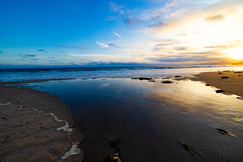

Previously, we discussed the benefits of using AI solutions to monitor wildlife populations. It’s a common AI scenario to help sustainability experts protect ecosystems. Now, let’s explore in detail one specific success story.

## The organization

The **Washington State Department of Natural Resources (DNR)** was founded in 1957 as the ward of Washington’s state trust lands and other natural resources. It manages these lands to ensure their health and productivity. So, their duty is double: to generate revenue and preserve ecosystems for present and future generations.

The DNR oversees 5.6 million acres of public lands. Furthermore, it manages a large diversity of lands, with different biomes and needs. Proper management requires technical expertise on specific habitats, such as forests, coastlines, and aquatic lands.

## The challenge

Within the DNR, the Aquatic Resources Division conducts several programs for overseeing 2.6 million acres of submerged aquatic lands. Among them, the **Nearshore Habitat Program** gathers hundreds of hours of underwater video footage a year to monitor marine vegetation. One of the goals is to track the abundance and distribution of native eelgrass, a species of seagrass.

This task involves analyzing around 350 hours of video footage, **identifying, classifying, and geolocating eelgrass**. The process required the manual work of two scientists and congested their workloads for three months. This process was a waste of highly specialized, valuable resources.

## The solution

The experts of the Nearshore Habitat Program decided to partner with Microsoft to solve this problem with AI. They found that the best approach was **automated video classification**, using AI models to identify eelgrass.

The technical basis for the use case is **Azure AI Services**’ functionalities for image recognition. The video is uploaded to Azure, split into frames, and analyzed by the models included in Azure AI Services. The models are managed, built, and deployed in **Azure Machine Learning**, so the task can be done by any scientist instead of data scientists. Finally, the team uses **Microsoft Power BI** to create reports of the results.

## The results

The solution is already saving months of experts’ time and boosting their **productivity**. The process now takes only weeks instead of months, and one person instead of two. In the medium term, the goal is to fully automate the process and replicate it for other monitoring projects.

To learn more, read [Washington State Department of Natural Resources uses Azure AI to automate aquatic resource monitoring, saving months of experts’ time](https://aka.ms/wa-nat-customer-story).

Next, let’s examine a sustainability use case in the mobility sector.
