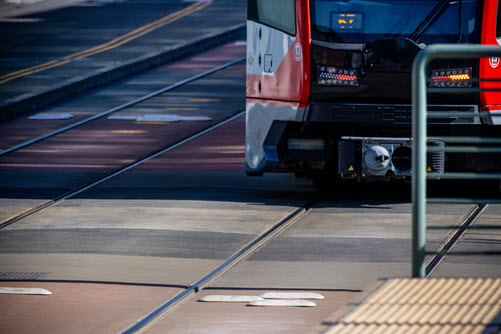

One of the pillars of smart cities is achieving green mobility for citizens. In Munich (Germany), they’re taking great steps to deliver sustainable bus services. Let’s see how they’re doing it.

## The organization

**Stadtwerke München (SWM)** is the municipal utilities company in Munich. It supplies the city with electricity, heating, drinking water, transport, and telecommunications. Their mobility services include the municipal subway, bus, tramway, and bike networks.

SWM is committed to making Munich greener. It generates green electricity to cover 90 percent of the city's needs, and 80 percent of the city’s public transport fleet is already electric. Their goal now is to focus on the bus fleet, which is being converted to battery electric.

## The challenge

Munich is a hectic city with a population of more than one and a half Million inhabitants. Operating its bus system is demanding, with 500 buses circulating during peak times. The electric buses must have autonomy to run at least 280 km. on a single charge. Considering that it takes 3-4 hours to charge a bus, charging must take place between closing down and restarting service. So, the whole **bus charging system** is synchronized to a tight schedule, which leaves little place for repairs and unexpected events.

Besides, any solution must be scalable. SWM manages **vast amounts of data**: each subway train alone sends over 2,000 data points every 10 seconds; geothermal solutions gather five gigabytes of data every hour, as do each of the 30 digitized areas of infrastructure. The organization requires a robust platform capable of operating with such volumes of data, such as Microsoft Azure.

## The solution

SWM developed a smart connectivity solution to improve the efficiency of the bus charging system. This tool called **INSIGHT** is built upon Microsoft products such as Azure AI Services, Azure Machine Learning, and Azure IoT. Its design ensures transparent, sustainable processes.

In INSIGHT, an IoT device gathers real-time data from the electric buses, such as battery charge, engine speed, or activation of warning lights. There are around 120 sensors on each bus. The device sends this data to INSIGHT, which is based on Azure infrastructure. There, the solution creates a digital twin of each bus, which enables it to track every datapoint.

At this point, the system feeds the digital twin data to the AI models built and stored in **Azure Machine Learning**. These models can make a 14-day forecast to predict how much a bus will consume on any given day.

## The results

The solution provides real-time insights into the condition of each bus. The impact is clear: employees can fix malfunctions faster and optimize repairs. Furthermore, it enables predictive maintenance, so a potential incident can be dealt with before it happens. These improvements result in **better scheduling** for the bus system, which benefits all its users. A better, friendlier mobility service encourages citizens to use it instead of less sustainable options.

Additionally, the solution improves the **charging load management system**. Since AI predicts how much energy each bus needs for the day, buses are only charged when necessary. This system is more efficient and sustainable.

To learn more, read [SWM relies on Azure IoT, artificial intelligence, and big data analyses](https://aka.ms/stadtwerke-customer-story).

Next, let’s wrap up everything you’ve learned with a knowledge check.
