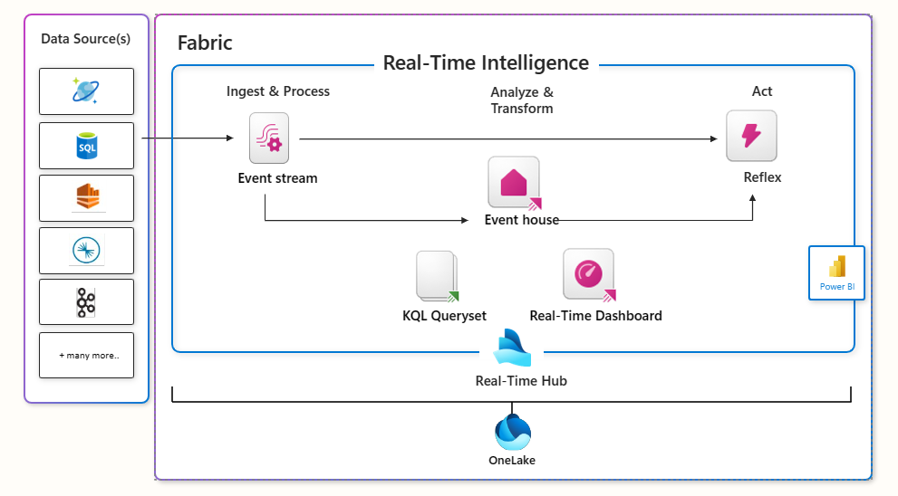

Microsoft Fabric Real-Time Intelligence empowers organizations to extract insights and visualize data in motion. Real-Time Intelligence offers an end-to-end solution for event-driven scenarios, streaming data, and data logs. Whether dealing with gigabytes or petabytes, all organizational data converges in the Real-Time Hub. No-code connectors seamlessly link time-based data from various sources, enabling immediate visual insights, geospatial analysis, and trigger-based reactions. Real-Time Intelligence transforms data into a dynamic, actionable resource that drives value across the entire organization, seamlessly aligning with all Fabric offerings.

## Real-time hub

The Microsoft Fabric real-time hub acts as a centralized catalog for your organization. It simplifies access, addition, exploration, and data sharing. By broadening data sources, it enhances insights and visual clarity across domains. Crucially, this hub ensures data availability and accessibility, enabling swift decision-making and informed actions. Sharing streaming data from diverse sources unlocks comprehensive business intelligence across your organization.

## Exploring data with real-time intelligence

To explore data with Real-Time Intelligence, initially choose a data stream from your organization or connected external/internal sources and then you can utilize Real-Time Intelligence’s tools for data exploration and to visualize data patterns, anomalies, and forecasting quantities.

Real-Time dashboards simplify data comprehension, accessible to all via visual tools, Natural Language, and Copilot. You can then turn the insights into actions by setting up Reflex alerts to react in real-time.

> [!NOTE]
> To learn more about the capabilities of Microsoft Fabric Real-Time Intelligence, see the [Real-Time Intelligence documentation in Microsoft Fabric](/fabric/real-time-intelligence/).
