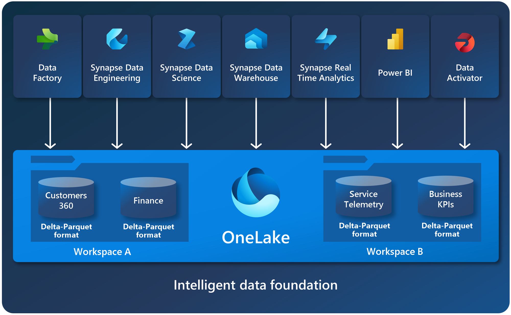

Microsoft Fabric automatically provisions OneLake, built upon Azure Data Lake Gen 2.

OneLake is a single, unified, logical data lake designed for your entire organization. OneLake comes automatically with every Microsoft Fabric tenant and serves as the central repository for all your analytics data. Whether structured or unstructured, OneLake supports any type of file and allows you to use the same data across multiple analytical engines without data movement or duplication.

## Key Benefits of OneLake

- **Organization-wide data lake** Before OneLake, creating multiple data lakes for different business groups was common. Now, OneLake provides a collaborative solution, ensuring that your entire organization shares a single data lake.
- **Distributed ownership and collaboration** Within a tenant, you can create workspaces, enabling different parts of your organization to manage their data items. This distributed ownership promotes collaboration while maintaining governance boundaries.
- **Open and Compatible** Built on Azure Data Lake Storage (ADLS) Gen2, OneLake stores data in Delta Parquet format. It supports existing ADLS Gen2 APIs and SDKs, making it compatible with your current applications.
- **Easy to navigate** It's straightforward to navigate OneLake data from Windows using [OneLake file explorer](/fabric/onelake/onelake-file-explorer).

For more information, see [OneLake, the OneDrive for data](/fabric/onelake/onelake-overview).