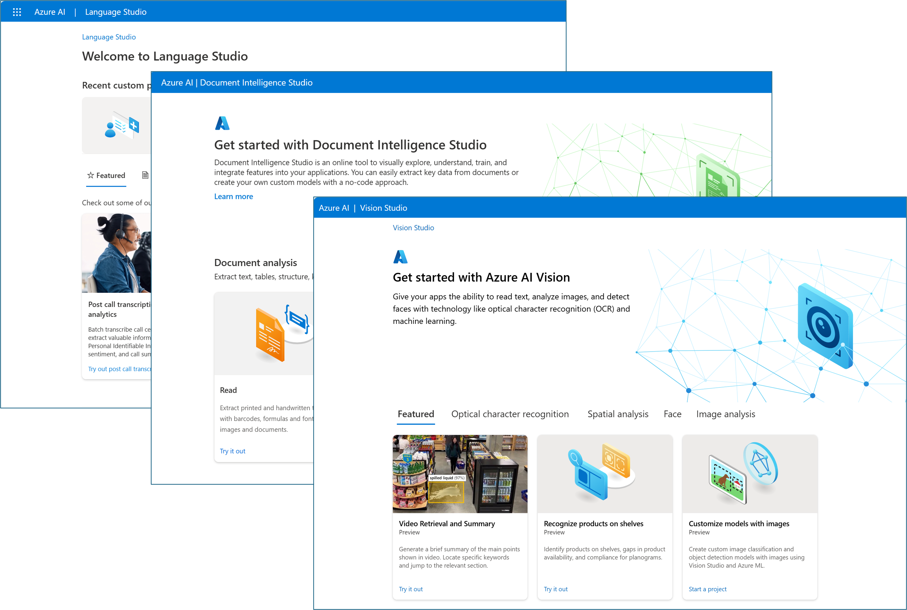

Once you create an Azure AI service resource, you can build applications using the REST API, software development kits (SDKs), or visual studio interfaces.

 

## Using service studio interfaces

Studio interfaces provide a friendly user interface to explore Azure AI services. There are different studios for different Azure AI services, such as Vision Studio, Language Studio, Speech Studio, and the Content Safety Studio. You can test out Azure AI services using the samples provided, or experiment with your own content. A studio-based approach allows you to explore, demo, and evaluate Azure AI services regardless of your experience with AI or coding.

## Associate the AI service resource
Before you can use an AI service resource, you must associate it with the studio you want to use on the Settings page. Select the resource, and then select **Use Resource**. You are then ready to explore the Azure AI service within the studio.

As an example, let's look at the Azure AI Content Safety service, which identifies harmful text or images. To explore what the Content Safety service does, let's use the Content Safety Studio. First create either a multi-service Azure AI services resource, or a single-service Content Safety resource. Then, on the Content Safety Studio Settings page, select the resource, and select **Use Resource**. The AI service you created is now associated with the Content Safety Studio, and ready to be used.

> [!NOTE]
> When developers incorporate an AI service into their applications, they often use a [SDK](/training/modules/create-manage-cognitive-services/5-use-sdk?azure-portal=true) or the [REST API](/training/modules/create-manage-cognitive-services/4-use-rest?azure-portal=true).
