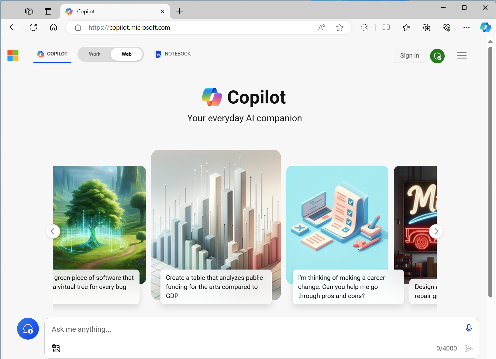
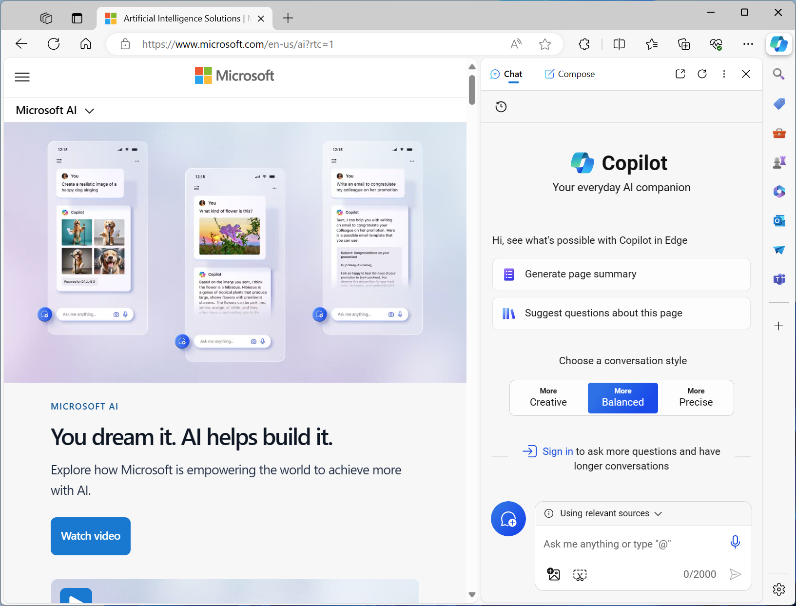

Microsoft Copilot features can be found throughout all different Microsoft applications. They unlock productivity across your organization, safeguard your business, and build and extend your AI capabilities. Explore some of the different use cases for Microsoft Copilot below.  

#### Web browsing with AI

**Microsoft Copilot**: use Microsoft Copilot to answer questions, create content, and search the web with the Microsoft Copilot app at https://copilot.microsoft.com, when using the Bing search engine, and in the Edge browser. For example, you can ask Microsoft Copilot to generate a list of opportunities in an industry or give more detailed information from your search results.

When you browse with Microsoft Edge, Copilot is built right in. You can open the Copilot pane in the browser and use it to research topics and create new content – for example to publish a blog post. With all of these Copilot options, signing in with a work or school account enables you to use Copilot in the context of your organization’s data and services – enabling you to get assistance with internal resources and information.

#### AI assistance for information workers

**Microsoft 365 Copilot**: Microsoft 365 integrates Copilot into the productivity applications that information workers use every day. You can use Copilot in Microsoft Word to generate a new document based on a natural language prompt, and then refine, summarize, and improve the document with a few prompts.

You can use Copilot in Microsoft PowerPoint to create a whole presentation based on the contents of a document or email, and then add graphics, reformat slides, and otherwise improve your presentation. 

In Microsoft Outlook, Copilot can help you summarize your emails, check your schedule, and even find relevant emails and documents to prepare for meetings.

These are just some examples of how you can use Microsoft 365 Copilot. There’s lots more you can accomplish in Windows, Excel, Teams, and other apps. Learn more at https://www.microsoft.com/microsoft-365/enterprise/copilot-for-microsoft-365

#### Use AI to support business processes

**Copilot in Dynamics 365 Customer Service**: Modernizes contact centers with generative AI. Customer service agents use Copilot to analyze support tickets, research similar issues, find resolutions, and communicate them to users with only a few clicks and prompts.

**Copilot in Dynamics 365 Sales**: Sales professionals can use Copilot to quickly find relevant customer and industry information by integrating with the company’s customer relationship management (CRM) database and beyond. This can enable an account manager to quickly review and qualify a lead, generate a proposal, and set up a customer engagement to close the deal.

**Copilot in Dynamics 365 Supply Chain Management**: Handles changes to purchase orders at scale and assess the impact and risk to help optimize procurement decisions. For example, Copilot identifies the level of impact that changes to purchase orders have on downstream processes and gives advice for next steps.

#### AI assisted data analytics

**Copilot in Microsoft Fabric**: Copilot enables analysts to automatically generate the code they need to analyze, manipulate, and visualize data in Spark notebooks.

**Copilot in Power BI**: When creating Power BI reports, Copilot can analyze your data and then suggest and create appropriate data visualizations from it.

#### Manage IT infrastructure and security 

**Copilot for Security**: Provides assistance for security professionals as the assess, mitigate, and respond to security threats.

**Copilot for Azure**: Integrated into the Azure portal to assist infrastructure administrators as they work with Azure cloud services.

#### AI powered software development

**GitHub Copilot**: Helps developers maximize their productivity by analyzing and explaining code, adding code documentation, generating new code based on natural language prompts, and more.

