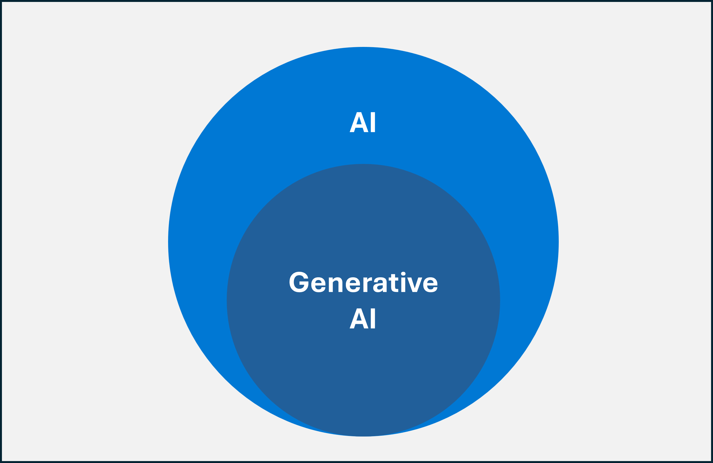

Artificial Intelligence (AI) is the ability of a computer program or machine to **mimic human-like behavior**. For example, to mimic visual senses, speech recognition, decision-making, natural language understanding, and so on. It's not a technology of itself, but rather a goal set by technologists to imitate human intelligence.

## What is generative AI?
Generative AI is a **subset of AI**. AI can be used to predict outcomes, detect entities, or classify documents, among others. However, generative AI, also known as GenAI, creates content, such as images, videos, code, or text. The goal is that this AI-generated content should be as useful as any created by humans. This approach is made possible by language models, which are complex AI models that can be used for a broad range of use cases.

For example, you may use generative AI to develop follow-up questions to a meeting, create an image from text, or explain the punch line of a joke, even if the joke is in a video.

>[!NOTE]
>AI has a great disruptive potential. That is why it should follow the highest ethical standards. **Responsible AI** refers to the **principles and best practices** that ensure AI work is accountable, inclusive, reliable, safe, fair, transparent, secure, and respects privacy. For instance, AI could create a video that shows a real person at an event they didn't attend in real life. Responsible AI involves not using this technology for deceitful purposes, since it would compromise their privacy and have unfair consequences.