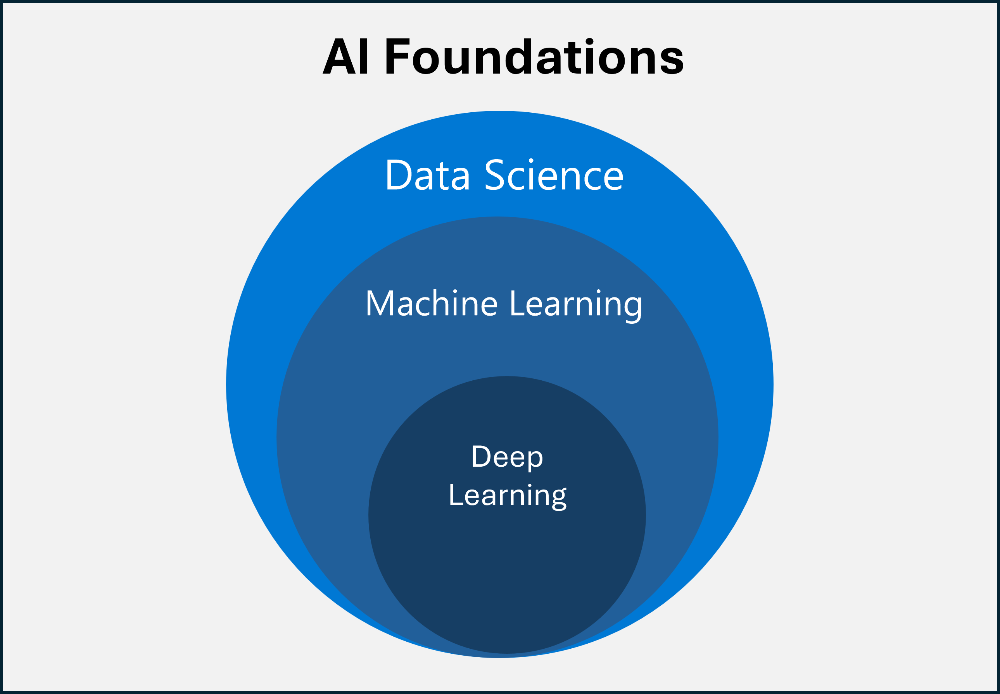

The primary goal of AI is to use machines for capabilities that are usually associated with humans. Let's see data science concepts support the foundation of AI. 

## What is data science?
Data science is an **interdisciplinary field** whose aim is to achieve AI. It primarily uses machine learning and statistics techniques. In most cases, data scientists are the experts in charge of solving AI problems.

## What is machine learning?
Machine learning is a **technique** where a machine sifts through numerous amounts of data to find patterns. This technique is frequently used for AI purposes. Machine learning uses algorithms that train a machine to learn patterns based on differentiating features about the data. The more training data, the more accurate the predictions. 

Here are some examples:
* **Email spam detection** - Machine learning could look for patterns where email has words like "free" or "guarantee", the email address domain is on a blocked list, or a link displayed in text doesn't match the URL behind it.
* **Credit card fraud detection** - Machine learning could look for patterns like the spending in a zip code the owner doesn't usually visit, buying an expensive item, or a sudden shopping spree.

## What is deep learning?
Deep learning is a **subset of machine learning**. Deep learning is imitating how a human brain processes information, as a connected artificial neural network. Unlike machine learning, deep learning can discover complex patterns and differentiating features about the data on its own. It normally works with unstructured data like images, text, and audio. It requires enormous amounts of data for better analysis and massive computing power for speed.

For instance, deep learning can be used to detect cancerous cells in medical images. Deep learning scans every pixel in the image as input to the neural nodes. The nodes analyze each pixel to filter out features that look cancerous. Each layer of nodes pushes findings of potential cancerous cells to the next layer of nodes to repeat the process and eventually aggregate all of the findings to classify the image. For example, the image might be classified as a healthy image or an image with cancerous features.

Next, let’s explore four categories of Microsoft tools you can use to add AI to your business.
