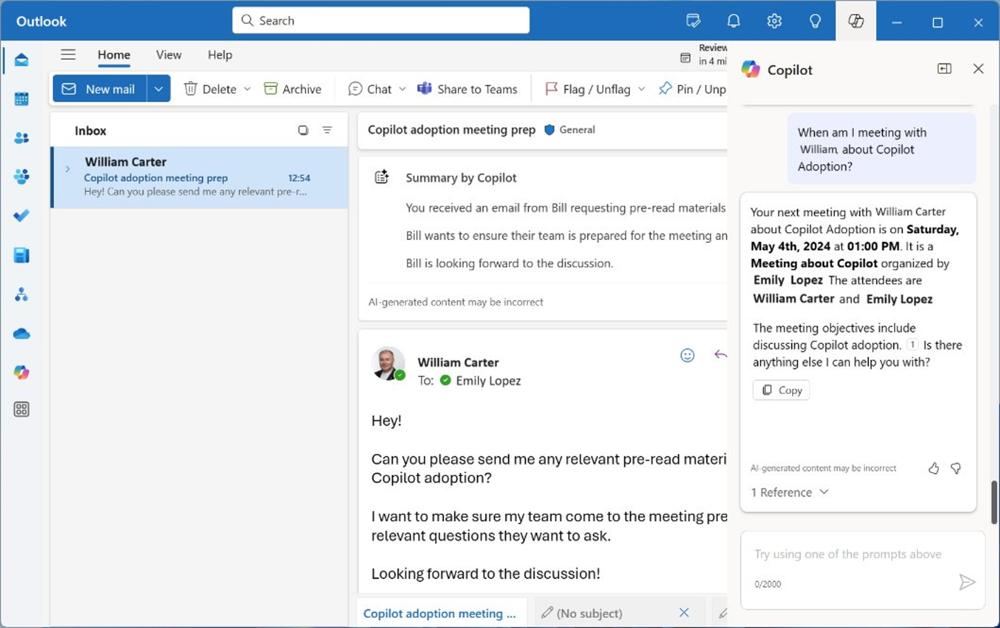

To truly realize the potential of AI, it’s essential to bring AI to every employee in ways that are relevant and meaningful to their work. Microsoft makes this possible by embedding AI in the applications people use in their everyday routine. No code or data science expertise is required because AI is delivered as just another feature of a SaaS product. The result is a wide range of intelligent applications for business users. 

*Copilot* refers to AI embedded into applications. Microsoft Copilot provides a transformed experience across business functions and everyday routines. 
 

## Business functions

Some AI solutions are specialized in helping solve problems and gain insight in some specific horizontal functions and sectors. These intelligent business applications weave relevant AI capabilities into their existing workflows. For example, Microsoft Dynamics 365 helps workers from specific business lines and functions automate and improve certain tasks. Microsoft 365 does the same by addressing a more general audience. 

These solutions are often delivered as SaaS AI solutions, which deliver fast and cost-effective results. With powerful intelligence in their existing workflows, business users can be more proactive and effective in their core competencies. Let’s take a look at some examples of these applications that can help anyone use AI to get more done. Here are some examples of powerful scenarios where AI is already having proven, beneficial effects:

|**Business function**|**Example scenario**|
|-|-|
|**Commerce**|Commerce users can use AI insights to help them more effectively manage cashflows using payment recommendations, intelligent budget proposals, and cashflow forecasting. They can even use AI to better protect their e-commerce business—and their customers—against fraud.|
|**Customer service**|Customer service users can gain insights to address increasing volumes and manage efficient agent distribution. They can also create virtual agents that identify and resolve customer issues quickly—all without having to write code.|
|**Finance**|Analysts are provided a range of AI-powered tools for real-time reporting, embedded analytics, and insights. For example, AI can predict when or whether their customers will pay their invoices.|
|**Human Resources**|Workforce data can be transformed into actionable insights and next-best-action guidance. AI can also be used to automate HR tasks for employees, making procedures more agile.|
|**Marketing**|AI-powered customer insights give marketing users a single view of their customers to optimize engagements and discover insights that drive personalized and meaningful experiences.|
|**Project management**|Embedded analytics can provide insights based on project sales and financial data. The solution proposes an AI-powered scheduling to anticipate needs. Operations users gain insights into how their customers use their products and services.|
|**Sales**|Sellers can sell smarter with embedded AI-powered insights fueled by customer data.|
|**Supply Chain**|Business users can use AI for predictive maintenance in factories. AI is also helpful to optimize inventory.|

With business applications that use AI as a core ingredient, users can bring together relationships, processes, and data across applications to gain increased visibility and control.

## Everyday AI 

There are also numerous AI capabilities that are already included in the applications everyone uses in their everyday routine, since they're integrated into almost every job and function. Anyone can use them to address the realities of the modern workplace like virtual communication and the overwhelming amount of information.

For years, Microsoft has been putting AI to work in the **[Microsoft 365](https://aka.ms/everydayai)** apps that people use every day—like Microsoft Teams, Outlook, and Office. With these intelligent productivity experiences, employees can collaborate and conduct meetings more effectively, focus their time on value-added work, and uncover timely insights to improve their work.

**Microsoft 365 Copilot** adds another layer of AI. Business users can ask this virtual assistant to perform certain tasks just by using natural language. The assistant uses the latest generative AI technology, OpenAI's GPT models, to understand the request and do what is asked.

These solutions can improve your routine by boosting your remote work, your focus, your productivity, and your search power.

### Everyday AI for remote work

Virtual meetings are becoming increasingly critical in most of our lives. While there’s no true replacement for in-person collaboration, there are new AI tools that can decrease pain points, increase human connection, and make virtual work more engaging.

For example, intelligent experiences in Microsoft Teams like background blur and custom backgrounds can help meeting participants minimize the chances of disturbances appearing on their screen. Live captions help improve accessibility for meeting participants who are hard of hearing or have hearing loss, non-native English speakers, or people with a sleeping baby nearby. Business users can even leverage real-time noise suppression to reduce distractions such as loud typing or a barking dog.

When you're not speaking in person, some nuances are missing and misunderstandings can occur. Copilot can help business users find the right tone for their emails in Outlook to help address such issues.

### Everyday AI for focus

Nowadays, workers' routines are too often interrupted by distractions, calls, and multitasking. AI can also help cope with this problem and enable employees to focus their time and attention on what matters most.

> [!NOTE] 
> 68 percent of workers complain of their lack of uninterrupted focus time during their working routines.1

For instance, Microsoft 365 Copilot includes features for focus to make sure users don't forget any important issues. In OneNote, for example, it identifies unanswered questions all across existing notes and grouping them in one centralized location. In Teams, Copilot can extract action points from the conversation in real time.

### Everyday AI for productivity

Breakthroughs in AI technologies have also enabled the transformation of personal productivity in apps people use every day, apps like PowerPoint, Word, and Excel.

To help prepare more engaging presentations, users can take advantage of intelligent suggestions for slide designs. Copilot also incorporates generative AI to create custom images for their slides. Users can rehearse the presentation and receive real-time feedback to improve pacing and limit filler words or culturally insensitive phrases.

Writers can take advantage of intelligent suggestions to not only correct spelling and grammar but also rephrase entire sentences for more effect or clarity. Copilot goes further and can write summaries, brainstorm ideas, organize ideas into key themes, or fully rewrite content.

### Everyday AI for search

Harnessing information has become the key to almost everything—from improving productivity to understanding customers and much more. However, data is often siloed and hard to find.

AI-powered search experiences like Microsoft Search can help business users wade through this data to uncover more effective insights and make better data-driven decisions. Microsoft Search enables users to search for people, files, sites, and more across their organizational data and public web data—all from within the Microsoft 365 products they’re already working in. Results are even personalized to each user to ensure relevance. This feature is improved with Copilot.

> [!NOTE] 
> 62 percent of employees consider they spend too much time struggling to find the information they need.1

>[!TIP]
>
>**Customer story**: A technology services support and consulting company uses Microsoft Copilot for Sales to capture notes in client meetings.​ Copilot for Sales analyzes transcribed text from Teams meetings to generate key discussion highlights tailored for sales roles. It then creates meeting summaries in Outlook from these discussion highlights, which are saved to CRM.​ The result is less time spent writing and collating notes, and the creation of consistent, standardized summaries that simplify the process of creating proposals and contracts.​ Customers benefit from a faster, more relevant response to enquiries and the company benefits from greater efficiency and an increase in revenue. Read the full customer story here: [https://aka.ms/sales-copilot-customer-story](https://aka.ms/sales-copilot-customer-story). 

Now is the time to empower your employees with the right AI tools to amplify their capabilities and achieve more. 

>[!TIP]
>Take a moment to reflect on ways your team or organization could benefit from AI capabilities in your existing workflows and business processes.
>

In the next unit, we'll discuss Power Platform, which also offers AI features for people without data science or coding expertise.