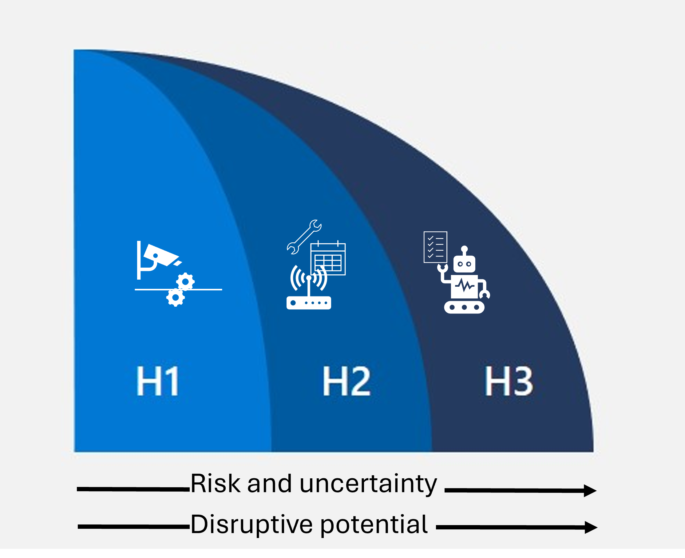

Adopting AI throughout an organization implies a serious investment. However, investing in AI projects requires a different perspective than most investments. If you use AI to improve or automate an existing process, then it's possible to measure return on investment (ROI) in the straightforward, traditional way. But there are a few characteristics of AI initiatives that make it difficult to estimate their costs and benefits.

First, most AI models require upfront investment before it's even possible to measure effectiveness. It's hard to predict the accuracy of the model and its business impact until you've prepared data and completed model training and testing. Additionally, it's hard to predict the amount of long-term maintenance a model needs. Individual models improve over time in ways that are difficult to calculate in advance.

With AI initiatives, you need to think like a venture capitalist. That means being willing to invest and take risks amid uncertainties. But you don't have to guess. Instead, you can use a framework to help prioritize AI investments.

## What is Microsoft's horizon-based framework?

At Microsoft, we use a horizon-based framework to evaluate and prioritize AI investments. The horizon framework is a way to break development initiatives into phases called "horizons". AI initiatives are three horizons, from improving core business functions to creating brand new revenue streams. The risk and uncertainty of specific applications depends on a company's level of AI maturity, size, business objectives, and more. 

### Horizon 1: Running (operate and optimize the core business)

Not every AI application involves revolutionary changes. In fact, using AI to improve or automate existing processes is becoming essential to remaining competitive. Horizon 1 (H1) represents AI initiatives that optimize core business functions.

For example, perhaps you manufacture electronic components. While you might manually inspect quality for 100 parts per hour, an AI model with image recognition capabilities could inspect 1,000 parts per hour.

### Horizon 2: Growing (improve market position)

Horizon 2 (H2) initiatives take advantage of emerging opportunities. These initiatives might create new services or new customer experiences.

For example, a manufacturer of electronics might use IoT to collect operational data and AI to suggest optimal times for maintenance. These initiatives facilitate a brand-new customer experience and help the manufacturer differentiate from competitors.

### Horizon 3: Transforming (change market position)

Horizon 3 (H3) involves disruptive and innovative new business models. These are revolutionary applications that might cross industry boundaries or even create new customer needs.

For example, the same electronics manufacturer could sell "electronics-as-a-service" which means they use AI models to predict which electronic devices work best for your current system and needs. Ultimately, the company is selling a personalized service rather than a single product, creating new revenue streams and opportunities.

Next, let’s take a look at how to use a prioritization grid to apply a horizon-based framework.