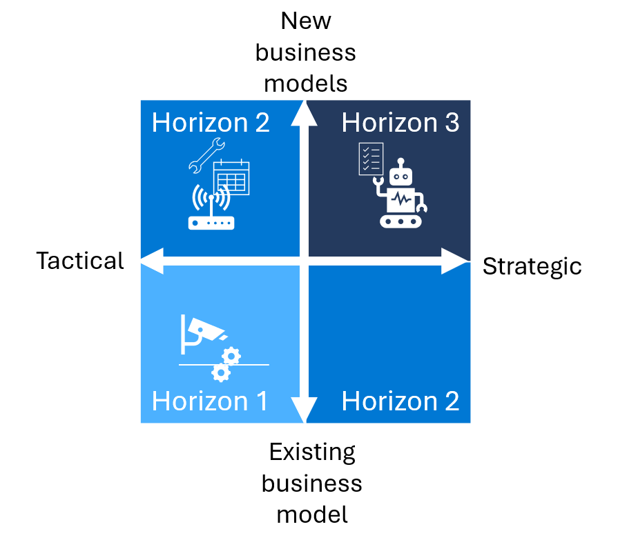

To classify initiatives into horizons, we first *map company initiatives to a prioritization grid*. Then we are able to *prioritize investments into horizons* based on where the initiative falls in the grid. 

## Map initiatives to a prioritization grid 

Start with a matrix with four quadrants that organizes planned initiatives by strategic impact on one axis and business model impact on the other. 

The matrix's horizontal axis represents a spectrum of "tactical" to "strategic" initiatives. "Tactical" initiatives are confined to a single team or use case. "Strategic" initiatives represent larger investments that might affect the entire organization. The matrix's vertical axis represents a spectrum of business models. Existing business model initiatives address competitive and disruptive threats, improve operations, or empower employees. New business model initiatives create new value propositions and revenue streams. 

As you map initiatives, it's helpful to involve the Chief Financial Officer (CFO) office and other stakeholders to ensure you've made the right assumptions around the opportunity valuation.

Let's try filling in the prioritization grid using the earlier manufacturing example. You might place automation of quality control in the lower left quadrant. It's an initiative that digitizes and optimizes an existing business model without requiring systemic changes.

Scenarios that fall below the middle line help the organization survive more than thrive. They might address competitive and disruptive threats, improve operations, or empower employees in the organization. Scenarios above the middle line help companies create new value propositions, revenue streams, or business models.

Once you are done classifying your initiatives on the grid, you can map the quadrants to horizons. The quadrant that an initiative fits determines which horizon it belongs to. The initiatives in quadrants one and four belong to Horizon 2. The initiatives in quadrant three belong to Horizon 1. The initiatives in quadrant two belong to Horizon 3.  

## Prioritize investments based on horizons

We recommend prioritizing initiatives in phases: start with foundational initiatives in the bottom left of the Prioritization framework quadrant and move towards transformational initiatives in the top right of the quadrant.

Having mapped the initiatives to their horizons, you tackle them in order: Horizon 1 initiatives first then Horizon 2 initiatives, and finally Horizon 3 initiatives.

We recommend this approach because it's helpful to grow capabilities and get buy-in before you move to more complex projects. Begin by forming technical teams that can prepare data appropriately and familiarize themselves with AI models. Starting with foundational initiatives also helps establish trust across the business and manage expectations related to AI initiatives. The success and value you're able to demonstrate in early initiatives pave the way for the more transformational projects.

Another reason to start at the bottom left of the prioritization framework quadrant is that the technology used to support H1 initiatives is typically more accessible than advanced use cases. There are countless out-of-the-box AI models you can apply to common use cases. These applications cost less and their effect on the business is easier to estimate. As you build maturity with these accessible models, you can experiment with more complex AI initiatives and hone your objectives.

Horizon 2 and Horizon 3 initiatives require more sophisticated data science capabilities, which may result in unintended or unexpected outcomes. These initiatives often require businesses to work with partners to create a custom model that can't be bought off the shelf. These solutions require the most resources, time, and risk, but they offer the greatest reward. Achieving a lasting competitive advantage requires solutions that aren't easily duplicated.

## Define clear value drivers and KPIs for your AI investments

Once you've chosen AI initiatives, it's important to identify value drivers and key performance indicators (KPIs) for each project. The framework provides a useful way to think about any investment including AI initiatives.

| **Value** | **Sample category** | **Definition** | **AI example** |
|---|---|---|---|
| Financial drivers | Sales |The revenue earned from products or services. | Use targeted marketing to improve accuracy in classifying prospects. |
| Financial drivers | Cost management | Process of planning and controlling the budget of a business. In addition to employee time and effort, the costs of AI models include cloud compute, which varies depending on the model's workload. | Improve prediction models for scheduling equipment maintenance to improve sustainability. |
| Financial drivers | Capital productivity | Measure of how physical capital is used in providing goods and services. | Enhance employee productivity and resource allocation with insight into operations. |
| Quality measures | Quality | The degree to which products or services meet customer or business expectations. | Improve product quality with automated inspection processes. |
| Quality measures | Cycle times | The time it takes to complete a process. | Accelerate product inspections with image recognition.                                    |
| Quality measures | Satisfaction (customer and/or employee) | How happy customers are with a company's products or services (which contributes to market share, competitive differentiation, and more). | Improve customer engagement with personalized discounts and product bundles. |

As you invest in initiatives, it's important to develop market and financial models to help balance potential risk and return. Consider factors such as the total addressable market (TAM), net present value (NPV), and internal rate of return (IRR). Work with the CFO office and other key stakeholders to ensure the financial models make sense within the context of the business. These metrics can help secure their buy-in and ensure support throughout the process.

Moving forward, we advise putting systemic processes in place to manage and evaluate value throughout the project lifecycle. We recommend taking an agile approach that happens in stages—after you invest in an initiative, evaluate the initial results. Then you can determine whether to continue, adjust your approach, or take another path. Continue to evaluate value at major milestones throughout the project.

>[!TIP]
>Take a moment to come up with some potential example investments for each of the 3 horizons. \
>

Next, let’s take a look at the AI-related roles and responsibilities that should be established in every AI organization.
